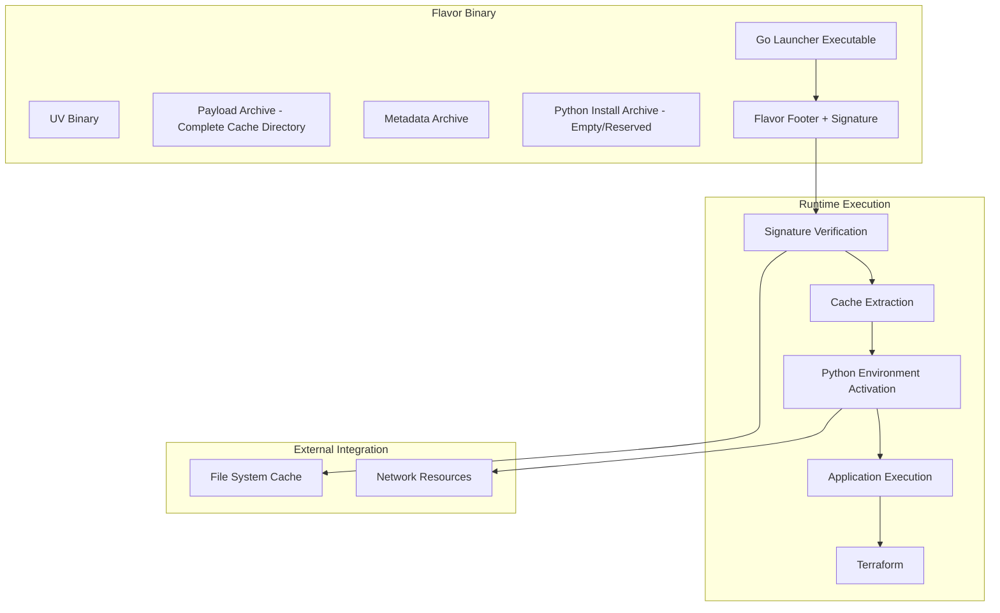
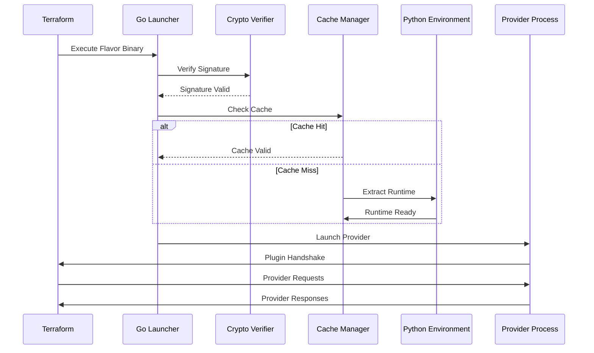

# Flavor v0.1 Architecture Design

**Document Version**: 1.0  
**Flavor Version**: 0.1  
**Last Updated**: August 2025

## Table of Contents

1. [Executive Summary](#1-executive-summary)
2. [System Architecture](#2-system-architecture)
3. [Component Design](#3-component-design)
4. [Cross-Language Integration](#4-cross-language-integration)
5. [Security Architecture](#5-security-architecture)
6. [Performance Design](#6-performance-design)
7. [Future Architecture](#7-future-architecture)

## 1. Executive Summary

The Progressive Secure Package Format (Flavor) v0.1 implements a **hybrid runtime architecture** that combines the performance and deployment advantages of Go with the flexibility and ecosystem richness of Python. The architecture is specifically designed to solve the complex problem of distributing Python-based Terraform providers as zero-dependency, cryptographically secure binaries.

### 1.1 Key Architectural Decisions

- **Hybrid Go+Python Runtime**: Go launcher for performance, Python for application logic
- **Embedded Runtime Strategy**: Complete Python environment packaged within binary
- **Progressive Security Model**: ECDSA signature verification with configurable security levels
- **Cache-First Performance**: Intelligent caching system for rapid subsequent executions
- **Standards Integration**: Native compatibility with Python (PEP 517) and Go build ecosystems

## 2. System Architecture

### 2.1 High-Level Architecture



### 2.2 Architectural Layers

#### Layer 1: Platform Integration
- **Go Binary Launcher**: Native platform executable
- **Process Management**: System process lifecycle
- **File System Interface**: Temporary directories and caching
- **Network Management**: Plugin protocol communication

#### Layer 2: Security and Verification
- **Cryptographic Verification**: ECDSA signature validation
- **Content Integrity**: SHA-256 hash verification
- **Runtime Isolation**: Process and file system isolation
- **Cache Security**: Secure cache validation and invalidation

#### Layer 3: Runtime Management
- **Python Environment**: Embedded interpreter and standard library
- **Package Management**: Embedded `uv` with dependency resolution
- **Archive Management**: Compressed runtime and application archives
- **Cache Optimization**: Intelligent cache reuse and invalidation

#### Layer 4: Application Execution
- **Provider Framework**: Pyvider framework integration
- **Plugin Protocol**: Terraform Plugin Protocol v6 implementation
- **Business Logic**: Provider-specific functionality
- **Error Handling**: Comprehensive error propagation and logging

### 2.3 Data Flow Architecture



## 3. Component Design

### 3.1 Go Launcher Component

**Location**: `src/flavor/go/flavor-launcher/`  
**Responsibilities**:
- Binary execution entry point
- Cryptographic verification coordination
- Python runtime management
- Cache lifecycle management
- Inter-process communication

**Key Design Patterns**:

```go
type Launcher struct {
    binaryPath     string
    cacheManager   *CacheManager
    verifier       *crypto.Verifier
    pythonRuntime  *runtime.PythonRuntime
}

func (l *Launcher) Execute(args []string) error {
    // 1. Verify cryptographic integrity
    if err := l.verifier.VerifyPackage(l.binaryPath); err != nil {
        return fmt.Errorf("signature verification failed: %w", err)
    }
    
    // 2. Setup runtime environment
    if err := l.setupRuntime(); err != nil {
        return fmt.Errorf("runtime setup failed: %w", err)
    }
    
    // 3. Execute Python application
    return l.pythonRuntime.Execute(args)
}
```

### 3.2 Python Integration Layer

**Location**: `src/flavor/packaging/`, `src/flavor/api.py`  
**Responsibilities**:
- Flavor format creation and manipulation
- Build orchestration and dependency management
- Cross-language compatibility validation
- Development tooling and CLI interfaces

**Architecture Patterns**:

```python
class PackagingOrchestrator:
    """Orchestrates Flavor package creation with simplified cache structure."""
    
    def build_package(self) -> None:
        """Build complete Flavor package with embedded Python environment."""
        with tempfile.TemporaryDirectory() as temp_dir:
            # 1. Create complete cache directory structure
            payload_dir = Path(temp_dir) / "payload"
            metadata_dir = payload_dir / "metadata"
            
            # 2. Setup Python environment directly in payload
            # This creates a complete venv with all dependencies
            self._create_python_environment(payload_dir)
            
            # 3. Create metadata with provider information
            self._create_metadata(metadata_dir, {
                "name": self.provider_name,
                "version": self.version,
                "entry_point": self.entry_point,
            })
            
            # 4. Create payload.tgz containing entire cache directory
            # When extracted, this becomes the provider's cache
            payload_archive = self._create_payload_archive(payload_dir)
            
            # 5. Build final Flavor package with Go launcher
            self._build_pspf_binary(payload_archive)
```

### 3.3 Cryptographic Component

**Dual Implementation**: Go (`pkg/flavor/`) + Python (`crypto.py`)  
**Responsibilities**:
- ECDSA key pair generation and management
- Package signing and verification
- Hash calculation and validation
- Cross-language cryptographic compatibility

**Security Design**:

```python
class CryptographicManager:
    """Manages Flavor cryptographic operations."""
    
    def __init__(self, curve: ECCurve = ECCurve.P256):
        self.curve = curve
        self.hash_algorithm = SHA256()
    
    def sign_package(self, content: bytes, private_key: PrivateKey) -> bytes:
        """Sign package content with ECDSA."""
        digest = sha256(content).digest()
        signature = private_key.sign(digest, ECDSA(self.hash_algorithm))
        return signature
    
    def verify_package(self, content: bytes, signature: bytes, public_key: PublicKey) -> bool:
        """Verify package signature."""
        digest = sha256(content).digest()
        try:
            public_key.verify(signature, digest, ECDSA(self.hash_algorithm))
            return True
        except InvalidSignature:
            return False
```

### 3.4 Cache Management System

**Location**: Go launcher + Python integration  
**Design Philosophy**: Performance through intelligent caching with security validation

**Cache Architecture**:

```
Cache Directory Structure (Simplified):
~/.cache/flavor/
├── bin/                                # Compiled Go binaries
│   ├── flavor-launcher                   # Go launcher executable
│   └── flavor-packager                   # Go packaging tool
└── providers/
    └── <provider-name>-<version>/      # Extracted payload becomes cache
        ├── bin/                        # Python executable
        ├── lib/                        # Python libraries and packages
        ├── metadata/                   # Provider metadata
        │   ├── provider_manifest.json  # Provider configuration
        │   └── config.json            # Runtime configuration
        └── src/                        # Editable installs symlinks
```

**Cache Validation Logic**:

1. **Content Hash Verification**: SHA-256 hash of cached content vs. package header
2. **Timestamp Validation**: Cache freshness and expiration policies  
3. **Signature Validation**: Cached content cryptographic integrity
4. **Space Management**: LRU eviction and cleanup policies

## 4. Cross-Language Integration

### 4.1 Go-Python Compatibility Matrix

| Component | Go Implementation | Python Implementation | Compatibility Status |
|-----------|------------------|----------------------|----------------------|
| ECDSA Signing | `pkg/flavor/crypto.go` | `src/flavor/crypto.py` | ✅ 100% Compatible |
| Package Format | `pkg/flavor/format.go` | `src/flavor/models.py` | ✅ Binary Compatible |
| Hash Calculation | Go `crypto/sha256` | Python `hashlib` | ✅ Identical Results |
| Archive Handling | Go `archive/tar` | Python `tarfile` | ✅ Interoperable |
| JSON Serialization | Go `encoding/json` | Python `json` | ✅ Schema Compatible |

### 4.2 Compatibility Testing Framework

**Test Strategy**: Comprehensive cross-language validation ensuring Go and Python implementations produce identical results.

**Test Categories**:

1. **Cryptographic Compatibility**:
   ```python
   def test_cross_language_signing():
       # Python signs, Go verifies
       python_signature = python_crypto.sign(content, private_key)
       assert go_crypto.verify(content, python_signature, public_key)
       
       # Go signs, Python verifies  
       go_signature = go_crypto.sign(content, private_key)
       assert python_crypto.verify(content, go_signature, public_key)
   ```

2. **Package Format Compatibility**:
   ```python
   def test_package_format_compatibility():
       # Python creates package, Go reads it
       python_package = python_builder.create_package(config)
       go_package = go_reader.parse_package(python_package)
       assert go_package.header == python_package.header
   ```

3. **Archive Compatibility**:
   ```python
   def test_archive_compatibility():
       # Ensure archives created by Python can be read by Go
       python_archive = python_archiver.create_archive(files)
       go_files = go_archiver.extract_archive(python_archive)
       assert go_files == files
   ```

### 4.3 TofuSoup Integration Architecture

Flavor integrates with the TofuSoup conformance testing framework to ensure cross-language compatibility:

```python
# TofuSoup integration in tofusoup/src/tofusoup/package/
class PspfIntegration:
    """TofuSoup integration for Flavor functionality."""
    
    def __init__(self):
        self.pspf_api = flavor.api  # Direct API integration
        self.go_harness = GoHarness("flavor-packager")  # Go binary harness
    
    def test_cross_language_compatibility(self):
        """Run comprehensive cross-language tests."""
        # Test signing compatibility
        self._test_signing_compatibility()
        
        # Test package format compatibility
        self._test_package_format_compatibility()
        
        # Test runtime execution compatibility
        self._test_execution_compatibility()
```

## 5. Security Architecture

### 5.1 Security Model

**Threat Model**: Flavor assumes an adversarial distribution environment where packages may be tampered with during transit or storage.

**Security Properties**:
- **Integrity**: Cryptographic guarantee that package contents have not been modified
- **Authenticity**: Verification that package was created by holder of private key
- **Non-Repudiation**: Signature provides proof of package creation by key holder
- **Isolation**: Runtime isolation prevents malicious packages from affecting system

### 5.2 Cryptographic Design

**Algorithm Selection Rationale**:
- **ECDSA**: Preferred over RSA for smaller signature sizes and equivalent security
- **P-256/P-384/P-521**: Industry-standard curves with proven security properties
- **SHA-256**: Widely supported, cryptographically secure hash function
- **ASN.1 DER**: Standard signature encoding for interoperability

**Key Management Philosophy**:
- **Separation of Concerns**: Private keys never embedded in packages
- **Key Rotation**: Architecture supports key rotation without format changes
- **Multi-Key Support**: Future support for multiple signing keys per package

### 5.3 Runtime Security

**Process Isolation**:
```go
type IsolatedRuntime struct {
    tempDir     string          // Isolated temporary directory
    environment map[string]string // Controlled environment variables
    process     *os.Process     // Isolated process handle
}

func (r *IsolatedRuntime) Execute(args []string) error {
    // 1. Create isolated temporary directory
    tempDir, err := os.MkdirTemp("", "flavor-runtime-")
    if err != nil {
        return err
    }
    defer os.RemoveAll(tempDir)  // Cleanup on exit
    
    // 2. Setup controlled environment
    env := []string{
        "PYTHONPATH=" + tempDir + "/lib",
        "PATH=" + tempDir + "/bin",
        // ... minimal environment
    }
    
    // 3. Execute with isolation
    cmd := exec.Command(pythonBinary, args...)
    cmd.Dir = tempDir
    cmd.Env = env
    return cmd.Run()
}
```

## 6. Performance Design

### 6.1 Performance Requirements

- **Cold Start**: < 2 seconds for first execution
- **Warm Start**: < 200ms for cached execution  
- **Memory Usage**: < 100MB additional overhead
- **Binary Size**: < 50MB typical package size
- **Cache Efficiency**: > 90% cache hit rate for repeated executions

### 6.2 Optimization Strategies

#### Cache-First Architecture
- **Runtime Caching**: Cache extracted Python environments between executions
- **Content-Based Invalidation**: Cache invalidation based on SHA-256 content hashes
- **Lazy Extraction**: Extract only necessary components on first use
- **Parallel Processing**: Concurrent extraction and verification where possible

#### Memory Optimization
- **Streaming Decompression**: Stream archives directly to cache without intermediate storage
- **Memory Mapping**: Use memory-mapped files for large archive access
- **Garbage Collection**: Automatic cleanup of unused cache entries
- **Resource Monitoring**: Monitor and limit resource usage

#### Binary Size Optimization
- **Runtime Deduplication**: Share common runtime components across packages
- **Compression Optimization**: Use optimal compression settings for different content types
- **Asset Minimization**: Include only necessary runtime components
- **Progressive Loading**: Load components only when needed

### 6.3 Performance Monitoring

```python
@dataclass
class PerformanceMetrics:
    """Performance metrics for Flavor operations."""
    startup_time: float          # Time from launch to ready
    cache_hit_rate: float        # Percentage of cache hits
    memory_usage: int            # Peak memory usage in bytes  
    binary_size: int             # Package binary size in bytes
    extraction_time: float       # Time to extract archives
    verification_time: float     # Cryptographic verification time
```

## 7. Future Architecture

### 7.1 Multi-Language Runtime Support

**Progressive Enhancement Path**:

```
Flavor Evolution:
v0.1: Go + Python (Current)
v0.2: Go + Python + Rust  
v1.0: Universal multi-language runtime
v2.0: Container-based isolation
```

**Multi-Runtime Architecture**:
```go
type RuntimeManager interface {
    SupportedLanguages() []string
    CreateRuntime(lang string, config RuntimeConfig) (Runtime, error)
    CacheRuntime(runtime Runtime) error
}

type Runtime interface {
    Language() string
    Execute(entrypoint string, args []string) error
    Cleanup() error
}
```

### 7.2 Container Integration

**Future Vision**: Flavor v2.0 will support container-based runtime isolation:

```yaml
# Future Flavor v2.0 configuration
runtime:
  isolation: container
  base_image: python:3.13-alpine
  security:
    read_only_filesystem: true
    no_new_privileges: true
    user: 65534  # nobody user
```

### 7.3 Distributed Package Management

**Registry Integration**: Future support for distributed package repositories with cryptographic verification:

```python
class PackageRegistry:
    """Distributed Flavor package registry."""
    
    def publish(self, package: PspfPackage, metadata: PackageMetadata) -> bool:
        """Publish package to registry with signature verification."""
        pass
    
    def fetch(self, name: str, version: str) -> PspfPackage:
        """Fetch package with automatic signature verification."""
        pass
    
    def verify_chain(self, package: PspfPackage) -> TrustChain:
        """Verify complete cryptographic trust chain."""
        pass
```

## Conclusion

The Flavor v0.1 architecture provides a robust, secure, and performant foundation for multi-runtime application packaging. The hybrid Go+Python design balances current practical needs with future extensibility, while maintaining strong security properties and excellent performance characteristics.

The architecture's modular design, comprehensive testing framework, and standards integration position Flavor for progressive enhancement toward universal multi-language support while maintaining backward compatibility and security guarantees.