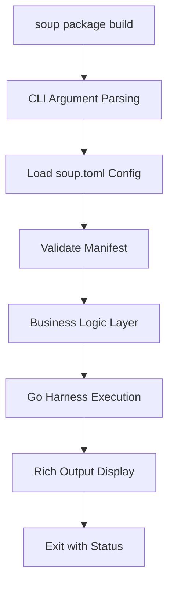
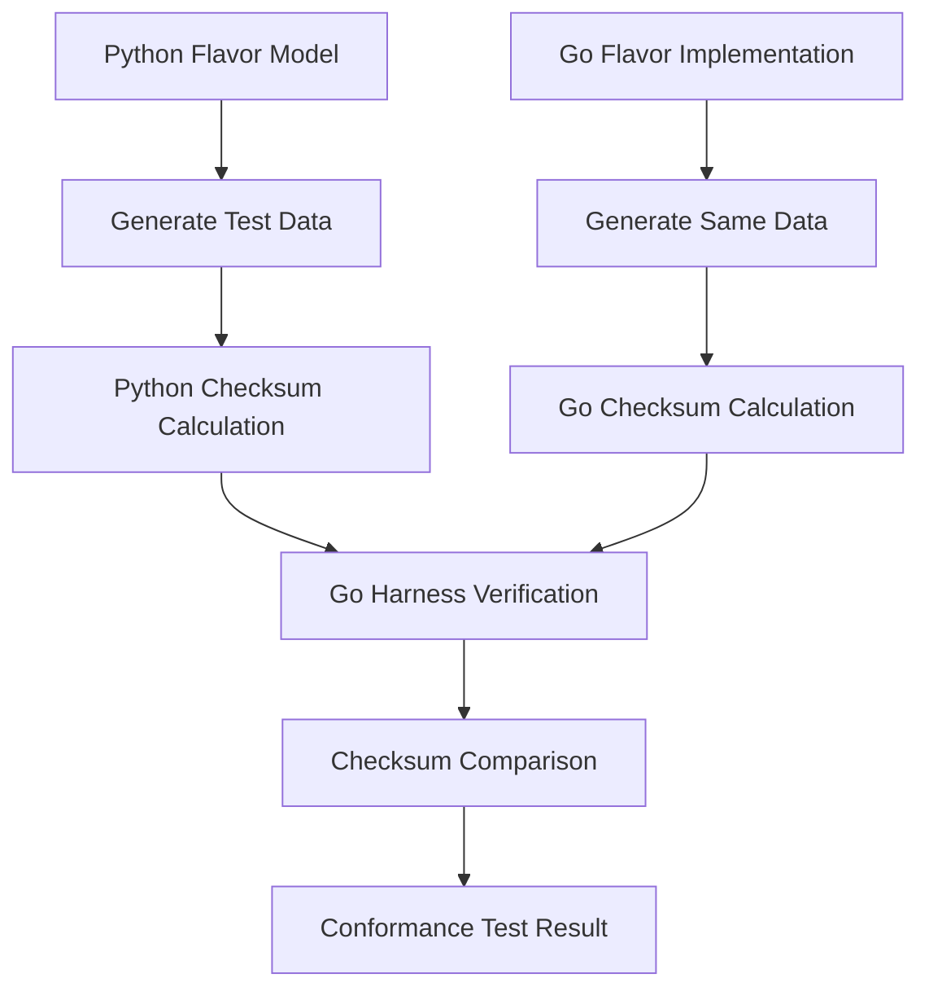

# Design Document: TofuSoup Integration - `flavor` → `soup package`

## Executive Summary

This design document outlines the architectural approach for integrating `flavor` into TofuSoup as the `soup package` command group, creating a unified developer experience for Flavor (Progressive Secure Package Format v0.1) operations within the OpenTofu ecosystem.

## Current State Analysis

### flavor Architecture
```
✅ Status: 50/50 tests passing
✅ Go/Python cross-compatibility verified
✅ Flavor v1.0 format stable
✅ Production-ready ECDSA signing/verification
```

**Key Components:**
- **CLI Layer**: Click-based `pyvbuild` commands
- **Business Logic**: Orchestrator, models, packaging logic
- **Cross-Language Core**: Go `flavor-packager` binary with Python wrapper
- **Testing**: Comprehensive cross-language compatibility tests

### TofuSoup Architecture
```
✅ Modular CLI with lazy loading
✅ Rich terminal output system
✅ Cross-language harness management
✅ Pytest-based conformance testing
✅ TOML-based configuration system
```

## Design Principles

### 1. **Architectural Alignment**
- **Modular Integration**: Flavor functionality as a first-class TofuSoup module
- **Lazy Loading**: Maintain fast CLI startup via TofuSoup's LazyGroup pattern
- **Rich UX**: Leverage TofuSoup's enhanced terminal output system
- **Configuration Unity**: Single `soup.toml` for all ecosystem tools

### 2. **Cross-Language Foundation**
- **Harness Management**: Go Flavor tools managed via existing TofuSoup harness system
- **Test Integration**: Flavor compatibility tests in TofuSoup's conformance framework
- **Future-Proofing**: Architecture ready for Rust implementation addition

### 3. **Developer Experience**
- **Command Consistency**: `soup package <subcommand>` follows TofuSoup patterns
- **Error Handling**: Rich error messages with actionable feedback
- **Workflow Integration**: Seamless integration with existing TofuSoup workflows

## Detailed Component Design

### 1. Module Structure

```
tofusoup/src/tofusoup/package/
├── __init__.py              # Module exports and public API
├── cli.py                   # Click commands for soup package
├── logic.py                 # Business logic (orchestration, packaging)
├── models.py                # Flavor data models and utilities
└── exceptions.py            # Package-specific exceptions
```

### 2. CLI Command Mapping

| Current `pyvbuild` | New `soup package` | Description |
|-------------------|-------------------|-------------|
| `pyvbuild package` | `soup package build` | Build Flavor package |
| `pyvbuild verify`  | `soup package verify` | Verify package integrity |
| `pyvbuild keygen`  | `soup package keygen` | Generate signing keys |
| `pyvbuild clean`   | `soup package clean` | Clean build artifacts |
| `pyvbuild init`    | `soup provider new` | Initialize new provider |

### 3. Harness Integration Design

**Go Harness Location:**
```
tofusoup/src/tofusoup/harness/go/flavor-packager/
├── main.go                  # CLI entry point
├── cmd/                     # Cobra commands
│   ├── build.go
│   ├── verify.go
│   └── keygen.go
├── pkg/flavor/               # Flavor format implementation
└── go.mod                  # Go module definition
```

### Phase 1: Foundation (TDD Approach)

**Test-First Development:**
1. **Create failing integration tests** for `soup package` commands
2. **Implement minimal CLI structure** to make tests pass
3. **Migrate core models and logic** with existing test coverage
4. **Validate cross-language compatibility** at each step

**Key TDD Cycles:**
```python
# test_soup_package_integration.py
def test_soup_package_build_basic():
    """soup package build should create valid Flavor file"""
    result = run_soup_command(["package", "build", "--manifest", "test.toml"])
    assert result.exit_code == 0
    assert "✅ Package built successfully" in result.output

def test_soup_package_verify_cross_language():
    """Verify Python and Go produce identical checksums"""
    # Existing pattern from flavor tests
    assert python_checksum == go_checksum
```

### Phase 2: Core Migration

**Business Logic Transfer:**
- **Orchestrator Pattern**: Migrate `BuildOrchestrator` to `tofusoup.package.logic`
- **Model Consistency**: Ensure Flavor models maintain exact binary compatibility
- **Harness Integration**: Adapt Go binary management to TofuSoup's harness system

### Phase 3: Enhanced Integration

**Rich UX Implementation:**
- **Progress Indicators**: Use `rich.progress` for build operations
- **Tree Displays**: Show package structure with `rich.tree`
- **Error Handling**: Rich error messages with suggested fixes

```python
# Example rich integration
from rich.progress import Progress, TaskID
from rich.tree import Tree

def build_package_with_progress(manifest_path: Path) -> None:
    with Progress() as progress:
        task = progress.add_task("Building Flavor package...", total=5)
        
        progress.update(task, description="Reading manifest")
        # ... build logic ...
        
        progress.update(task, advance=1, description="Compiling Python dependencies")
        # ... compilation ...
```

## Data Flow Architecture

### 1. Command Execution Flow



### 2. Cross-Language Validation Flow



## Risk Analysis & Mitigation

### Technical Risks

**Risk 1: Cross-Language Compatibility Break**
- **Mitigation**: Maintain existing test coverage, validate checksums at each step
- **Detection**: Automated tests run on every change
- **Recovery**: Rollback capability until full migration validated

**Risk 2: Performance Degradation**
- **Mitigation**: Profile CLI startup time, maintain lazy loading benefits
- **Detection**: Automated performance benchmarks
- **Recovery**: Optimize hot paths, ensure lazy loading effectiveness

**Risk 3: Developer Workflow Disruption**
- **Mitigation**: Provide clear migration path, maintain backward compatibility initially
- **Detection**: User feedback and testing with real projects
- **Recovery**: Improve CLI UX based on feedback

### Process Risks

**Risk 4: Test Coverage Loss**
- **Mitigation**: Migrate all 50 existing tests, maintain 100% pass rate
- **Detection**: CI/CD pipeline validation
- **Recovery**: Fix failing tests immediately, never proceed with broken tests

## Success Metrics

### Functional Requirements
- ✅ **All Commands Available**: Every `pyvbuild` command accessible via `soup package`
- ✅ **Cross-Language Compatibility**: Identical checksums from Go/Python implementations
- ✅ **Test Coverage**: All existing 50 tests pass in new structure
- ✅ **Configuration Unity**: Single `soup.toml` configuration

### Performance Requirements
- ✅ **CLI Startup**: < 500ms cold start time (lazy loading working)
- ✅ **Build Performance**: No regression from current `pyvbuild` times
- ✅ **Memory Usage**: Efficient resource utilization

### User Experience Requirements
- ✅ **Rich Output**: Enhanced terminal experience with progress indicators
- ✅ **Error Messages**: Clear, actionable error messages
- ✅ **Documentation**: Complete command documentation and examples

## Future Evolution Path

### Rust Implementation Readiness

**Architecture Extension:**
```
tofusoup/src/tofusoup/harness/rust/flavor-packager/
├── Cargo.toml
├── src/main.rs
└── src/flavor/
    ├── models.rs
    ├── builder.rs
    └── verifier.rs
```

**Three-Way Compatibility Testing:**
```python
@pytest.mark.parametrize("implementation", ["python", "go", "rust"])
def test_pspf_checksum_cross_compatibility(implementation):
    """Verify all three implementations produce identical checksums"""
    checksum = generate_pspf_checksum(implementation, test_data)
    assert checksum == EXPECTED_CANONICAL_CHECKSUM
```

### Integration Ecosystem

**Provider Registry Integration:**
```bash
soup package publish registry.example.com/namespace/provider
soup package install namespace/provider@1.0.0
```

**CI/CD Integration:**
```bash
soup package test-matrix    # Test across all language implementations
soup package benchmark      # Performance comparison across implementations
```

## Conclusion

This design creates a unified, powerful development environment for Flavor package management while maintaining the proven cross-language compatibility and comprehensive testing that makes the current `pyvider-builder` system reliable. The integration with TofuSoup's architecture provides enhanced developer experience and positions the system for future multi-language expansion.

The TDD approach ensures that functionality is never lost during migration, and the modular design allows for incremental migration with validation at each step.