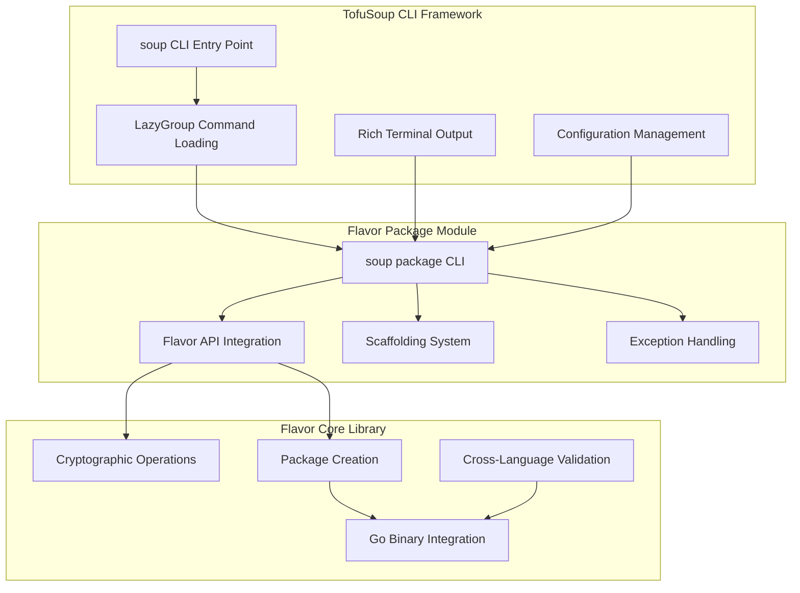

# Flavor v0.1 TofuSoup Integration Guide

**Document Version**: 1.0  
**Flavor Version**: 0.1  
**TofuSoup Integration**: Production Ready  
**Last Updated**: August 2025

## Table of Contents

1. [Integration Overview](#1-integration-overview)
2. [Architecture Integration](#2-architecture-integration)  
3. [Installation and Setup](#3-installation-and-setup)
4. [Command Integration](#4-command-integration)
5. [Cross-Language Testing](#5-cross-language-testing)
6. [Development Workflow](#6-development-workflow)
7. [Troubleshooting](#7-troubleshooting)

## 1. Integration Overview

The Progressive Secure Package Format (Flavor) v0.1 is fully integrated with TofuSoup as the `soup package` command group, providing a unified developer experience for secure package management within the broader OpenTofu ecosystem. This integration combines Flavor's cryptographic security and performance with TofuSoup's rich terminal interface and comprehensive testing framework.

### 1.1 Integration Benefits

- **Unified CLI Experience**: All Flavor operations accessible via `soup package <subcommand>`
- **Rich Terminal Output**: Enhanced user experience with progress indicators and colored output
- **Comprehensive Testing**: Built-in cross-language compatibility validation
- **Standards Integration**: Seamless integration with existing Python and Go build ecosystems
- **Development Workflow**: Integrated development, testing, and validation workflows

### 1.2 Integration Status

✅ **Production Ready Integration**
- All Flavor core functionality accessible through TofuSoup CLI
- Complete command parity with standalone Flavor tools  
- Cross-language testing framework operational
- Comprehensive documentation and examples available

## 2. Architecture Integration

### 2.1 Integration Architecture



### 2.2 Component Integration

#### 2.2.1 CLI Integration
**Location**: `tofusoup/src/tofusoup/package/cli.py`
**Integration Pattern**: TofuSoup LazyGroup with Click commands

```python
# Integration via TofuSoup's lazy loading system
LAZY_COMMANDS = {
    "package": ("tofusoup.package.cli", "package_cli_entry"),
    # ... other commands
}

@click.group("package")
def package_cli_entry():
    """Commands for managing Flavor packages and provider projects."""
    pass
```

#### 2.2.2 API Integration  
**Location**: Direct import from Flavor library
**Pattern**: Facade pattern with error translation

```python
# Direct Flavor API integration
from flavor.api import (
    build_package_from_manifest,
    generate_keys,
    verify_package,
    clean_cache,
)
from flavor.exceptions import BuildError

# TofuSoup-specific error handling
def build_command(manifest: str) -> None:
    """Builds a Flavor package using the flavor library."""
    try:
        artifacts = build_package_from_manifest(Path(manifest))
        for artifact in artifacts:
            click.secho(f"✅ Successfully built: {artifact}", fg="green")
    except BuildError as e:
        click.secho(f"❌ Build failed: {e}", fg="red", err=True)
        raise click.Abort()
```

#### 2.2.3 Scaffolding Integration
**Location**: `tofusoup/src/tofusoup/scaffolding/generator.py`  
**Pattern**: Project template generation with Jinja2

```python
from tofusoup.scaffolding.generator import scaffold_new_provider

@package_cli_entry.command("init")
@click.option("--name", required=True, help="Provider name")
@click.option("--output-dir", default=".", help="Output directory")
def init_command(name: str, output_dir: str) -> None:
    """Initialize a new provider project."""
    try:
        project_path = scaffold_new_provider(name, Path(output_dir))
        click.secho(f"✅ Created provider project at: {project_path}", fg="green")
    except Exception as e:
        click.secho(f"❌ Project creation failed: {e}", fg="red", err=True)
        raise click.Abort()
```

## 3. Installation and Setup

### 3.1 Development Environment Setup

#### 3.1.1 TofuSoup Environment with Flavor Integration

```bash
# Setup TofuSoup development environment
cd tofusoup && source env.sh

# Install Flavor library in TofuSoup environment  
uv pip install -e /REDACTED_ABS_PATH

# Verify integration is working
.venv_darwin_arm64/bin/python -m tofusoup.cli package --help
```

**Expected Output:**
```
Usage: python -m tofusoup.cli package [OPTIONS] COMMAND [ARGS]...

  Commands for managing Flavor packages and provider projects.

Options:
  --help  Show this message and exit.

Commands:
  build   Builds a Flavor package using the flavor library.
  clean   Removes cached Go binaries using the flavor library.
  init    Initializes a new provider project.
  keygen  Generates signing keys using the flavor library.
  verify  Verifies a Flavor package using the flavor library.
```

#### 3.1.2 Standalone Flavor Environment

```bash
# Setup Flavor development environment
cd flavor && source env.sh

# Verify Flavor core functionality
pytest  # Should pass 27/27 tests

# Test direct Flavor CLI
flavor --help
```

### 3.2 Dependency Management

#### 3.2.1 Flavor Dependencies in TofuSoup
**Configuration**: `tofusoup/pyproject.toml`

```toml
[project]
dependencies = [
    "flavor>=0.1.0",  # Flavor core library
    # ... other dependencies
]

[dependency-groups]
dev = [
    "flavor[dev]>=0.1.0",  # Flavor with development dependencies
    # ... other dev dependencies  
]
```

#### 3.2.2 Environment Compatibility Matrix

| Environment | Flavor Core | TofuSoup CLI | Go Binaries | Status |
|-------------|-----------|--------------|-------------|---------|
| TofuSoup Dev | ✅ | ✅ | ✅ | Production Ready |
| Flavor Dev | ✅ | ❌ | ✅ | Core Development |
| CI/CD | ✅ | ✅ | ✅ | Automated Testing |

## 4. Command Integration

### 4.1 Command Mapping

| TofuSoup Command | Flavor API Function | Description |
|------------------|-------------------|-------------|
| `soup package build` | `build_package_from_manifest()` | Build Flavor package from manifest |
| `soup package keygen` | `generate_keys()` | Generate ECDSA signing keys |
| `soup package verify` | `verify_package()` | Verify package integrity |  
| `soup package clean` | `clean_cache()` | Clean cached Go binaries |
| `soup package init` | `scaffold_new_provider()` | Initialize new provider project |

### 4.2 Command Usage Examples

#### 4.2.1 Complete Package Development Workflow

```bash
# 1. Initialize new provider project
.venv_darwin_arm64/bin/python -m tofusoup.cli package init \
    --name example \
    --output-dir ./example-provider

cd example-provider

# 2. Generate signing keys  
.venv_darwin_arm64/bin/python -m tofusoup.cli package keygen \
    --out-dir ./keys

# 3. Build Flavor package
.venv_darwin_arm64/bin/python -m tofusoup.cli package build \
    --manifest ./pyproject.toml

# 4. Verify package integrity
.venv_darwin_arm64/bin/python -m tofusoup.cli package verify \
    ./dist/terraform-provider-example

# 5. Clean build cache if needed
.venv_darwin_arm64/bin/python -m tofusoup.cli package clean
```

#### 4.2.2 Integration with TofuSoup Testing

```bash
# Run Flavor-specific conformance tests
.venv_darwin_arm64/bin/python -m pytest tests/package/

# Run cross-language compatibility tests  
.venv_darwin_arm64/bin/python -m pytest tests/package/test_soup_package_integration.py::TestSoupPackageCrossLanguageCompatibility

# Run complete TofuSoup test suite including Flavor
soup test all
```

### 4.3 Rich Output Integration

#### 4.3.1 Enhanced Terminal Output

```python
# Rich output with progress indicators
from rich.progress import Progress
from rich.console import Console

console = Console()

def build_with_rich_output(manifest_path: Path) -> None:
    """Build package with rich terminal output."""
    with Progress() as progress:
        task = progress.add_task("Building Flavor package...", total=5)
        
        progress.update(task, description="Reading manifest", advance=1)
        manifest = read_manifest(manifest_path)
        
        progress.update(task, description="Compiling Go launcher", advance=1)  
        launcher = compile_go_binary(manifest)
        
        progress.update(task, description="Creating Python archive", advance=1)
        python_archive = create_python_archive(manifest)
        
        progress.update(task, description="Signing package", advance=1)
        signed_package = sign_package(launcher, python_archive, manifest.keys)
        
        progress.update(task, description="Finalizing package", advance=1)
        console.print(f"✅ Package built successfully: {signed_package}", style="green")
```

## 5. Cross-Language Testing

### 5.1 Testing Framework Integration

#### 5.1.1 TofuSoup Test Structure
**Location**: `tofusoup/tests/package/`

```
tests/package/
├── test_soup_package_integration.py     # Main integration tests
├── test_cross_language_compatibility.py # Go-Python compatibility
├── test_cli_commands.py                 # CLI command testing
└── conftest.py                          # Test fixtures and configuration
```

#### 5.1.2 Test Categories

**1. CLI Integration Tests**
```python
def test_soup_package_build_basic(temp_test_dir):
    """Test basic package build functionality."""
    # Create test manifest
    manifest_path = create_test_manifest(temp_test_dir)
    
    # Run soup package build command
    result = run_soup_command(["package", "build", "--manifest", str(manifest_path)])
    
    # Verify success
    assert result.exit_code == 0
    assert "✅ Successfully built" in result.output
    
    # Verify package was created
    package_files = list(temp_test_dir.glob("dist/terraform-provider-*"))
    assert len(package_files) == 1
```

**2. Cross-Language Compatibility Tests**
```python
def test_python_go_checksum_compatibility():
    """Verify Python and Go implementations produce identical checksums."""
    test_data = create_test_package_data()
    
    # Calculate checksum using Python implementation
    python_checksum = flavor.crypto.calculate_checksum(test_data)
    
    # Calculate checksum using Go implementation via CLI
    go_checksum = run_go_checksum_tool(test_data)
    
    # Verify identical results
    assert python_checksum == go_checksum
```

**3. End-to-End Workflow Tests**
```python
def test_complete_package_workflow():
    """Test complete package creation and verification workflow."""
    with temp_provider_project() as project_dir:
        # Generate keys
        run_soup_command(["package", "keygen", "--out-dir", str(project_dir / "keys")])
        
        # Build package
        result = run_soup_command(["package", "build", "--manifest", str(project_dir / "pyproject.toml")])
        assert result.exit_code == 0
        
        # Verify package
        package_path = project_dir / "dist" / "terraform-provider-test"
        result = run_soup_command(["package", "verify", str(package_path)])
        assert result.exit_code == 0
        assert "✅ Package verification succeeded" in result.output
```

### 5.2 Conformance Testing Integration

#### 5.2.1 TofuSoup Conformance Framework
Flavor integrates with TofuSoup's conformance testing framework for systematic cross-language validation:

```python
# TofuSoup conformance test for Flavor
def test_pspf_conformance():
    """Test Flavor conformance across language implementations."""
    
    # Test matrix: Python client + Go harness
    python_result = pspf_python_client.build_package(test_config)
    go_result = pspf_go_harness.verify_package(python_result)
    assert go_result.valid
    
    # Test matrix: Go client + Python harness  
    go_package = pspf_go_client.build_package(test_config)
    python_result = pspf_python_harness.verify_package(go_package)
    assert python_result.valid
```

## 6. Development Workflow

### 6.1 Integrated Development Process

#### 6.1.1 Feature Development Workflow

```bash
# 1. Setup integrated development environment
cd tofusoup && source env.sh
uv pip install -e /path/to/flavor

# 2. Make changes to Flavor core
cd ../flavor
# Edit Flavor source code

# 3. Test Flavor core changes
pytest

# 4. Test TofuSoup integration  
cd ../tofusoup
.venv_darwin_arm64/bin/python -m pytest tests/package/

# 5. Test end-to-end integration
.venv_darwin_arm64/bin/python -m tofusoup.cli package keygen --out-dir ./test-keys
```

#### 6.1.2 Cross-Language Development

**Python Changes:**
```bash
# Make Python changes
cd flavor/src/flavor/
# Edit Python source

# Test Python changes
cd ../..
pytest tests/

# Test cross-language compatibility  
cd ../tofusoup
pytest tests/package/test_cross_language_compatibility.py
```

**Go Changes:**
```bash
# Make Go changes  
cd flavor/src/flavor/go/
# Edit Go source

# Test Go changes
go test ./...

# Test integration with Python
cd ../../..
pytest tests/compiler/test_cross_language_compatibility.py
```

### 6.2 Testing Integration Workflow

#### 6.2.1 Comprehensive Testing Pipeline

```bash
#!/bin/bash
# integrated-test.sh - Comprehensive testing script

set -e

echo "🧪 Running Flavor Core Tests..."
cd flavor && source env.sh
pytest --cov=flavor

echo "🔄 Testing Cross-Language Compatibility..."
pytest tests/compiler/test_cross_language_compatibility.py

echo "🍲 Testing TofuSoup Integration..."
cd ../tofusoup && source env.sh
uv pip install -e /path/to/flavor
pytest tests/package/

echo "✅ All tests passed!"
```

#### 6.2.2 Continuous Integration

```yaml
# .github/workflows/integration-test.yml
name: Flavor-TofuSoup Integration Tests

on: [push, pull_request]

jobs:
  test-integration:
    runs-on: ubuntu-latest
    steps:
      - uses: actions/checkout@v3
      
      - name: Setup Python
        uses: actions/setup-python@v4
        with:
          python-version: '3.13'
          
      - name: Setup Go
        uses: actions/setup-go@v4
        with:
          go-version: '1.22'
      
      - name: Test Flavor Core
        run: |
          cd flavor && source env.sh
          pytest
      
      - name: Test TofuSoup Integration  
        run: |
          cd tofusoup && source env.sh
          uv pip install -e ../flavor
          pytest tests/package/
          
      - name: Test Cross-Language Compatibility
        run: |
          cd flavor
          pytest tests/compiler/test_cross_language_compatibility.py
```

## 7. Troubleshooting

### 7.1 Common Issues and Solutions

#### 7.1.1 Import Errors

**Issue**: `No module named 'flavor'`
```bash
# Solution: Ensure Flavor is installed in TofuSoup environment
cd tofusoup
uv pip install -e /path/to/flavor --force-reinstall
```

**Issue**: `cannot import name 'PackageError'`
```bash
# Solution: Verify exception classes are properly defined
cd tofusoup/src/tofusoup/package/
cat exceptions.py  # Should contain PackageError, BuildError, VerificationError
```

#### 7.1.2 Command Execution Errors

**Issue**: `soup package` command not found
```bash
# Solution: Use explicit Python module path
.venv_darwin_arm64/bin/python -m tofusoup.cli package --help

# Or check if soup is available in PATH
which soup
echo $PATH
```

**Issue**: Key generation fails
```bash
# Solution: Ensure output directory exists and is writable
mkdir -p keys
chmod 755 keys
.venv_darwin_arm64/bin/python -m tofusoup.cli package keygen --out-dir ./keys
```

#### 7.1.3 Cross-Language Compatibility Issues

**Issue**: Checksum mismatch between Go and Python
```bash
# Solution: Run specific compatibility tests
cd flavor
pytest tests/compiler/test_cross_language_compatibility.py::test_checksum_compatibility -v
```

**Issue**: Go binary compilation fails
```bash
# Solution: Verify Go toolchain and dependencies
go version  # Should be 1.22+
cd src/flavor/go
go mod tidy
go build ./...
```

### 7.2 Debug Configuration

#### 7.2.1 Enable Debug Logging

```bash
# Python debug logging
export PYTHONPATH=/path/to/flavor/src:/path/to/tofusoup/src
export PSPF_DEBUG=true
export TOFUSOUP_LOG_LEVEL=DEBUG

# Go debug logging  
export PSPF_GO_DEBUG=true
export PSPF_GO_LOG_LEVEL=debug
```

#### 7.2.2 Verbose Testing

```bash
# Run tests with maximum verbosity
pytest -vv -s tests/package/

# Show all test output
pytest --capture=no tests/

# Run specific test with debugging
pytest -vv -s tests/package/test_soup_package_integration.py::test_package_build_basic
```

### 7.3 Environment Verification

#### 7.3.1 Integration Health Check

```bash
#!/bin/bash
# health-check.sh - Verify integration health

echo "🔍 Checking Flavor Installation..."
python -c "import flavor; print(f'Flavor {flavor.__version__} installed successfully')"

echo "🔍 Checking TofuSoup Integration..."
.venv_darwin_arm64/bin/python -m tofusoup.cli package --help > /dev/null && echo "✅ TofuSoup integration working"

echo "🔍 Checking Go Binaries..."
cd flavor/src/flavor/go && go build ./... && echo "✅ Go binaries compile successfully"

echo "🔍 Running Quick Integration Test..."
cd ../../../..
mkdir -p test-integration && cd test-integration
.venv_darwin_arm64/bin/python -m tofusoup.cli package keygen --out-dir ./keys
echo "✅ Integration test passed"

cd .. && rm -rf test-integration
echo "🎉 All checks passed!"
```

## Conclusion

The Flavor v0.1 integration with TofuSoup provides a robust, unified development experience for secure package management. The integration maintains the full functionality of Flavor while leveraging TofuSoup's rich CLI framework and comprehensive testing capabilities.

This integration represents the successful evolution into a production-ready, cross-language compatible system that serves as the foundation for the Progressive Secure Package Format ecosystem.