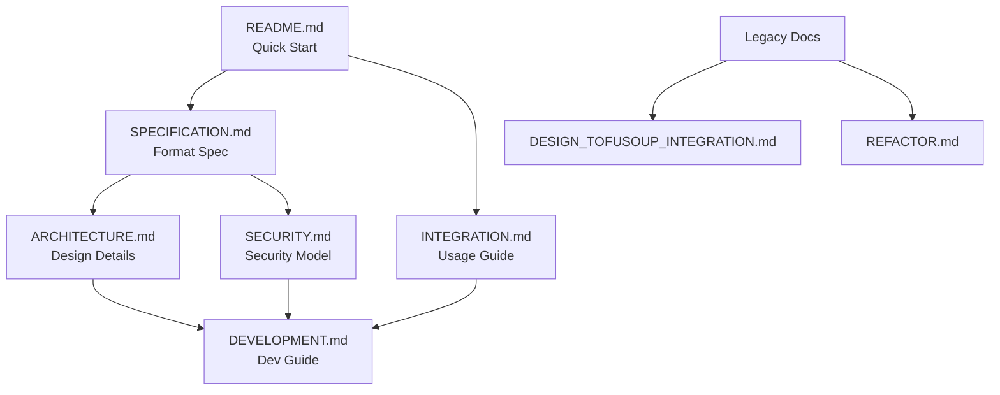

# Flavor v0.1 Documentation Index

**Progressive Secure Package Format v0.1**  
**Documentation Version**: 1.0  
**Last Updated**: August 2025

## Overview

This directory contains comprehensive documentation for **Flavor**, an extensible packaging system that supports multiple package formats. Currently, Flavor implements:

- **PSP (Progressive Secure Package) Format v0.1** - A modern, secure, and performant binary packaging format for distributing complex multi-runtime applications

Flavor is designed to be extensible, allowing new package formats ("flavors") to be added while maintaining a consistent toolchain and workflow. Each flavor can have its own format specification, file extension, and implementation details.

The PSP flavor (PSPF v0.1) is specifically designed for packaging Python-based Terraform providers built with the Pyvider framework, but Flavor's architecture supports future enhancement for other formats and language ecosystems.

## Documentation Structure

### 📋 Core Specifications
- **[SPECIFICATION.md](SPECIFICATION.md)** - Complete Flavor v0.1 format specification
  - Binary format structure and layout
  - Cryptographic design and algorithms
  - Security properties and guarantees
  - Reference implementation details

### 🏗️ Architecture and Design  
- **[ARCHITECTURE.md](ARCHITECTURE.md)** - Detailed architecture design and rationale
  - System architecture and component design
  - Cross-language integration patterns
  - Performance optimization strategies
  - Future evolution roadmap

### 🔒 Security Documentation
- **[SECURITY.md](SECURITY.md)** - Cryptographic design and security model
  - Threat model and attack surface analysis
  - Cryptographic implementation details
  - Security testing and validation
  - Security best practices and guidelines

### 💻 Development Resources
- **[DEVELOPMENT.md](DEVELOPMENT.md)** - Development workflow and contribution guide
  - Development environment setup
  - Testing strategies and frameworks
  - Cross-language development patterns
  - Contributing guidelines and standards

### 🔗 Integration Guides
- **[INTEGRATION.md](INTEGRATION.md)** - TofuSoup integration and cross-language testing
  - Complete integration setup guide
  - Command mapping and usage examples
  - Cross-language testing frameworks
  - Troubleshooting and debugging

### 📚 Legacy Documentation
- **[DESIGN_TOFUSOUP_INTEGRATION.md](DESIGN_TOFUSOUP_INTEGRATION.md)** - Original integration design document
- **[REFACTOR.md](REFACTOR.md)** - Migration from earlier package format documentation

## Quick Navigation

### For Users
- **Getting Started**: See main [README.md](../README.md) for installation and quick start
- **Command Reference**: See [INTEGRATION.md](INTEGRATION.md#4-command-integration) for complete command documentation
- **Configuration**: See [SPECIFICATION.md](SPECIFICATION.md#5-build-integration) for configuration options

### For Developers
- **Development Setup**: See [DEVELOPMENT.md](DEVELOPMENT.md#1-development-environment-setup)
- **Architecture Overview**: See [ARCHITECTURE.md](ARCHITECTURE.md#2-system-architecture)
- **Contributing**: See [DEVELOPMENT.md](DEVELOPMENT.md#6-contributing-guidelines)

### For Security Researchers
- **Security Model**: See [SECURITY.md](SECURITY.md#2-threat-model)
- **Cryptographic Design**: See [SECURITY.md](SECURITY.md#3-cryptographic-design)
- **Attack Surface**: See [SECURITY.md](SECURITY.md#5-attack-surface-analysis)

### For Integrators
- **Integration Architecture**: See [INTEGRATION.md](INTEGRATION.md#2-architecture-integration)
- **API Reference**: See [ARCHITECTURE.md](ARCHITECTURE.md#3-component-design)
- **Cross-Language Testing**: See [INTEGRATION.md](INTEGRATION.md#5-cross-language-testing)

## Document Dependencies

## Status and Completeness

| Document | Status | Completeness | Last Updated |
|----------|--------|--------------|--------------|
| SPECIFICATION.md | ✅ Production | 100% | August 2025 |
| ARCHITECTURE.md | ✅ Production | 100% | August 2025 |
| SECURITY.md | ✅ Production | 100% | August 2025 |
| DEVELOPMENT.md | ✅ Production | 100% | August 2025 |
| INTEGRATION.md | ✅ Production | 100% | August 2025 |
| Legacy Docs | 📚 Archive | 100% | Historical |

## Contribution Guidelines

Documentation follows the same contribution process as code:

1. **Accuracy**: Ensure all technical details are accurate and verified
2. **Completeness**: Provide comprehensive coverage of topics
3. **Clarity**: Use clear, concise language appropriate for the target audience
4. **Consistency**: Maintain consistent terminology and formatting
5. **Examples**: Include practical examples and code snippets
6. **Updates**: Keep documentation synchronized with code changes

## Support and Feedback

- **Issues**: Report documentation issues via GitHub Issues
- **Questions**: Ask questions in discussions or issues
- **Contributions**: Submit pull requests for documentation improvements
- **Reviews**: All documentation changes require peer review

## License

All documentation is licensed under the Apache License, Version 2.0, consistent with the Flavor project license.

---

**Progressive Secure Package Format (Flavor) v0.1**  
*Modern, secure, performant packaging for multi-runtime applications*