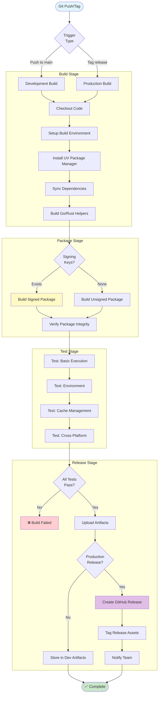

# CI/CD Integration

Automate FlavorPack packaging in your CI/CD pipelines.

## Pipeline Overview



## GitHub Actions


```yaml
# .github/workflows/package.yml
name: Build Package

on:
  push:
    branches: [main]
  release:
    types: [created]

jobs:
  build:
    strategy:
      matrix:
        include:
          - platform: linux_amd64
            os: ubuntu-latest
          - platform: darwin_arm64
            os: macos-latest

    runs-on: ${{ matrix.os }}

    steps:
      - uses: actions/checkout@v4

      - name: Set up Python
        uses: actions/setup-python@v5
        with:
          python-version: '3.11'

      - name: Install UV
        run: curl -LsSf https://astral.sh/uv/install.sh | sh

      - name: Install FlavorPack
        run: |
          # Note: FlavorPack is not yet on PyPI - install from source
          git clone https://github.com/provide-io/flavorpack.git
          cd flavorpack
          uv sync

      - name: Build Helpers
        run: |
          cd flavorpack
          make build-helpers

      - name: Package Application
        run: |
          flavor pack \
            --manifest pyproject.toml \
            --output dist/myapp-${{ matrix.platform }}.psp

      - name: Upload Artifact
        uses: actions/upload-artifact@v4
        with:
          name: myapp-${{ matrix.platform }}
          path: dist/myapp-${{ matrix.platform }}.psp

      - name: Upload to Release
        if: github.event_name == 'release'
        uses: actions/upload-release-asset@v1
        env:
          GITHUB_TOKEN: ${{ secrets.GITHUB_TOKEN }}
        with:
          upload_url: ${{ github.event.release.upload_url }}
          asset_path: dist/myapp-${{ matrix.platform }}.psp
          asset_name: myapp-${{ matrix.platform }}.psp
          asset_content_type: application/octet-stream
```


## GitLab CI

```yaml
# .gitlab-ci.yml
stages:
  - build
  - test
  - package
  - deploy

variables:
  PACKAGE_NAME: "myapp"

build:helpers:
  stage: build
  image: python:3.11
  script:
    # Note: FlavorPack is not yet on PyPI - install from source
    - git clone https://github.com/provide-io/flavorpack.git
    - cd flavorpack
    - pip install uv
    - uv sync
    - make build-helpers
  artifacts:
    paths:
      - flavorpack/dist/bin/
    expire_in: 1 hour

package:linux:
  stage: package
  image: python:3.11
  dependencies:
    - build:helpers
  script:
    - cd flavorpack
    - uv run flavor pack --manifest ../pyproject.toml --output ../${PACKAGE_NAME}-linux_amd64.psp
  artifacts:
    paths:
      - ${PACKAGE_NAME}-linux_amd64.psp

deploy:production:
  stage: deploy
  only:
    - main
  script:
    - scp ${PACKAGE_NAME}-linux_amd64.psp deploy@server:/opt/myapp/
    - ssh deploy@server 'systemctl restart myapp'
```

## CircleCI

```yaml
# .circleci/config.yml
version: 2.1

jobs:
  build-and-package:
    docker:
      - image: python:3.11
    steps:
      - checkout

      - run:
          name: Install FlavorPack
          command: |
            # Note: FlavorPack is not yet on PyPI - install from source
            git clone https://github.com/provide-io/flavorpack.git
            cd flavorpack
            pip install uv
            uv sync

      - run:
          name: Build Helpers
          command: |
            cd flavorpack
            make build-helpers

      - run:
          name: Package Application
          command: |
            cd flavorpack
            uv run flavor pack \
              --manifest ../pyproject.toml \
              --output ../myapp.psp

      - store_artifacts:
          path: myapp.psp

      - persist_to_workspace:
          root: .
          paths:
            - myapp.psp

workflows:
  version: 2
  build-deploy:
    jobs:
      - build-and-package
      - deploy:
          requires:
            - build-and-package
          filters:
            branches:
              only: main
```

## Best Practices

### 1. **Cache Dependencies**


```yaml
# GitHub Actions
- name: Cache UV
  uses: actions/cache@v3
  with:
    path: ~/.cache/uv
    key: ${{ runner.os }}-uv-${{ hashFiles('**/pyproject.toml') }}

- name: Cache Helpers
  uses: actions/cache@v3
  with:
    path: dist/bin
    key: ${{ runner.os }}-helpers-${{ hashFiles('src/flavor-go/**', 'src/flavor-rs/**') }}
```


### 2. **Verify Packages**

```yaml
- name: Verify Package
  run: |
    flavor verify myapp.psp
    flavor inspect myapp.psp
```

### 3. **Multi-Platform Matrix**

```yaml
strategy:
  matrix:
    include:
      - { os: ubuntu-latest, platform: linux_amd64 }
      - { os: macos-latest, platform: darwin_arm64 }
      - { os: macos-13, platform: darwin_amd64 }
      - { os: windows-latest, platform: windows_amd64 }
```

### 4. **Semantic Versioning**

```yaml
- name: Get Version
  id: version
  run: echo "VERSION=$(python -c 'import tomli; print(tomli.load(open(\"pyproject.toml\", \"rb\"))[\"project\"][\"version\"])')" >> $GITHUB_OUTPUT

- name: Package with Version
  run: |
    VERSION=$(cat VERSION)
    flavor pack \
      --manifest pyproject.toml \
      --output myapp-v${VERSION}.psp
```

### 5. **Security Scanning**

```yaml
- name: Scan Package
  run: |
    # Add your security scanner
    trivy fs myapp.psp
```

## Integration with Package Registries

### Upload to S3


```yaml
- name: Upload to S3
  run: |
    aws s3 cp myapp.psp s3://my-packages/myapp/myapp-${{ github.sha }}.psp
  env:
    AWS_ACCESS_KEY_ID: ${{ secrets.AWS_ACCESS_KEY_ID }}
    AWS_SECRET_ACCESS_KEY: ${{ secrets.AWS_SECRET_ACCESS_KEY }}
```


### Upload to Artifactory


```yaml
- name: Upload to Artifactory
  run: |
    curl -u ${{ secrets.ARTIFACTORY_USER }}:${{ secrets.ARTIFACTORY_PASSWORD }} \
      -T myapp.psp \
      "https://artifactory.company.com/artifactory/packages/myapp.psp"
```


## Complete Real-World Example

Here's a production-ready GitHub Actions workflow that builds, tests, and releases packages for multiple platforms with proper caching and error handling:


```yaml
# .github/workflows/release.yml
name: Build and Release FlavorPack Package

on:
  push:
    branches: [main]
    tags: ['v*']
  pull_request:
    branches: [main]

env:
  PACKAGE_NAME: myapp

jobs:
  build:
    name: Build ${{ matrix.platform }}
    runs-on: ${{ matrix.os }}

    strategy:
      fail-fast: false
      matrix:
        include:
          - os: ubuntu-latest
            platform: linux_amd64
            artifact_name: myapp-linux-amd64.psp
          - os: macos-latest
            platform: darwin_arm64
            artifact_name: myapp-macos-arm64.psp
          - os: macos-13
            platform: darwin_amd64
            artifact_name: myapp-macos-amd64.psp

    steps:
      - name: Checkout code
        uses: actions/checkout@v4

      - name: Set up Python
        uses: actions/setup-python@v5
        with:
          python-version: '3.11'

      - name: Install UV
        run: curl -LsSf https://astral.sh/uv/install.sh | sh

      - name: Add UV to PATH
        run: echo "$HOME/.cargo/bin" >> $GITHUB_PATH

      - name: Cache UV dependencies
        uses: actions/cache@v3
        with:
          path: ~/.cache/uv
          key: ${{ runner.os }}-uv-${{ hashFiles('**/pyproject.toml') }}
          restore-keys: |
            ${{ runner.os }}-uv-

      - name: Clone FlavorPack
        run: |
          git clone --depth 1 https://github.com/provide-io/flavorpack.git
          cd flavorpack
          uv sync

      - name: Cache FlavorPack Helpers
        id: cache-helpers
        uses: actions/cache@v3
        with:
          path: flavorpack/dist/bin
          key: ${{ runner.os }}-helpers-${{ hashFiles('flavorpack/src/flavor-go/**', 'flavorpack/src/flavor-rs/**') }}

      - name: Build Helpers
        if: steps.cache-helpers.outputs.cache-hit != 'true'
        run: |
          cd flavorpack
          make build-helpers

      - name: Build Package
        run: |
          cd flavorpack
          uv run flavor pack \
            --manifest ../pyproject.toml \
            --output ../dist/${{ matrix.artifact_name }}

      - name: Verify Package
        run: |
          cd flavorpack
          uv run flavor verify ../dist/${{ matrix.artifact_name }}
          uv run flavor inspect ../dist/${{ matrix.artifact_name }}

      - name: Test Package Execution
        run: |
          chmod +x dist/${{ matrix.artifact_name }}
          ./dist/${{ matrix.artifact_name }} --version || true

      - name: Upload Artifact
        uses: actions/upload-artifact@v4
        with:
          name: ${{ matrix.artifact_name }}
          path: dist/${{ matrix.artifact_name }}
          retention-days: 30

  release:
    name: Create Release
    needs: build
    if: startsWith(github.ref, 'refs/tags/v')
    runs-on: ubuntu-latest

    steps:
      - name: Download all artifacts
        uses: actions/download-artifact@v4
        with:
          path: artifacts

      - name: Display structure
        run: ls -R artifacts/

      - name: Create Release
        uses: softprops/action-gh-release@v1
        with:
          files: artifacts/**/*.psp
          draft: false
          prerelease: false
          generate_release_notes: true
        env:
          GITHUB_TOKEN: ${{ secrets.GITHUB_TOKEN }}

  notify:
    name: Notify Build Status
    needs: [build, release]
    if: always()
    runs-on: ubuntu-latest

    steps:
      - name: Check build status
        run: |
          if [ "${{ needs.build.result }}" == "success" ]; then
            echo "✅ Build successful"
          else
            echo "❌ Build failed"
            exit 1
          fi
```


### Usage

1. **Copy this workflow** to `.github/workflows/release.yml` in your repository
2. **Push to main branch** for development builds
3. **Create a tag** for releases:
   ```bash
   git tag v1.0.0
   git push origin v1.0.0
   ```

### Features

✅ **Multi-platform builds** (Linux, macOS Intel, macOS ARM)
✅ **Dependency caching** (UV and helpers)
✅ **Package verification** (automatic integrity checks)
✅ **Artifact uploads** (available for 30 days)
✅ **Automatic releases** (on version tags)
✅ **Build notifications** (success/failure status)

### Customization


```yaml
# Add Windows support
- os: windows-latest
  platform: windows_amd64
  artifact_name: myapp-windows-amd64.psp

# Add package signing
- name: Sign Package
  env:
    SIGNING_KEY: ${{ secrets.FLAVOR_PRIVATE_KEY }}
  run: |
    echo "$SIGNING_KEY" > private.key
    flavor pack \
      --manifest pyproject.toml \
      --private-key private.key \
      --output dist/myapp.psp

# Deploy to server
- name: Deploy to Production
  if: startsWith(github.ref, 'refs/tags/v')
  run: |
    scp dist/myapp.psp deploy@server:/opt/myapp/
    ssh deploy@server 'systemctl restart myapp'
```


## See Also

- **[Docker Integration](docker/)**
- **[Multi-Platform Builds](multi-platform/)**
