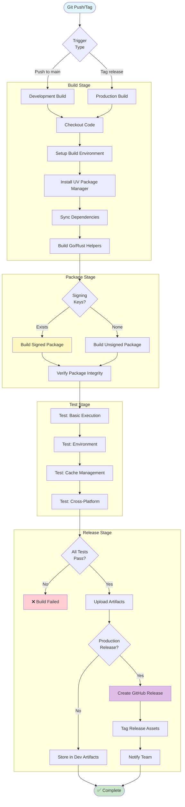

# CI/CD Integration

Automate FlavorPack packaging in your CI/CD pipelines.

## Pipeline Overview


```mermaid
flowchart TD
    Start([Git Push/Tag]) --> Trigger{Trigger<br/>Type}
    Trigger -->|Push to main| BuildDev[Development Build]
    Trigger -->|Tag release| BuildProd[Production Build]

    subgraph "Build Stage"
        BuildDev --> Checkout[Checkout Code]
        BuildProd --> Checkout
        Checkout --> SetupEnv[Setup Build Environment]
        SetupEnv --> InstallUV[Install UV Package Manager]
        InstallUV --> SyncDeps[Sync Dependencies]
        SyncDeps --> BuildHelpers[Build Go/Rust Helpers]
    end

    subgraph "Package Stage"
        BuildHelpers --> LoadKeys{Signing<br/>Keys?}
        LoadKeys -->|Exists| SignedBuild[Build Signed Package]
        LoadKeys -->|None| UnsignedBuild[Build Unsigned Package]

        SignedBuild --> VerifyPkg[Verify Package Integrity]
        UnsignedBuild --> VerifyPkg
    end

    subgraph "Test Stage"
        VerifyPkg --> TestBasic[Test: Basic Execution]
        TestBasic --> TestEnv[Test: Environment]
        TestEnv --> TestCache[Test: Cache Management]
        TestCache --> TestCrossPlat[Test: Cross-Platform]
    end

    subgraph "Release Stage"
        TestCrossPlat --> AllPass{All Tests<br/>Pass?}
        AllPass -->|No| Failed[❌ Build Failed]
        AllPass -->|Yes| UploadArtifact[Upload Artifacts]

        UploadArtifact --> IsProd{Production<br/>Release?}
        IsProd -->|No| StoreDev[Store in Dev Artifacts]
        IsProd -->|Yes| CreateRelease[Create GitHub Release]

        CreateRelease --> TagRelease[Tag Release Assets]
        TagRelease --> NotifyTeam[Notify Team]
    end

    StoreDev --> Done([✅ Complete])
    NotifyTeam --> Done

    style Start fill:#e1f5ff
    style Done fill:#c8e6c9
    style Failed fill:#ffcdd2
    style SignedBuild fill:#fff9c4
    style CreateRelease fill:#e1bee7
```

## GitHub Actions


```yaml
# .github/workflows/package.yml
name: Build Package

on:
  push:
    branches: [main]
  release:
    types: [created]

jobs:
  build:
    strategy:
      matrix:
        include:
          - platform: linux_amd64
            os: ubuntu-latest
          - platform: darwin_arm64
            os: macos-latest

    runs-on: ${{ matrix.os }}

    steps:
      - uses: actions/checkout@v4

      - name: Set up Python
        uses: actions/setup-python@v5
        with:
          python-version: '3.11'

      - name: Install UV
        run: curl -LsSf https://astral.sh/uv/install.sh | sh

      - name: Install FlavorPack
        run: uv pip install flavorpack

      - name: Build Helpers
        run: make build-helpers

      - name: Package Application
        run: |
          flavor pack \
            --manifest pyproject.toml \
            --output dist/myapp-${{ matrix.platform }}.psp

      - name: Upload Artifact
        uses: actions/upload-artifact@v4
        with:
          name: myapp-${{ matrix.platform }}
          path: dist/myapp-${{ matrix.platform }}.psp

      - name: Upload to Release
        if: github.event_name == 'release'
        uses: actions/upload-release-asset@v1
        env:
          GITHUB_TOKEN: ${{ secrets.GITHUB_TOKEN }}
        with:
          upload_url: ${{ github.event.release.upload_url }}
          asset_path: dist/myapp-${{ matrix.platform }}.psp
          asset_name: myapp-${{ matrix.platform }}.psp
          asset_content_type: application/octet-stream
```


## GitLab CI

```yaml
# .gitlab-ci.yml
stages:
  - build
  - test
  - package
  - deploy

variables:
  PACKAGE_NAME: "myapp"

build:helpers:
  stage: build
  image: python:3.11
  script:
    - pip install flavorpack
    - make build-helpers
  artifacts:
    paths:
      - dist/bin/
    expire_in: 1 hour

package:linux:
  stage: package
  image: python:3.11
  dependencies:
    - build:helpers
  script:
    - pip install flavorpack
    - flavor pack --manifest pyproject.toml --output ${PACKAGE_NAME}-linux_amd64.psp
  artifacts:
    paths:
      - ${PACKAGE_NAME}-linux_amd64.psp

deploy:production:
  stage: deploy
  only:
    - main
  script:
    - scp ${PACKAGE_NAME}-linux_amd64.psp deploy@server:/opt/myapp/
    - ssh deploy@server 'systemctl restart myapp'
```

## CircleCI

```yaml
# .circleci/config.yml
version: 2.1

jobs:
  build-and-package:
    docker:
      - image: python:3.11
    steps:
      - checkout

      - run:
          name: Install FlavorPack
          command: pip install flavorpack

      - run:
          name: Build Helpers
          command: make build-helpers

      - run:
          name: Package Application
          command: |
            flavor pack \
              --manifest pyproject.toml \
              --output myapp.psp

      - store_artifacts:
          path: myapp.psp

      - persist_to_workspace:
          root: .
          paths:
            - myapp.psp

workflows:
  version: 2
  build-deploy:
    jobs:
      - build-and-package
      - deploy:
          requires:
            - build-and-package
          filters:
            branches:
              only: main
```

## Best Practices

### 1. **Cache Dependencies**


```yaml
# GitHub Actions
- name: Cache UV
  uses: actions/cache@v3
  with:
    path: ~/.cache/uv
    key: ${{ runner.os }}-uv-${{ hashFiles('**/pyproject.toml') }}

- name: Cache Helpers
  uses: actions/cache@v3
  with:
    path: dist/bin
    key: ${{ runner.os }}-helpers-${{ hashFiles('src/flavor-go/**', 'src/flavor-rs/**') }}
```


### 2. **Verify Packages**

```yaml
- name: Verify Package
  run: |
    flavor verify myapp.psp
    flavor inspect myapp.psp
```

### 3. **Multi-Platform Matrix**

```yaml
strategy:
  matrix:
    include:
      - { os: ubuntu-latest, platform: linux_amd64 }
      - { os: macos-latest, platform: darwin_arm64 }
      - { os: macos-13, platform: darwin_amd64 }
      - { os: windows-latest, platform: windows_amd64 }
```

### 4. **Semantic Versioning**

```yaml
- name: Get Version
  id: version
  run: echo "VERSION=$(python -c 'import tomli; print(tomli.load(open(\"pyproject.toml\", \"rb\"))[\"project\"][\"version\"])')" >> $GITHUB_OUTPUT

- name: Package with Version
  run: |
    VERSION=$(cat VERSION)
    flavor pack \
      --manifest pyproject.toml \
      --output myapp-v${VERSION}.psp
```

### 5. **Security Scanning**

```yaml
- name: Scan Package
  run: |
    # Add your security scanner
    trivy fs myapp.psp
```

## Integration with Package Registries

### Upload to S3


```yaml
- name: Upload to S3
  run: |
    aws s3 cp myapp.psp s3://my-packages/myapp/myapp-${{ github.sha }}.psp
  env:
    AWS_ACCESS_KEY_ID: ${{ secrets.AWS_ACCESS_KEY_ID }}
    AWS_SECRET_ACCESS_KEY: ${{ secrets.AWS_SECRET_ACCESS_KEY }}
```


### Upload to Artifactory

```yaml
- name: Upload to Artifactory
  run: |
    curl -u ${{ secrets.ARTIFACTORY_USER }}:${{ secrets.ARTIFACTORY_PASSWORD }} \
      -T myapp.psp \
      "https://artifactory.company.com/artifactory/packages/myapp.psp"
```

## See Also

- **[Docker Integration](docker.md)**
- **[Multi-Platform Builds](multi-platform.md)**
