# FlavorPack Architecture

## Table of Contents

1. [Overview](#overview)
2. [System Architecture](#system-architecture)
3. [PSPF/2025 Format Specification](#pspf2025-format-specification)
4. [Multi-Language Components](#multi-language-components)
5. [Build Pipeline](#build-pipeline)
6. [Security Model](#security-model)
7. [Helper System](#helper-system)
8. [Testing Architecture](#testing-architecture)

## Overview

FlavorPack is a multi-language packaging system that implements the Progressive Secure Package Format (PSPF/2025). It creates self-extracting, polyglot archives that are simultaneously valid as:
- Native OS executables (Linux/macOS/Windows)
- PSPF packages with cryptographic integrity verification
- Python-installable packages with embedded dependencies

The system orchestrates Python, Go, and Rust components to create secure, portable software packages that can run anywhere without pre-installed runtimes.

## System Architecture

### High-Level Architecture


### Design Principles

1. **Language Agnostic**: Payloads can be any language/runtime
2. **Progressive Extraction**: Load only what's needed, when needed
3. **Secure by Default**: Ed25519 signatures on all packages
4. **Zero Dependencies**: Launchers are static binaries
5. **Cross-Platform**: Works on Linux, macOS, Windows
6. **Reproducible**: Deterministic builds with seed keys
7. **Testable**: Comprehensive test suite with Taster

## PSPF/2025 Format Specification

The PSPF format is a polyglot file that appears as:
1. **To the OS**: A normal executable binary
2. **To Flavor Pack**: A structured package with metadata and slots

### Binary Structure

```
Offset  Content
0       Launcher Binary (variable size)
N       Index Block (8192 bytes) - contains offsets and signature
N+8192  Metadata (gzipped JSON) - manifest and configuration
...     Slot Table (64 bytes per slot)
...     Slot 0 (tar.gz) - usually Python environment
...     Slot 1 (tar.gz) - usually application code
...     Slot N (tar.gz) - additional resources
EOF-8   Magic Footer (📦🪄 - exactly 8 bytes)
```

### Index Block Structure

The 8KB index block contains:
- Format version and magic number
- Offsets to metadata and slot sections
- Ed25519 public key (32 bytes)
- Package signature (64 bytes)
- Slot count and checksums

### Slot Operation Chains

PSPF/2025 uses **operation chains** to specify transformations applied to slot data. See [FEP-0001 Operation Chain System](../reference/spec/fep-0001-core-format-and-operation-chains/#5-operation-chain-system) for complete specification.

**Common Operation Chains:**
- `[]` (empty) - Raw uncompressed data
- `[OP_TAR]` (0x01) - Uncompressed TAR archive
- `[OP_GZIP]` (0x10) - GZIP compressed single file
- `[OP_TAR, OP_GZIP]` (0x1001) - TAR archive + GZIP compression (tar.gz)
- `[OP_TAR, OP_ZSTD]` (0x1B01) - TAR archive + Zstandard compression (tar.zst)

Each slot descriptor contains a 64-bit `operations` field encoding up to 8 operations applied in sequence.

## Multi-Language Components

### Python Orchestrator (`src/flavor/`)

**Primary Role**: High-level packaging logic and dependency management

Key modules:
- `packaging/orchestrator.py` - Main build coordinator
- `packaging/python_packager.py` - Python-specific packaging
- `packaging/orchestrator_helpers.py` - Helper utilities
- `psp/format_2025/builder.py` - PSPF package building logic
- `psp/format_2025/reader.py` - PSPF package reading/extraction

**Responsibilities**:
- Parse project manifests (pyproject.toml, JSON)
- Resolve and download dependencies
- Create virtual environments
- Coordinate with native builders
- Handle key generation and signing

### Go Helpers (`src/flavor-go/`)

**flavor-go-builder** - Creates PSPF packages
- Reads JSON manifests
- Assembles binary structure
- Calculates checksums
- Signs packages with Ed25519

**flavor-go-launcher** - Runtime executor
- Verifies package integrity
- Extracts slots to cache
- Manages workenv lifecycle
- Executes applications

### Rust Helpers (`src/flavor-rs/`)

**flavor-rs-builder** - Alternative builder implementation
- Memory-safe package creation
- Cross-platform support
- Deterministic builds

**flavor-rs-launcher** - Alternative launcher
- Fast extraction with memory-mapped I/O
- Minimal runtime overhead
- Signal handling and process management

## Build Pipeline

### Build Flow Diagram

```mermaid
flowchart TD
    Start([flavor pack]) --> ReadManifest[Read pyproject.toml]
    ReadManifest --> ValidateManifest{Validate<br/>Manifest}
    ValidateManifest -->|Invalid| Error1[Error: Invalid Manifest]
    ValidateManifest -->|Valid| CreateVenv[Create Virtual Environment]

    CreateVenv --> InstallDeps[Install Dependencies]
    InstallDeps --> CreateSlots[Create Slot Archives]

    subgraph "Slot Creation"
        CreateSlots --> Slot0[Slot 0: Python Runtime<br/>tar + gzip]
        CreateSlots --> Slot1[Slot 1: Application Code<br/>tar + gzip]
        CreateSlots --> SlotN[Slot N: Resources<br/>tar + gzip]
    end

    Slot0 --> SelectHelper{Select<br/>Helper}
    Slot1 --> SelectHelper
    SlotN --> SelectHelper

    SelectHelper -->|Available| GoBuilder[flavor-go-builder]
    SelectHelper -->|Available| RsBuilder[flavor-rs-builder]
    SelectHelper -->|None| Error2[Error: No Builder Found]

    GoBuilder --> BuildManifest[Generate Builder Manifest JSON]
    RsBuilder --> BuildManifest

    BuildManifest --> InvokeBuilder[Invoke Native Builder]
    InvokeBuilder --> AssemblePkg[Assemble PSPF Package]

    AssemblePkg --> SignPkg{Sign<br/>Package?}
    SignPkg -->|Yes| GenKeys[Generate/Load Ed25519 Keys]
    SignPkg -->|No| WriteOutput

    GenKeys --> Sign[Sign Package]
    Sign --> EmbedSig[Embed Signature in Index]
    EmbedSig --> WriteOutput[Write Output File]

    WriteOutput --> Verify{Verify<br/>Package?}
    Verify -->|Yes| RunVerify[Run flavor verify]
    Verify -->|No| Done
    RunVerify --> CheckSig{Signature<br/>Valid?}
    CheckSig -->|Yes| Done([✅ Package Built])
    CheckSig -->|No| Error3[Error: Verification Failed]

    Error1 --> Failed([❌ Build Failed])
    Error2 --> Failed
    Error3 --> Failed

    style Start fill:#e1f5ff
    style Done fill:#c8e6c9
    style Failed fill:#ffcdd2
    style GoBuilder fill:#fff9c4
    style RsBuilder fill:#ffe0b2
```



### Build Steps Detail

### Step 1: Manifest Processing
```python
manifest = read_manifest("pyproject.toml")
build_config = manifest.get("tool", {}).get("flavor", {})
```

### Step 2: Python Environment Creation
```python
python_packager = PythonPackager(...)
venv_path = python_packager.create_virtual_environment()
python_packager.install_dependencies(requirements)
```

### Step 3: Slot Creation
Each component is packaged into a tar.gz slot:
1. **Python Runtime Slot** - Python interpreter and standard library
2. **Dependencies Slot** - All pip packages as wheels
3. **Application Slot** - Application code
4. **Volatile Slots** - Temporary data removed after setup

### Step 4: Builder Invocation
```bash
flavor-go-builder \
  --manifest /tmp/builder-manifest.json \
  --launcher flavor-go-launcher \
  --output package.psp \
  --strip
```

### Step 5: Signature and Verification
```python
private_key, public_key = generate_ed25519_keypair(seed)
signature = sign_package(package_bytes, private_key)
index.signature = signature
index.public_key = public_key
```

## Security Model

### Cryptographic Integrity

Every PSPF package includes:
- **Ed25519 Signature**: Package metadata is signed
- **Public Key**: Embedded in the index block
- **Automatic Verification**: Launcher verifies on every run
- **Deterministic Keys**: Optional with `--key-seed` for reproducibility

### Trust Model
- Private key generated at build time
- Private key discarded after signing
- No external certificate authorities needed
- Tamper detection built into format

### Security Best Practices
- Never use `FLAVOR_VALIDATION=none` in production
- Always test packages with proper validation levels
- Use deterministic builds for audit trails
- Never commit keys or secrets

## Runtime Execution Flow

### Package Execution Diagram


## Helper System

### Helper Discovery

The `HelperManager` class finds helpers in order:

1. **Bundled with Package** - For PyPI distribution
   ```
   src/flavor/helpers/flavor-{go,rs}-{builder,launcher}-{platform}
   ```

2. **Local Development** - Built from source
   ```
   dist/bin/flavor-{go,rs}-{builder,launcher}-{platform}
   ```

3. **System Cache** - Downloaded or installed
   ```
   ~/.cache/flavor/helpers/flavor-{go,rs}-{builder,launcher}-{platform}
   ```

### Building Helpers

```bash
# Build all helpers for current platform
make build-helpers

# Or use the build script directly
./build.sh

# Helpers will be placed in dist/bin/ with platform suffix
# e.g., dist/bin/flavor-rs-launcher-darwin_arm64
```

### Helper Commands

```bash
# List available helpers
flavor helpers list

# Build helpers from source
flavor helpers build --lang all

# Test helper functionality
flavor helpers test
```

## Testing Architecture

### Test Categories

1. **Unit Tests**: Fast, isolated component tests
2. **Integration Tests**: Multi-component interaction tests
3. **Cross-Language Tests**: Go/Rust/Python interoperability
4. **Security Tests**: Cryptographic verification
5. **Stress Tests**: Large files, concurrent operations

### Taster Test Suite

The `tests/taster/` package provides comprehensive testing:
- `exit` - Test exit codes and error handling
- `file` - Test file I/O and workenv persistence
- `signals` - Test signal handling
- `env` - Verify environment variable processing
- `cache` - Manage Flavor Pack cache
- `crosslang` - Test cross-language compatibility
- `package` - Test self-packaging capabilities

### Test Execution

```bash
# Run all tests
make test

# Run specific categories
pytest -m unit
pytest -m integration
pytest -m taster

# Run with coverage
make test-cov

# Run cross-language compatibility tests
make validate-pspf
```

## Critical Implementation Notes

### Environment Variables

**Build-Time**:
- `FLAVOR_LAUNCHER_BIN` - Path to launcher binary
- `FLAVOR_WORKENV_BASE` - Base directory for workenv
- `FLAVOR_LOG_LEVEL` - Logging verbosity

**Runtime**:
- `FLAVOR_WORKENV` - Set by launcher when running as PSP
- `FLAVOR_VALIDATION` - Validation level (strict/standard/relaxed/minimal/none)
- `FLAVOR_LOG_LEVEL` - Runtime logging level

### Platform Detection

Platform detection is automatic based on:
- OS: `darwin`, `linux`, `windows`
- Architecture: `amd64`, `arm64`
- Format: `{os}_{arch}`

### Workenv Management

The work environment is:
- Cached between runs for performance
- Located at `~/.cache/flavor/workenv/{workenv_name}/`
- Persistent for non-volatile slots
- Cleaned up for volatile slots after setup

## Cache and Metadata Architecture

### Directory Structure

The cache uses a dual-directory structure to separate runtime metadata from package content:

```
~/.cache/flavor/workenv/
├── myapp/                    # Content directory (extracted package files)
│   ├── bin/                  # Binaries (Python, tools)
│   ├── lib/                  # Libraries
│   └── ...                   # Other package content
│
└── .myapp.pspf/              # Instance metadata directory (hidden)
    ├── instance/             # Persistent runtime metadata
    │   ├── extract/          # Extraction state
    │   │   ├── lock          # PID-based lock file
    │   │   └── complete      # Extraction completion marker
    │   ├── package.checksum  # Package integrity checksum
    │   └── index.json        # Extracted index metadata
    ├── package/              # Package metadata (replaced on update)
    │   └── psp.json          # Original package manifest
    └── tmp/                  # Temporary extraction directories
        └── {pid}/            # PID-specific extraction workspace
```

### Metadata Types

1. **Instance Metadata** (`.{workenv}.pspf/instance/`)
   - Persistent across package updates
   - Contains runtime state, checksums, locks
   - Survives package re-extraction
   - Used for cache validation

2. **Package Metadata** (`.{workenv}.pspf/package/`)
   - Extracted from the package itself
   - Replaced on each extraction
   - Contains original manifest and build info
   - Read-only after extraction

### Atomic Extraction Process

The extraction process ensures atomicity and prevents corruption:

1. **Lock Acquisition**
   - Check for existing lock file with PID
   - Verify if PID is still running (stale lock cleanup)
   - Create exclusive lock with current PID
   - If locked, wait for other process to complete

2. **Temporary Extraction**
   - Create temp directory: `.{workenv}.pspf/tmp/{pid}/`
   - Extract all slots to temp directory
   - Preserve file permissions and timestamps
   - Verify checksums during extraction

3. **Shebang Rewriting**
   - Scan `bin/` directory for Python scripts
   - Update shebangs from temp path to final path
   - Ensures scripts work after atomic move

4. **Atomic Replacement**
   - Use atomic rename operation to move temp to final
   - Falls back to remove + rename if cross-device
   - Ensures no partial extraction states

5. **Cleanup**
   - Remove temp directory
   - Save package checksum for validation
   - Write index metadata for inspection
   - Mark extraction as complete
   - Release lock file

### Concurrent Access Safety

- **PID-based locking**: Prevents multiple processes from extracting simultaneously
- **Stale lock cleanup**: Dead process locks are automatically removed
- **Wait mechanism**: Processes wait for ongoing extraction to complete
- **Atomic operations**: No partial states visible to other processes

### Cache Validation

The cache validation process uses checksums to ensure integrity:

1. Check if workenv directory exists
2. Verify extraction completion marker exists
3. Compare saved checksum with package checksum
4. Based on `FLAVOR_VALIDATION` level: warn/continue or fail
5. Strict validation: Fatal error on checksum mismatch
6. Re-extract if cache invalid or incomplete

## Key Design Decisions

1. **Multi-Language Architecture**: Combines strengths of Python (flexibility), Go/Rust (performance)
2. **Progressive Extraction**: Reduces startup time and disk usage
3. **Polyglot Format**: Single file works as both executable and package
4. **Built-in Security**: No external dependencies for verification
5. **Deterministic Builds**: Reproducible with seed keys
6. **Helper Independence**: Helpers are generic, data-driven executors

## Future Enhancements

1. **Windows Support**: Currently disabled due to UTF-8 issues
2. **Package Compression**: Additional compression algorithms
3. **Partial Updates**: Update slots without rebuilding entire package
4. **Network Loading**: Stream slots from remote sources
5. **Multi-Architecture**: Fat binaries with multiple architectures