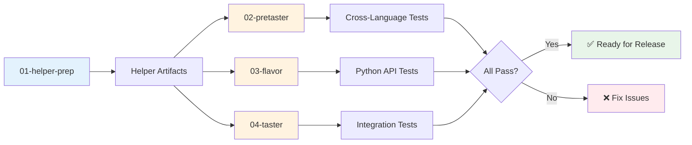

# CI/CD Pipeline

## Overview

The FlavorPack CI/CD system consists of multiple independent GitHub Actions workflows that build, test, and validate the entire system across multiple platforms and language implementations.

## Workflow Architecture



### Design Principles

1. **Manual Triggering**: All workflows use `workflow_dispatch` for manual control
2. **Script Delegation**: Complex logic lives in `.github/scripts/`, not in workflow YAML
3. **Artifact Sharing**: Workflows share build artifacts rather than calling each other
4. **Platform Coverage**: Multi-platform support (Linux, macOS, Windows*)

   *Windows temporarily disabled due to UTF-8 encoding issues

## Main Workflows

### 01 - Helper Prep

**File**: `.github/workflows/01-helper-prep.yml`

**Purpose**: Build and validate Go/Rust helpers for all platforms

**Key Features**:
- Builds helpers for multiple platforms using matrix strategy
- Creates versioned artifacts (e.g., `flavor-helpers-0.3.0-linux_amd64`)
- Validates helper functionality with basic tests
- Uploads artifacts for downstream workflows

**Platform Matrix**:
```json
[
  {"platform": "linux_amd64", "os": "ubuntu-24.04", "rust_target": "x86_64-unknown-linux-gnu"},
  {"platform": "linux_arm64", "os": "ubuntu-24.04", "rust_target": "aarch64-unknown-linux-gnu"},
  {"platform": "darwin_amd64", "os": "macos-13", "rust_target": "x86_64-apple-darwin"},
  {"platform": "darwin_arm64", "os": "macos-15", "rust_target": "aarch64-apple-darwin"}
]
```

### 02 - Pretaster Pipeline

**File**: `.github/workflows/02-pretaster-pipeline.yml`

**Purpose**: Validate cross-language compatibility

**Key Features**:
- Tests all builder/launcher combinations (4 total)
- Validates PSP execution and extraction
- Runs combination tests for cross-language support
- Provides honest validation output

**Test Matrix**:
- Go builder + Go launcher
- Go builder + Rust launcher  
- Rust builder + Go launcher
- Rust builder + Rust launcher

### 03 - Flavor Pipeline

**File**: `.github/workflows/03-flavor-pipeline.yml`

**Purpose**: Test the main FlavorPack Python package

**Key Features**:
- Runs comprehensive test suite with pytest
- Tests package building functionality
- Validates API consistency
- Generates coverage reports

### 04 - Taster Pipeline

**File**: `.github/workflows/04-taster-pipeline.yml`

**Purpose**: Test the Taster comprehensive test package

**Key Features**:
- Downloads helper artifacts from helper pipeline
- Builds Taster PSP package
- Runs comprehensive test suite
- Validates Python packaging functionality

### 05 - Code Quality

**File**: `.github/workflows/05-code-quality.yml`

**Purpose**: Enforce code quality standards

**Checks**:
- Python linting with ruff
- Type checking with mypy
- Code formatting validation
- Documentation standards

### 06 - Security Scan

**File**: `.github/workflows/06-security-scan.yml`

**Purpose**: Security vulnerability scanning

**Scans**:
- Dependency vulnerability checks
- SAST (Static Application Security Testing)
- Container image scanning (if applicable)
- Secret scanning

### 07 - Dependency Audit

**File**: `.github/workflows/07-dependency-audit.yml`

**Purpose**: Audit and validate dependencies

**Checks**:
- License compliance
- Outdated dependency detection
- Security advisory matching
- Dependency graph analysis

### 08 - License Compliance

**File**: `.github/workflows/08-license-compliance.yml`

**Purpose**: Ensure license compatibility

**Validates**:
- All dependencies have compatible licenses
- License headers in source files
- NOTICE file accuracy
- Third-party attribution

## Supporting Scripts

### Build Scripts

**`.github/scripts/build-platform-helpers.sh`**
- Builds Go and Rust helpers for a specific platform
- Handles cross-compilation settings
- Creates platform-specific binaries

**`.github/scripts/build-pretaster.sh`**
- Builds pretaster PSP package
- Creates test manifests dynamically
- Packages test scripts and configurations

**`.github/scripts/build-crosslang-tests.sh`**
- Creates test packages for cross-language validation
- Generates manifests for all builder/launcher combinations
- Uses PSPF/2025 nested format

### Test Scripts

**`.github/scripts/run-tests.sh`**
- Main test runner for Python tests
- Handles pytest configuration
- Collects test metadata and coverage

**`.github/scripts/run-pretaster-tests.sh`**
- Executes pretaster test suite
- Detects PSP execution context (FLAVOR_WORKENV)
- Provides honest validation output

**`.github/scripts/test-metadata.py`**
- Collects and formats test metadata
- Handles Windows UTF-8 encoding
- Generates JSON reports for CI

### Utility Scripts

**`.github/scripts/validate-psp-package.sh`**
- Validates PSP package structure
- Checks signature verification
- Tests basic execution

**`.github/scripts/get-version.sh`**
- Extracts version from pyproject.toml
- Used for artifact naming

## Artifact Management

### Naming Convention
```
flavor-helpers-{version}-{platform}
flavor-helpers-{version}-all
```

### Artifact Contents
- Platform-specific helper binaries
- Version-stamped for traceability
- Includes both builders and launchers

### Download Strategy
```yaml
- uses: dawidd6/action-download-artifact@v6
  with:
    workflow: 01-helper-prep.yml
    name: flavor-helpers-0.3.0-linux_amd64
    path: ./helpers
    workflow_conclusion: success
```

## Environment Variables

### Build-Time Variables
- `FLAVOR_LAUNCHER_BIN` - Path to launcher binary
- `FLAVOR_WORKENV_BASE` - Base directory for workenv resolution
- `FLAVOR_LOG_LEVEL` - Logging verbosity (trace, debug, info, warn, error)

### Runtime Variables
- `FLAVOR_WORKENV` - Set by launcher when running as PSP
- `PYTHONUTF8=1` - Windows UTF-8 support
- `PYTHONIOENCODING=utf-8` - Windows encoding fix

## Local Testing with Act

[Act](https://github.com/nektos/act) allows running GitHub Actions locally:

```bash
# Install act
brew install act  # macOS
# or
curl https://raw.githubusercontent.com/nektos/act/master/install.sh | bash

# Run a specific workflow
act -W .github/workflows/03-flavor-pipeline.yml

# Run with specific event
act workflow_dispatch -W .github/workflows/01-helper-prep.yml

# Run with secrets
act -s GITHUB_TOKEN=$GITHUB_TOKEN
```

## Windows Support

Currently disabled due to UTF-8 encoding issues with emoji characters in test scripts.

### Required Fixes for Re-enabling
1. Set UTF-8 environment variables before Python execution:
   ```bash
   export PYTHONUTF8=1
   export PYTHONIOENCODING=utf-8
   ```

2. Update test scripts to handle Windows paths correctly

3. Ensure all Python scripts use proper encoding declarations

## Testing Strategy

### Unit Tests
- Run via pytest in flavor pipeline
- Fast, isolated component tests
- Platform-independent

### Integration Tests
- Cross-language compatibility via pretaster
- PSP execution validation
- End-to-end packaging tests

### Validation Levels
1. **PSP Execution**: Proves package extracts and runs
2. **Command Validation**: Tests specific functionality
3. **Cross-Language**: Validates all combinations work

## Best Practices

### Workflow Design
1. Keep workflow YAML minimal
2. Delegate to scripts in `.github/scripts/`
3. Use matrix strategies for multi-platform builds
4. Always use manual triggers (`workflow_dispatch`)

### Error Handling
1. Provide clear error messages
2. Use exit codes consistently
3. Log detailed information for debugging
4. Fail fast on critical errors

### Security
1. Use deterministic builds with `--key-seed`
2. Verify signatures in all tests
3. Never commit secrets or keys
4. Use GitHub Actions secrets for sensitive data

## Troubleshooting

### Common Issues

**Helper artifacts not found**
- Ensure helper pipeline ran successfully
- Check artifact names match expected pattern
- Verify workflow_conclusion is "success"

**Windows encoding errors**
- Set UTF-8 environment variables
- Check for emoji characters in scripts
- Use proper encoding declarations

**PSP execution fails**
- Verify helpers are built correctly
- Check manifest format (must be nested PSPF/2025)
- Ensure launcher binary is executable

### Debug Techniques

1. **Enable debug logging**:
   ```yaml
   env:
     FLAVOR_LOG_LEVEL: debug
   ```

2. **Check artifact contents**:
   ```bash
   unzip -l artifact.zip
   ```

3. **Validate manifest structure**:
   ```bash
   jq . manifest.json
   ```

4. **Test locally before CI**:
   ```bash
   .github/scripts/build-platform-helpers.sh darwin_arm64
   ```

## Future Improvements

1. **Re-enable Windows Support**: Fix UTF-8 encoding issues
2. **Parallel Test Execution**: Run platform tests concurrently
3. **Caching Strategy**: Cache built helpers between runs
4. **Performance Metrics**: Add timing and size metrics
5. **Automated Releases**: Create releases from successful builds

## Related Documentation

- [Contributing Guide](contributing/)
- [Testing Guide](testing/index/)
- [Architecture](architecture/)
- [Release Process](release/)