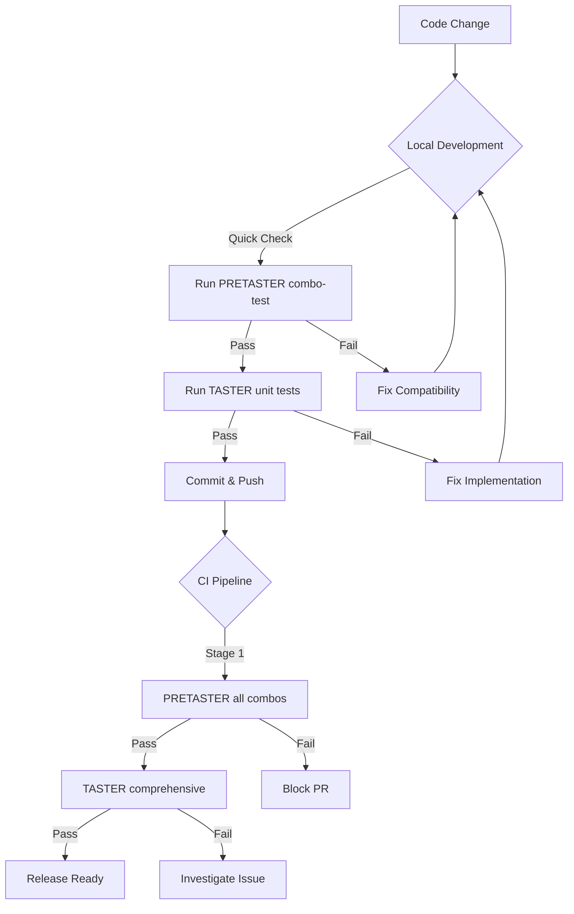

# TASTER vs PRETASTER: Testing Framework Comparison

FlavorPack uses two complementary testing frameworks to ensure comprehensive validation of PSPF packages across all languages and platforms.

## Quick Comparison

| Feature | TASTER | PRETASTER |
|---------|--------|-----------|
| **Type** | Python-based comprehensive test suite | Shell-based cross-language validation |
| **Language** | Python 3.11+ with pytest | Bash scripts |
| **Primary Purpose** | Property testing, integration testing, security validation | Builder/launcher compatibility testing |
| **Test Scope** | Format validation, I/O pipelines, signal handling, memory-mapped I/O, metadata inspection | Package creation and execution across language combinations |
| **Use Cases** | Development, debugging, comprehensive validation | CI/CD, quick compatibility checks, cross-language verification |
| **Test Execution** | `pytest` with markers and property-based testing | `make` targets and shell scripts |
| **Package Format** | Self-contained PSPF package with Python runtime | Simple shell scripts packaged as PSPF |
| **Dependencies** | FlavorPack, pytest, hypothesis | FlavorPack helpers (go/rust binaries) |
| **Speed** | Slower but thorough (property testing, edge cases) | Fast (focused compatibility checks) |
| **When to Use** | Feature development, debugging issues, security testing | PR validation, release testing, quick sanity checks |

---

## TASTER: Comprehensive Python Testing Framework

### Overview

**Taster** is a sophisticated Python-based testing framework packaged as a self-contained PSPF package. It serves as both a testing tool and a reference implementation demonstrating all FlavorPack capabilities.

### Key Features

1. **Cross-Language Compatibility Testing**
   - Tests Python, Go, and Rust implementation interactions
   - Validates builder/launcher communication
   - Ensures consistent behavior across language boundaries

2. **PSPF Format Validation**
   - Binary format correctness
   - Slot descriptor validation
   - Operation chain processing
   - Metadata integrity verification

3. **Property-Based Testing**
   - Uses Hypothesis framework for edge case discovery
   - Generates test inputs automatically
   - Finds subtle bugs through randomized testing

4. **Runtime Environment Testing**
   - Environment variable filtering (`unset`, `pass`, `set`, `map`)
   - Runtime configuration validation
   - Process isolation verification

5. **I/O Pipeline Validation**
   - Data transformation correctness
   - Corruption detection
   - Memory-mapped I/O efficiency

6. **Signal Handling & Process Management**
   - Graceful shutdown testing
   - Interrupt handling
   - Child process cleanup

### Test Organization

```bash
tests/taster/
├── src/taster/          # Taster implementation
│   ├── commands/        # Test commands
│   ├── lib/             # Shared libraries
│   └── cli.py           # Command-line interface
├── tests/               # pytest test suite
│   ├── test_*.py        # Test modules
│   └── conftest.py      # pytest configuration
└── pyproject.toml       # Package manifest
```

### Running TASTER Tests

```bash
# All tests
pytest tests/taster/tests/ -v

# Specific test categories
pytest -m cross_language      # Cross-language tests
pytest -m hypothesis          # Property-based tests
pytest -m integration         # Integration tests
pytest -m stress              # Performance tests

# With coverage
pytest --cov=src --cov-report=term-missing

# Run packaged taster commands
./tests/taster/dist/taster.psp env         # Environment testing
./tests/taster/dist/taster.psp verify      # Package verification
./tests/taster/dist/taster.psp crosslang   # Cross-language tests
```

### When to Use TASTER

✅ **Use TASTER when:**
- Developing new FlavorPack features
- Debugging package format issues
- Testing environment variable processing
- Validating I/O pipelines
- Performing security validation
- Finding edge cases with property-based testing
- Testing signal handling and process management

❌ **Don't use TASTER when:**
- You need quick builder/launcher compatibility checks (use PRETASTER)
- Running in minimal CI environments without Python
- Testing only binary format compatibility

---

## PRETASTER: Fast Cross-Language Validation

### Overview

**Pretaster** is a lightweight shell-based testing framework focused on validating that all combinations of builders and launchers work together correctly. It's designed for speed and simplicity.

### Key Features

1. **Builder/Launcher Combination Testing**
   - Tests all 4 valid combinations:
     - Python builder + Go launcher
     - Python builder + Rust launcher
     - Go builder + Go launcher
     - Rust builder + Rust launcher

2. **Quick Sanity Checks**
   - Package creation validation
   - Basic execution testing
   - Exit code verification
   - Simple I/O testing

3. **Minimal Dependencies**
   - Only requires shell and FlavorPack helpers
   - No Python runtime needed for execution
   - Fast test execution

4. **CI/CD Optimized**
   - Simple pass/fail output
   - Fast feedback loop
   - Easy integration with CI pipelines

### Test Organization

```bash
tests/pretaster/
├── configs/             # Manifest JSON files
│   ├── test-echo.json   # Simple echo test
│   ├── test-shell.json  # Shell script test
│   └── test-env.json    # Environment test
├── scripts/             # Test scripts
│   ├── echo_test.py     # Python echo
│   └── simple_test.sh   # Shell script
├── tests/               # Test runners
│   ├── combination-tests.sh        # All combos
│   ├── direct-execution-tests.sh   # Execution tests
│   └── test-pretaster.sh           # Core tests
└── Makefile            # Build and test targets
```

### Running PRETASTER Tests

```bash
# Quick test - pretaster package only
make -C tests/pretaster quick

# All builder/launcher combinations
make -C tests/pretaster combo-test

# Build all test packages
make -C tests/pretaster package-all

# Run all tests
make -C tests/pretaster test

# Execute test packages directly
./tests/pretaster/dist/echo-test.psp "Hello World"
./tests/pretaster/dist/shell-test.psp
```

### Combination Testing

PRETASTER systematically tests these combinations:

| Builder | Launcher | Status | Notes |
|---------|----------|--------|-------|
| Python | Go | ✅ Supported | Most common combination |
| Python | Rust | ✅ Supported | Production-ready |
| Go | Go | ✅ Supported | Native Go toolchain |
| Rust | Rust | ✅ Supported | Native Rust toolchain |

### When to Use PRETASTER

✅ **Use PRETASTER when:**
- Validating PR changes don't break compatibility
- Running CI/CD pipelines
- Quick sanity checks after code changes
- Testing new helper binary versions
- Verifying cross-platform builds
- Release validation

❌ **Don't use PRETASTER when:**
- You need detailed format validation (use TASTER)
- Testing complex features like environment filtering
- Debugging subtle package format issues
- Running property-based tests

---

## Decision Matrix

### Which Framework Should I Use?

| Scenario | Framework | Reasoning |
|----------|-----------|-----------|
| **PR validation** | PRETASTER | Fast, focused on compatibility |
| **Debugging format issues** | TASTER | Detailed validation and inspection |
| **Release testing** | BOTH | PRETASTER for compatibility, TASTER for completeness |
| **Feature development** | TASTER | Comprehensive test coverage |
| **CI/CD pipeline** | PRETASTER first, then TASTER | Fast feedback, then thorough validation |
| **Security testing** | TASTER | Property-based testing finds edge cases |
| **Cross-platform builds** | PRETASTER | Quick verification across platforms |
| **Environment variable testing** | TASTER | Detailed environment processing tests |

---

## Integration Strategy

### Recommended Testing Workflow



### Local Development

```bash
# 1. Quick compatibility check (1-2 minutes)
make -C tests/pretaster combo-test

# 2. If passed, run relevant TASTER tests
pytest tests/taster/tests/ -v -k "test_relevant_feature"

# 3. If both pass, run full TASTER suite
pytest tests/taster/tests/ -v
```

### CI/CD Pipeline

```yaml
# .github/workflows/test.yml
jobs:
  pretaster:
    name: "Fast Compatibility"
    steps:
      - run: make -C tests/pretaster combo-test
    timeout-minutes: 5

  taster:
    name: "Comprehensive Testing"
    needs: pretaster  # Only run if pretaster passes
    steps:
      - run: pytest tests/taster/tests/ -v
    timeout-minutes: 30
```

---

## Common Patterns

### Testing a New Feature

1. **Write TASTER tests first** - Define expected behavior
2. **Implement the feature** - Make tests pass
3. **Run PRETASTER** - Ensure compatibility wasn't broken
4. **Run full TASTER suite** - Verify no regressions

### Debugging a Failed Package

1. **Run PRETASTER** - Identify which builder/launcher combo fails
2. **Switch to TASTER** - Use detailed validation commands
3. **Use inspection tools** - `taster verify`, `taster inspect`
4. **Fix and verify** - Run both frameworks to confirm fix

### Release Validation

```bash
# 1. Build all helpers
make build-helpers

# 2. Quick compatibility check
make -C tests/pretaster combo-test

# 3. Comprehensive validation
pytest tests/taster/tests/ -v --cov

# 4. Build documentation examples
# (Verify all examples still work)
```

---

## Summary

| Aspect | TASTER | PRETASTER |
|--------|--------|-----------|
| **Speed** | Slower (minutes) | Fast (seconds) |
| **Depth** | Comprehensive | Focused |
| **Language** | Python | Shell |
| **Best For** | Development & Debugging | CI/CD & Compatibility |
| **Dependencies** | Many (pytest, hypothesis) | Minimal (bash, helpers) |
| **Output** | Detailed reports | Pass/fail |

**Key Insight**: Use **PRETASTER** for fast feedback on compatibility, and **TASTER** for thorough validation and debugging. Both are essential for maintaining FlavorPack quality.

---

## Further Reading

- [TASTER README](https://github.com/provide-io/flavorpack/tree/develop/tests/taster) - Complete TASTER documentation
- [PRETASTER README](https://github.com/provide-io/flavorpack/tree/develop/tests/pretaster) - Complete PRETASTER documentation
- [Testing Guide](./index/) - General testing strategy
- [Cross-Language Testing](./cross-language/) - Cross-language test details
