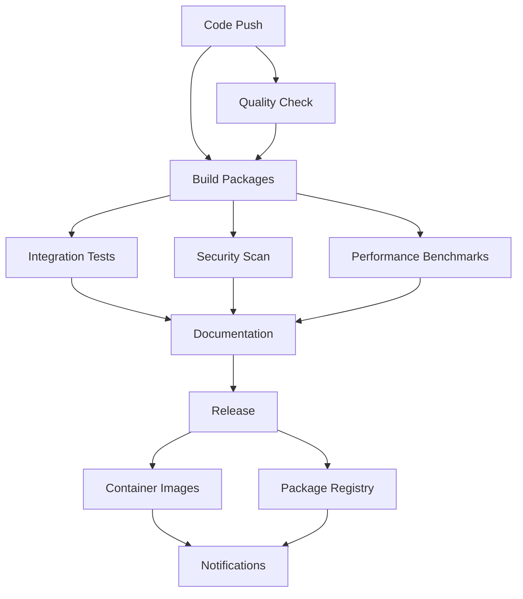

# Multi-Platform CI/CD Example

A comprehensive example demonstrating professional CI/CD workflows for Flavor packages with multi-platform builds, automated testing, security scanning, and release automation.

## 🎯 What This Example Shows

- ✅ **Multi-platform builds** for Linux (x86_64, ARM64), macOS (Intel, Apple Silicon), Windows
- ✅ **Comprehensive testing** including unit tests, integration tests, and performance benchmarks
- ✅ **Security-first approach** with vulnerability scanning, code signing, and SLSA attestations
- ✅ **Automated releases** with semantic versioning and release notes generation
- ✅ **Container image builds** with multi-arch support and attestations
- ✅ **Package registry** updates and documentation generation
- ✅ **Production-ready workflows** with proper error handling and notifications

**Perfect for:** Production teams deploying Flavor packages at scale

## 📁 Project Structure

```
multi-platform/
├── README.md                    # This file
├── .github/
│   └── workflows/
│       ├── flavor-build.yml      # Main CI/CD pipeline
│       ├── release.yml         # Release automation
│       ├── security.yml        # Security scanning
│       └── nightly.yml         # Nightly builds
├── src/                        # Provider source code
│   ├── main.py                 # Provider entry point
│   └── ...                     # Provider implementation
├── tests/                      # Test suites
│   ├── unit/                   # Unit tests
│   ├── integration/            # Integration tests
│   └── performance/            # Performance benchmarks
├── docker/                     # Container configurations
│   ├── Dockerfile              # Production container
│   └── Dockerfile.dev          # Development container
├── scripts/                    # Utility scripts
│   ├── build-local.sh          # Local build script
│   ├── test-all.sh             # Run all tests
│   └── release-local.sh        # Local release testing
├── terraform-examples/         # Terraform configurations
│   ├── basic/                  # Basic usage
│   └── production/             # Production setup
├── docs/                       # Additional documentation
│   ├── ARCHITECTURE.md         # CI/CD architecture
│   ├── SECURITY.md             # Security practices
│   └── TROUBLESHOOTING.md      # Common issues
├── requirements.txt            # Python dependencies
├── requirements-dev.txt        # Development dependencies
├── pyproject.toml             # Python project config
├── .pre-commit-config.yaml    # Pre-commit hooks
└── VERSION                     # Version file
```

## 🚀 Quick Start

### Step 1: Fork and Configure Repository

```bash
# Fork this repository to your organization
# Configure repository secrets in Settings > Secrets and variables > Actions:

# Required secrets:
PSPF_PRIVATE_KEY        # Flavor signing private key
PSPF_PUBLIC_KEY         # Flavor signing public key (matching private key)
PSPF_RELEASE_PRIVATE_KEY # Release signing private key
PSPF_RELEASE_PUBLIC_KEY  # Release signing public key
CODECOV_TOKEN           # Codecov API token (optional)
```

### Step 2: Enable Workflows

```bash
# Navigate to Actions tab in GitHub
# Enable the following workflows:
# - Flavor Multi-Platform Build (flavor-build.yml)
# - Flavor Release (release.yml)
# - Security Scanning (security.yml)
# - Nightly Builds (nightly.yml)
```

### Step 3: Create First Release

```bash
# Create and push a version tag
git tag v1.0.0
git push origin v1.0.0

# Or create release through GitHub UI
# Go to Releases > Create a new release > Choose tag v1.0.0
```

### Step 4: Monitor Build Progress

```bash
# Watch the Actions tab for build progress
# Builds will create:
# - Multi-platform binaries
# - Container images
# - Security attestations
# - Performance reports
# - Release documentation
```

## 🏗️ CI/CD Architecture

### Pipeline Overview

The CI/CD system consists of multiple interconnected workflows:



### Workflow Details

#### 1. **Quality Check Job**
- **Code formatting** with Black and isort
- **Linting** with flake8 and pylint
- **Type checking** with mypy
- **Security scanning** with bandit and safety
- **Unit tests** with pytest and coverage reporting
- **Artifact upload** for test results and reports

#### 2. **Build Packages Job**
- **Multi-platform matrix** builds across 5 platforms
- **Cross-compilation** setup with QEMU for ARM builds
- **Flavor package creation** with optimized settings
- **Package verification** and functional testing
- **Cryptographic signing** with cosign
- **SLSA provenance** generation for supply chain security
- **Performance metrics** collection

#### 3. **Integration Tests Job**
- **Terraform integration** testing on multiple platforms
- **Real-world scenarios** with actual terraform configurations
- **Provider functionality** validation
- **Cross-platform compatibility** verification

#### 4. **Security Scan Job**
- **Vulnerability scanning** with Trivy
- **SLSA provenance verification**
- **Compliance reporting** generation
- **Security posture assessment**

#### 5. **Performance Benchmarks Job**
- **Startup time** measurements with hyperfine
- **Memory usage** profiling
- **Command execution** performance testing
- **Historical trend** analysis

#### 6. **Documentation Job**
- **Release notes** auto-generation
- **Package information** compilation
- **Installation guides** creation
- **API documentation** updates

## 🔒 Security Features

### Code Signing and Attestations

Every package includes multiple security layers:

**Flavor Native Signing**: Cryptographic signatures using ECDSA P-256
```bash
# Verify Flavor signature
flavor-packager verify terraform-provider-example_v1.0.0_linux-x86_64
```

**Cosign Signatures**: Industry-standard keyless signing
```bash
# Verify cosign signature
cosign verify-blob terraform-provider-example_v1.0.0_linux-x86_64 \
  --signature terraform-provider-example_v1.0.0_linux-x86_64.cosign.sig \
  --certificate terraform-provider-example_v1.0.0_linux-x86_64.cosign.crt
```

**SLSA Attestations**: Supply chain provenance
```json
{
  "_type": "https://in-toto.io/Statement/v0.1",
  "subject": [
    {
      "name": "terraform-provider-example_v1.0.0_linux-x86_64",
      "digest": {
        "sha256": "a1b2c3d4e5f6..."
      }
    }
  ],
  "predicateType": "https://slsa.dev/provenance/v0.2",
  "predicate": {
    "builder": {
      "id": "https://github.com/your-org/repo/actions/runs/123456"
    }
  }
}
```

### Vulnerability Scanning

Continuous security monitoring with multiple tools:

**Trivy Scanner**: Container and filesystem vulnerability scanning
**Bandit**: Python security issue detection
**Safety**: Python dependency vulnerability checking
**CodeQL**: Semantic code analysis for security issues

### Secret Management

Secure handling of sensitive data:

**GitHub Secrets**: Encrypted secret storage
**Short-lived Tokens**: Temporary authentication where possible
**Principle of Least Privilege**: Minimal required permissions
**Audit Logging**: Full traceability of secret access

## 📊 Performance Monitoring

### Automated Benchmarking

Every build includes comprehensive performance testing:

**Startup Time Benchmarking**:
```bash
# Measure startup performance across platforms
hyperfine --warmup 3 --min-runs 10 'terraform-provider-example --version'

# Results tracked over time:
# Platform    | Mean Time    | Std Dev
# linux-x86_64   | 245ms ± 12ms | ±4.9%
# darwin-aarch64 | 198ms ± 8ms  | ±4.0%
# windows-x86_64 | 312ms ± 18ms | ±5.8%
```

**Memory Usage Profiling**:
```bash
# Memory consumption analysis
/usr/bin/time -v terraform-provider-example --help

# Tracked metrics:
# - Peak memory usage
# - Page faults
# - Context switches
```

**Package Size Optimization**:
```bash
# Size comparison across platforms and versions
Platform      | v1.0.0  | v1.1.0  | Change
linux-x86_64  | 45.2MB  | 43.8MB  | -3.1%
darwin-aarch64| 42.1MB  | 41.3MB  | -1.9%
windows-x86_64| 48.7MB  | 47.2MB  | -3.1%
```

### Historical Tracking

Performance metrics are stored and trended over time:

- **Regression Detection**: Automated alerts for performance degradation
- **Optimization Validation**: Confirm improvements in new releases
- **Platform Comparison**: Identify platform-specific performance characteristics
- **Release Decision Support**: Performance-based go/no-go decisions

## 🐳 Container Images

### Multi-Architecture Support

Automated container builds for multiple architectures:

```bash
# Pull multi-arch image
docker pull ghcr.io/your-org/repo:v1.0.0

# Verify architecture support
docker manifest inspect ghcr.io/your-org/repo:v1.0.0
```

### Container Security

**Minimal Base Images**: Alpine Linux for small attack surface
**Non-root Execution**: Dedicated user account for security
**Health Checks**: Built-in container health monitoring
**Vulnerability Scanning**: Automated container security scanning

### Usage Examples

```bash
# Run provider in container
docker run --rm ghcr.io/your-org/repo:v1.0.0 --version

# Use in CI/CD pipelines
docker run --rm -v $(pwd):/workspace ghcr.io/your-org/repo:v1.0.0 --schema

# Development environment
docker run -it --rm ghcr.io/your-org/repo:dev bash
```

## 📦 Release Automation

### Semantic Versioning

Automated version management with semantic versioning:

**Version Patterns**:
- `v1.0.0` - Major release
- `v1.0.1` - Patch release  
- `v1.1.0-beta.1` - Pre-release
- `v1.1.0-alpha.1` - Alpha release

**Automated Workflows**:
- **Tag-triggered releases**: Create release when version tag is pushed
- **Manual releases**: Trigger releases through GitHub UI
- **Draft releases**: Create draft releases for review
- **Pre-releases**: Mark alpha/beta releases appropriately

### Release Artifacts

Every release includes comprehensive artifacts:

**Binary Packages**: Multi-platform executables with all metadata
**Container Images**: Multi-arch container images with attestations
**Documentation**: Auto-generated release notes and installation guides
**Security Attestations**: SLSA provenance and signature files
**Package Index**: Machine-readable package metadata

### Release Process

```bash
# 1. Create and push version tag
git tag v1.0.0
git push origin v1.0.0

# 2. GitHub Actions automatically:
# - Builds all platform packages
# - Runs comprehensive testing
# - Performs security scanning
# - Creates container images
# - Generates documentation
# - Publishes release

# 3. Stakeholders receive notifications with:
# - Release summary
# - Download links
# - Verification instructions
# - Breaking changes (if any)
```

## 🔧 Local Development

### Development Setup

```bash
# Clone repository
git clone https://github.com/your-org/repo.git
cd repo

# Install development dependencies
pip install -r requirements-dev.txt

# Install pre-commit hooks
pre-commit install

# Run local build
./scripts/build-local.sh

# Run all tests
./scripts/test-all.sh
```

### Testing Workflows Locally

**Act**: Run GitHub Actions locally
```bash
# Install act
curl https://raw.githubusercontent.com/nektos/act/master/install.sh | bash

# Run quality check workflow
act -j quality-check

# Run build workflow for specific platform
act -j build-packages -P ubuntu-latest=nektos/act-environments-ubuntu:18.04
```

**Local Release Testing**:
```bash
# Test release process locally
./scripts/release-local.sh v1.0.0-test
```

### Development Workflow

```bash
# Create feature branch
git checkout -b feature/new-feature

# Make changes and test locally
./scripts/test-all.sh

# Commit with conventional commits
git commit -m "feat: add new resource type"

# Push and create PR
git push -u origin feature/new-feature
# Create PR through GitHub UI

# Merge triggers full CI/CD pipeline
```

## 📈 Metrics and Monitoring

### Build Metrics

**Success Rate**: Track build success rate over time
**Build Duration**: Monitor CI/CD pipeline performance
**Test Coverage**: Ensure comprehensive test coverage
**Security Posture**: Track vulnerability findings and resolution

### Usage Analytics

**Download Statistics**: Monitor package adoption
**Platform Distribution**: Understand platform preferences
**Version Adoption**: Track version upgrade patterns
**Container Pulls**: Monitor container image usage

### Performance Trends

**Startup Time**: Track performance across versions
**Package Size**: Monitor binary size optimization
**Memory Usage**: Profile memory consumption trends
**Build Speed**: Optimize CI/CD pipeline performance

## 🆘 Troubleshooting

### Common CI/CD Issues

**Build Failures**:
```bash
# Check workflow logs in GitHub Actions
# Common issues:
# - Missing secrets configuration
# - Flavor tools installation failures
# - Cross-compilation environment issues
# - Test failures in different platforms
```

**Release Issues**:
```bash
# Verify tag format
git tag --list | grep v1.0.0

# Check release workflow permissions
# Repository Settings > Actions > General > Workflow permissions

# Validate signing keys
echo "$PSPF_PRIVATE_KEY" | flavor-packager verify-key
```

**Security Scan Failures**:
```bash
# Review Trivy scan results
# Check for new vulnerabilities in dependencies
# Update dependencies if needed:
pip install --upgrade -r requirements.txt
```

### Performance Issues

**Slow Builds**:
```bash
# Enable build caching
# Optimize Docker layer caching
# Use self-hosted runners for better performance
# Parallelize independent jobs
```

**Large Package Sizes**:
```bash
# Review dependencies
pip list --format=columns
# Remove unused dependencies
# Enable compression in Flavor build
# Use smaller Python runtime if possible
```

### Local Development Issues

**Pre-commit Hook Failures**:
```bash
# Fix formatting issues
black src/ tests/
isort src/ tests/

# Update hook versions
pre-commit autoupdate
```

**Test Failures**:
```bash
# Run specific test suite
pytest tests/unit/ -v
pytest tests/integration/ -v

# Debug with verbose output
pytest -v -s tests/test_specific.py::test_function
```

## 📚 Learning Outcomes

After implementing this CI/CD example, you'll understand:

### **Advanced CI/CD Patterns**
- Multi-platform build matrices
- Security-first development practices
- Automated testing strategies
- Performance monitoring and optimization

### **Production Deployment**
- Release automation and versioning
- Container image management
- Package registry operations
- Stakeholder communication

### **Security and Compliance**
- Code signing and attestations
- Vulnerability management
- Supply chain security
- Compliance reporting

### **DevOps Excellence**
- Infrastructure as code
- Monitoring and observability
- Incident response
- Continuous improvement

## 🎯 Production Checklist

Before deploying this CI/CD system:

- [ ] **Security**: Configure all required secrets
- [ ] **Access**: Set up proper GitHub permissions
- [ ] **Notifications**: Configure Slack/email notifications
- [ ] **Monitoring**: Set up external monitoring for releases
- [ ] **Documentation**: Customize for your specific provider
- [ ] **Testing**: Run full pipeline in staging environment
- [ ] **Rollback**: Prepare rollback procedures
- [ ] **Training**: Train team on new processes

---

**Ready for production CI/CD?** 👉 [Security Guide](./docs/SECURITY.md) | [Architecture Details](./docs/ARCHITECTURE.md) | [Examples Overview](../README.md)