# FlavorPack Architecture

## System Overview

FlavorPack is a cross-language packaging system designed to work seamlessly with other provide.io tools. The architecture consists of three main layers: the Python orchestrator, native helpers (Go/Rust), and the PSPF package format.

## Component Architecture

```mermaid
graph TB
    subgraph "FlavorPack Components"
        direction TB
        PY[Python Orchestrator<br/>📦 Build Coordinator]
        GO[Go Helper<br/>🐹 Builder & Launcher]
        RS[Rust Helper<br/>🦀 Builder & Launcher]
    end

    subgraph "PSPF Package (.psp)"
        direction TB
        L[Native Launcher<br/>Platform-specific binary]
        I[Index Block<br/>8KB metadata + signature]
        M[Metadata<br/>Gzipped JSON manifest]
        S[Slots<br/>Tar.gz archives]
        F[Magic Footer<br/>📦🪄]
    end

    subgraph "Applications"
        APP1[CLI Tools]
        APP2[Web Services]
        APP3[Data Pipelines]
        APP4[Terraform Providers]
    end

    APP1 --> PY
    APP2 --> PY
    APP3 --> PY
    APP4 --> PY

    PY --> GO
    PY --> RS
    GO --> L
    RS --> L

    L --> I
    I --> M
    M --> S
    S --> F

    classDef orchestrator fill:#e1f5fe,stroke:#01579b,stroke-width:2px
    classDef helpers fill:#f3e5f5,stroke:#4a148c,stroke-width:2px
    classDef pspf fill:#e8f5e8,stroke:#1b5e20,stroke-width:2px
    classDef apps fill:#fff3e0,stroke:#e65100,stroke-width:2px

    class PY orchestrator
    class GO,RS helpers
    class L,I,M,S,F pspf
    class APP1,APP2,APP3,APP4 apps
```



## Progressive Secure Package Format (PSPF/2025)

The Progressive Secure Package Format is a polyglot file that works as both an OS executable and a structured package. Each `.psp` file is structured with a native launcher at the start, followed by package metadata and compressed data slots, ending with a cryptographically signed index block.

### Package Structure

```
┌─────────────────────────────────────┐
│   Native Launcher (Go/Rust)        │  Platform-specific executable
│   Self-contained execution logic    │  Reads index, extracts slots
├─────────────────────────────────────┤
│   Metadata Block                    │  Compressed JSON manifest
│   - Package name/version            │  Package information
│   - Python version                  │
│   - Dependencies                    │
├─────────────────────────────────────┤
│   Slot Table                        │  Array of 64-byte descriptors
│   - Slot 0: Runtime environment     │  One descriptor per slot
│   - Slot 1: Application code        │
│   - Slot 2+: Resources              │
├─────────────────────────────────────┤
│   Slot Data                         │  Compressed tar.gz archives
│   - Python runtime files            │  Extracted to work environment
│   - Application code                │
│   - Dependencies                    │
├─────────────────────────────────────┤
│   Index Block (8KB)                 │  Cryptographically signed
│   - Format version                  │  Package metadata
│   - Offsets and checksums           │  Integrity verification
│   - Ed25519 signature               │  Authenticity validation
│   - Magic footer: 📦🪄              │  Format identification
└─────────────────────────────────────┘
```

### Key Components

1. **Native Launcher**
   - Platform-specific executable (Go or Rust)
   - Embedded at the start of the package
   - Reads the index block from the end
   - Extracts slots to work environment
   - Validates checksums and signatures
   - Executes the packaged application

2. **Metadata Block**
   - Compressed JSON manifest
   - Contains package information:
     - Name, version, description
     - Python version requirements
     - Entry points and commands
     - Dependencies and their versions
   - Located after the launcher

3. **Slot Table**
   - Array of 64-byte slot descriptors
   - Each descriptor contains:
     - Offset to slot data
     - Compressed size
     - Uncompressed size
     - Checksum (SHA-256)
     - Operation chains (uint64)
   - Defines the structure of package contents

4. **Slot Data**
   - Compressed tar.gz archives
   - Slot 0: Python runtime environment
   - Slot 1: Application code
   - Slot 2+: Additional resources
   - Extracted on-demand to work environment

5. **Index Block**
   - Fixed 8KB structure at end of file
   - Contains all offsets and checksums
   - Ed25519 signature for authenticity
   - Magic markers: 📦 (start) and 🪄 (end)
   - Used by launcher to locate components

### Security Model

FlavorPack uses Ed25519 signatures for cryptographic verification:

**Signing Process:**
1. Hash the package contents (all bytes except signature)
2. Sign the hash with Ed25519 private key
3. Embed signature in the index block

**Verification Process:**
1. Extract signature from index block
2. Hash the package contents (excluding signature)
3. Verify hash against signature using public key
4. Reject package if verification fails

**Key Properties:**
- Ed25519 provides 128-bit security
- Fast signature generation and verification
- Small key sizes (32 bytes public, 64 bytes private)
- Small signatures (64 bytes)

### Work Environment Management

Packages extract to cached work environments for performance:

**Cache Location:**
- Default: `~/.cache/flavor/workenvs/` (Linux/macOS)
- Default: `%LOCALAPPDATA%\flavor\workenvs\` (Windows)
- Configurable via `FLAVOR_WORKENV_DIR`

**Cache Validation:**
- Keyed by package checksum
- Validated on every execution
- Re-extracted if validation fails
- Old environments cleaned automatically

**Progressive Extraction:**
- Only extracts slots that have changed
- Reuses cached slots when possible
- Optimizes for repeated execution

## Python Orchestrator

The Python layer (`src/flavor/`) coordinates the entire build process:

### Main Components

1. **`packaging/orchestrator.py`**
   - Main build coordinator
   - Selects appropriate helper (Go/Rust)
   - Orchestrates package assembly
   - Manages signing and verification

2. **`packaging/python_packager.py`**
   - Python-specific packaging logic
   - Dependency resolution
   - Virtual environment creation
   - Application code bundling

3. **`psp/format_2025/builder.py`**
   - PSPF package assembly
   - Slot creation and compression
   - Index block generation
   - Launcher embedding

4. **`psp/format_2025/reader.py`**
   - Package reading and extraction
   - Slot parsing
   - Metadata deserialization
   - Checksum verification

5. **`psp/format_2025/launcher.py`**
   - Launcher management
   - Helper selection logic
   - Launcher embedding
   - Platform detection

6. **`psp/format_2025/crypto.py`**
   - Ed25519 signing and verification
   - Key generation and management
   - Signature embedding

## Native Helpers

Native helpers provide fast, efficient launchers:

### Go Helper (`src/flavor-go/`)

**Capabilities:**
- Fast package parsing
- Efficient slot extraction
- Native process execution
- Cross-platform support

**Structure:**
- `cmd/flavor-go/` - CLI entry point
- `pkg/psp/format_2025/` - PSPF implementation
- `pkg/launcher/` - Execution logic
- Built as static binary (no dependencies)

### Rust Helper (`src/flavor-rust/`)

**Capabilities:**
- Ultra-fast execution
- Memory-safe implementation
- Zero-copy parsing where possible
- Aggressive optimization

**Structure:**
- `src/main.rs` - Entry point
- `src/psp/format_2025/` - PSPF implementation
- `src/launcher/` - Execution logic
- Built with musl for static linking

## Build Process

The packaging workflow:


## Execution Process

How packaged applications run:


## Cross-Language Compatibility

FlavorPack ensures compatibility across all builder/launcher combinations:

### Compatibility Matrix

| Builder ↓ / Launcher → | Python | Go | Rust |
|-------------------------|--------|----|----|
| **Python**              | ✅      | ✅  | ✅  |
| **Go**                  | ✅      | ✅  | ✅  |
| **Rust**                | ✅      | ✅  | ✅  |

All combinations produce identical PSPF packages that work interchangeably.

### Testing Strategy

The `tests/pretaster/` tool validates all combinations:

```bash
# Test all builder/launcher combinations
make validate-pspf-combo

# Test specific combination
pretaster test --builder go --launcher rust
```

## Platform Support

FlavorPack supports major operating systems and architectures:

### Supported Platforms

- **Linux**: x86_64, aarch64 (ARM64)
- **macOS**: x86_64 (Intel), aarch64 (Apple Silicon)
- **Windows**: x86_64

### Binary Compatibility

**Linux:**
- Static binaries (Go: CGO_ENABLED=0, Rust: musl)
- Works on CentOS 7+, Amazon Linux 2023, Ubuntu, Alpine
- No glibc dependencies

**macOS:**
- Universal binaries (x86_64 + aarch64)
- Compatible with macOS 10.15+

**Windows:**
- Native PE executables
- Compatible with Windows 10+

## Integration with Ecosystem

FlavorPack integrates with other provide.io tools:

### Pyvider Integration

Package Terraform providers built with Pyvider:

```bash
flavor pack --manifest pyproject.toml \
    --entry-point "pyvider provide" \
    --output terraform-provider-custom.psp
```

### Provide Foundation

Uses Foundation for:
- Structured logging
- Configuration management
- Error handling patterns

### WrkNv Integration

Packages can specify workenv requirements:

```toml
[tool.flavor.workenv]
python-version = "3.11"
system-packages = ["git", "make"]
```

## Performance Characteristics

FlavorPack is optimized for production use:

### Build Performance

- Package assembly: <5 seconds for typical application
- Helper compilation: <10 seconds (cached)
- Slot compression: Parallel (all cores)

### Runtime Performance

- Cold start: <500ms (first run, extraction required)
- Warm start: <50ms (cached work environment)
- Execution overhead: <10ms

### Package Size

- Minimal overhead: ~5MB for launcher + index
- Efficient compression: ~30-50% size reduction
- Deduplicated slots: Shared resources cached

## Design Principles

### Polyglot Architecture

- Python for orchestration and high-level logic
- Go for cross-platform launcher (fast compilation)
- Rust for maximum performance (aggressive optimization)
- Each language used for its strengths

### Progressive Extraction

- Extract only what's needed
- Reuse cached components
- Validate before extraction
- Clean up stale environments

### Security First

- Cryptographic signatures mandatory
- Checksum validation on every file
- No unsigned packages accepted
- Key management built-in

### Developer Experience

- Simple CLI interface
- Clear error messages
- Comprehensive logging
- Fast build cycles

---

For the complete binary format specification, see [FEP-0001: Core Format and Operation Chains](../reference/spec/fep-0001-core-format-and-operation-chains/).
