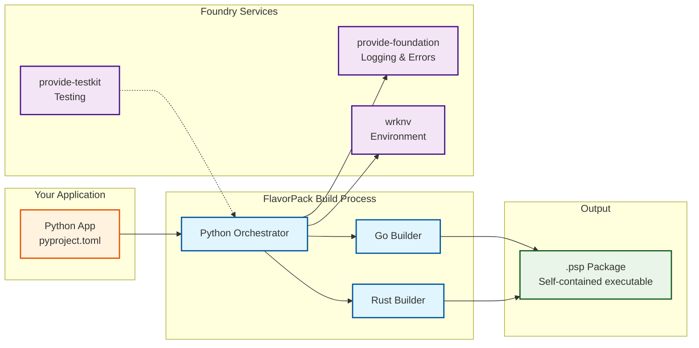
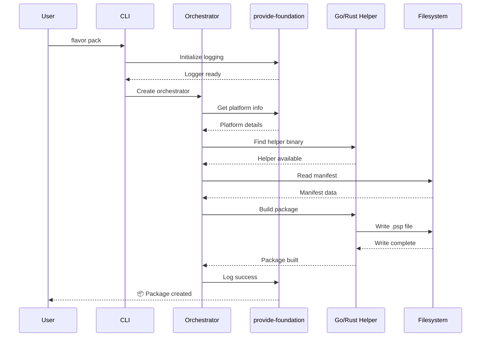

# FlavorPack Architecture in the Foundry Ecosystem

This document explains how FlavorPack's architecture integrates with the Provide Foundry ecosystem and how it leverages other foundry components.

## Ecosystem Integration



## Layer Interactions

### 1. Foundation Layer Dependencies

FlavorPack **requires** `provide-foundation` for core services:

```python
# FlavorPack uses foundation services
from provide.foundation import logging, errors, platform

# Structured logging with emojis
logger = logging.get_logger(__name__)
logger.info("📦 Starting package build")

# Rich error handling
try:
    build_package()
except Exception as e:
    raise errors.PackagingError("Failed to build package") from e

# Platform detection
platform_info = platform.detect()
```

Benefits:
- **Consistent logging** across all foundry tools
- **Rich error context** with hierarchical errors
- **Platform detection** for cross-platform builds

### 2. Framework Layer Integration

FlavorPack **integrates** with pyvider for provider packaging:

```python
# Package a pyvider-based Terraform provider
from flavor import Packager
from pyvider import Provider

provider = Provider.from_module("my_provider")
packager = Packager(manifest="provider.toml")
package = packager.build(
    provider=provider,
    output="terraform-provider-custom.psp"
)
```

Benefits:
- **Provider distribution** without Python installation
- **Version pinning** for reproducible providers
- **Single-file deployment** for Terraform plugins

### 3. Tools Layer Collaboration

FlavorPack **works with** other foundry tools:

#### With wrknv
```bash
# Use wrknv to manage build environment
wrknv activate myproject
flavor pack --manifest pyproject.toml

# wrknv ensures correct Python version and dependencies
```

#### With tofusoup
```bash
# Package test scenarios for cross-language testing
tofusoup generate-tests
flavor pack --manifest test-scenario.toml
```

#### With plating
```bash
# Package provider with generated documentation
plating generate --provider my_provider
flavor pack --include-docs
```

## Architectural Patterns

### 1. **Dependency Injection**

FlavorPack uses dependency injection for testability:

```python
from provide.foundation import logging, config
from flavor.orchestrator import Orchestrator

class Orchestrator:
    def __init__(
        self,
        logger: logging.Logger,
        config: config.Config,
        helper_manager: HelperManager
    ):
        self.logger = logger
        self.config = config
        self.helpers = helper_manager
```

This allows:
- **Easy testing** with mock dependencies
- **Flexible configuration** for different environments
- **Consistent interfaces** across foundry tools

### 2. **Plugin Architecture**

FlavorPack supports plugins for extensibility:

```python
from flavor.plugins import BuilderPlugin

class CustomBuilder(BuilderPlugin):
    def build_slot(self, slot_config):
        # Custom slot building logic
        pass

# Register plugin
Orchestrator.register_plugin(CustomBuilder)
```

### 3. **Event-Driven Processing**

FlavorPack uses events for build lifecycle:

```python
from flavor.events import BuildEvent

@BuildEvent.on("slot_extracted")
def handle_slot_extraction(slot):
    logger.info(f"Extracted slot {slot.id}")

@BuildEvent.on("package_signed")
def handle_signing(package):
    logger.info(f"Package signed with {package.signature}")
```

## Cross-Package Communication

### Shared Configuration

All foundry tools use consistent configuration:

```toml
# pyproject.toml - shared configuration structure
[tool.flavor]
type = "python-app"
entry_point = "myapp.cli:main"

[tool.wrknv]
python_version = "3.11"
dependencies = ["requests", "pyvider"]

[tool.provide]
telemetry = true
logging_level = "info"
```

### Shared Types

FlavorPack uses foundry-wide type definitions:

```python
from provide.foundation.types import Path, URL
from pyvider.types import Provider
from flavor.types import Package

def package_provider(
    provider: Provider,
    output: Path
) -> Package:
    ...
```

### Shared Testing Infrastructure

FlavorPack tests integrate with `provide-testkit`:

```python
from provide.testkit import fixtures, markers

@fixtures.use_temp_dir
@markers.integration
def test_package_building(temp_dir):
    # Test uses shared fixtures and markers
    pass
```

## Data Flow

### Package Building Flow



## Performance Considerations

### 1. **Helper Selection**

FlavorPack intelligently selects helpers based on platform and availability:

```python
# Priority order:
1. Rust helper (fastest, memory-safe)
2. Go helper (mature, cross-platform)
3. Python fallback (always available)
```

### 2. **Parallel Processing**

FlavorPack builds slots in parallel when possible:

```python
# Concurrent slot building
with ThreadPoolExecutor() as executor:
    futures = [
        executor.submit(build_slot, slot)
        for slot in manifest.slots
    ]
    results = [f.result() for f in futures]
```

### 3. **Caching Integration**

FlavorPack leverages wrknv caching:

```python
# Reuse workenv artifacts
if wrknv.has_cached_venv(app_hash):
    logger.info("♻️  Using cached virtual environment")
    venv = wrknv.load_cached_venv(app_hash)
else:
    logger.info("🔨 Building virtual environment")
    venv = wrknv.create_venv()
```

## Security Architecture

### 1. **Signing Chain**

FlavorPack integrates with foundry's security model:

```python
# Use foundation's crypto services
from provide.foundation.crypto import Ed25519Signer

signer = Ed25519Signer(private_key)
signature = signer.sign(package_hash)
package.add_signature(signature)
```

### 2. **Verification**

Package verification uses foundation's validation:

```python
from provide.foundation.crypto import verify_signature

if not verify_signature(package.signature, package_hash, public_key):
    raise errors.SecurityError("Invalid package signature")
```

## Extension Points

FlavorPack provides hooks for foundry integration:

### 1. **Pre-Build Hooks**

```python
@flavor.hooks.pre_build
def check_dependencies():
    # Validate dependencies with wrknv
    wrknv.validate_dependencies()
```

### 2. **Post-Build Hooks**

```python
@flavor.hooks.post_build
def upload_to_registry(package):
    # Upload to package registry
    registry.upload(package)
```

### 3. **Custom Launchers**

```python
# Add custom launcher for specific use case
flavor.register_launcher(
    name="custom-launcher",
    binary="path/to/launcher",
    platforms=["linux_amd64"]
)
```

## Learn More

- **[Design Principles](principles.md)** - Foundry-wide design philosophy
- **[Development Guide](../development/)** - Contribute to FlavorPack
- **[Provide Foundry](https://foundry.provide.io)** - Complete ecosystem documentation
