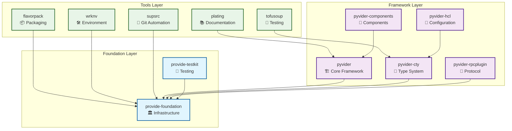

# FlavorPack in the Provide Foundry

FlavorPack is part of the **Provide Foundry** - a comprehensive collection of Python tools and frameworks designed to make building Terraform providers, packaging applications, and managing development workflows both powerful and enjoyable.

## The Foundry Ecosystem

The Provide Foundry consists of multiple layers, each building upon the previous:



## Where FlavorPack Fits

FlavorPack operates in the **Tools Layer**, providing packaging capabilities for:

### 1. **Terraform Providers Built with Pyvider**
Package custom Terraform providers as single executable binaries that can be distributed without Python dependencies.

```bash
# Package a pyvider-based provider
flavor pack \
  --manifest provider.toml \
  --type terraform-provider \
  --output terraform-provider-custom.psp
```

### 2. **CLI Tools for DevOps**
Create self-contained command-line tools that work across all environments.

```bash
# Package a CLI tool
flavor pack \
  --manifest pyproject.toml \
  --entry-point myapp.cli:main \
  --output myapp.psp
```

### 3. **Development Environment Artifacts**
Package applications managed by `wrknv` for consistent deployment.

### 4. **Testing Artifacts with Tofusoup**
Create packaged versions of test scenarios for cross-language conformance testing.

## Integration with Foundry Tools

### With provide-foundation

FlavorPack uses `provide-foundation` for:
- **Structured logging**: Consistent emoji-enhanced logging
- **Error handling**: Rich error context and hierarchical errors
- **Platform detection**: Cross-platform compatibility

### With wrknv

FlavorPack integrates with `wrknv` for:
- **Environment management**: Package workenv-managed applications
- **Dependency resolution**: Coordinate package building with workenv setup
- **Distribution**: Deploy packaged applications to managed environments

### With pyvider

FlavorPack enables:
- **Provider distribution**: Package Terraform providers as binaries
- **No Python requirement**: Distribute providers without requiring Python installation
- **Versioning**: Package specific provider versions

### With provide-testkit

FlavorPack supports:
- **Test packaging**: Create packaged versions of test scenarios
- **Fixture distribution**: Distribute test fixtures as packages
- **CI/CD integration**: Package test suites for distributed testing

## Core Principles

FlavorPack follows the foundry's design principles:

### 1. **Composability**
FlavorPack integrates seamlessly with other foundry tools while remaining useful standalone.

### 2. **Type Safety**
Full Python 3.11+ type annotations with runtime validation.

### 3. **Developer Experience**
- Clear error messages
- Comprehensive documentation
- Interactive examples
- CLI that "just works"

### 4. **Security First**
- Ed25519 cryptographic signatures
- Checksum verification
- Tamper detection
- Secure defaults

### 5. **Performance**
- Native Go/Rust launchers
- Efficient caching
- Minimal overhead
- Optimized extraction

## Learn More

### Foundry Documentation
- **[Provide Foundry Overview](https://foundry.provide.io)** - Complete foundry documentation
- **[Architecture](architecture.md)** - How FlavorPack fits in the ecosystem
- **[Design Principles](principles.md)** - Shared design philosophy

### FlavorPack Specifics
- **[Getting Started](../getting-started/index.md)** - Start packaging applications
- **[Core Concepts](../guide/concepts/index.md)** - Understand PSPF format
- **[Development Guide](../development/index.md)** - Contribute to FlavorPack

### Other Foundry Tools
- **[pyvider](https://foundry.provide.io/pyvider/)** - Build Terraform providers
- **[wrknv](https://foundry.provide.io/wrknv/)** - Manage development environments
- **[provide-foundation](https://foundry.provide.io/foundation/)** - Core infrastructure
- **[provide-testkit](https://foundry.provide.io/testkit/)** - Testing utilities

---

**Ready to package your applications?** Check out our [Quick Start guide](../getting-started/quickstart.md).
