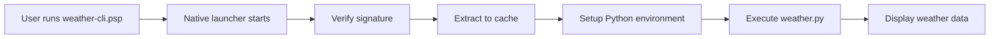

# Creating Your First Package

This tutorial walks you through creating a real-world Python application and packaging it with FlavorPack. We'll build a simple but useful CLI tool that fetches weather information.

!!! example "What we'll build"
    A weather CLI tool that:
    - Accepts a city name as input
    - Fetches current weather data
    - Displays it in a formatted output
    - Works as a standalone executable

## Step 1: Create the Application

### Project Structure

Create a new directory for your project:

```bash
mkdir weather-cli
cd weather-cli
```

### Write the Application Code

Create `weather.py`:

```python
#!/usr/bin/env python3
"""
A simple weather CLI tool packaged with FlavorPack.
"""

import json
import sys
from urllib.request import urlopen
from urllib.parse import quote
from urllib.error import URLError, HTTPError


def get_weather(city: str) -> dict:
    """Fetch weather data for a given city."""
    # Using wttr.in service which doesn't require API keys
    url = f"https://wttr.in/{quote(city)}?format=j1"
    
    try:
        with urlopen(url) as response:
            return json.loads(response.read().decode('utf-8'))
    except HTTPError as e:
        if e.code == 404:
            print(f"❌ City '{city}' not found")
        else:
            print(f"❌ HTTP error: {e}")
        sys.exit(1)
    except URLError as e:
        print(f"❌ Network error: {e}")
        sys.exit(1)


def format_weather(data: dict, city: str) -> str:
    """Format weather data for display."""
    current = data['current_condition'][0]
    location = data['nearest_area'][0]
    
    output = []
    output.append("=" * 50)
    output.append(f"🌍 Weather for {location['areaName'][0]['value']}, "
                  f"{location['country'][0]['value']}")
    output.append("=" * 50)
    output.append(f"🌡️  Temperature: {current['temp_C']}°C ({current['temp_F']}°F)")
    output.append(f"🌤️  Condition: {current['weatherDesc'][0]['value']}")
    output.append(f"💨 Wind: {current['windspeedKmph']} km/h {current['winddir16Point']}")
    output.append(f"💧 Humidity: {current['humidity']}%")
    output.append(f"👁️  Visibility: {current['visibility']} km")
    output.append(f"🌡️  Feels like: {current['FeelsLikeC']}°C ({current['FeelsLikeF']}°F)")
    output.append("=" * 50)
    
    return "\n".join(output)


def main():
    """Main entry point for the weather CLI."""
    print("🌤️  Weather CLI - Powered by FlavorPack")
    print()
    
    if len(sys.argv) > 1:
        city = " ".join(sys.argv[1:])
    else:
        city = input("Enter city name: ").strip()
    
    if not city:
        print("❌ Please provide a city name")
        sys.exit(1)
    
    print(f"\nFetching weather for {city}...")
    
    weather_data = get_weather(city)
    print(format_weather(weather_data, city))
    print("\n✨ Packaged with FlavorPack - https://foundry.provide.io/flavorpack/")


if __name__ == "__main__":
    main()
```

## Step 2: Create the Package Manifest

Create `pyproject.toml`:

```toml
[project]
name = "weather-cli"
version = "1.0.0"
description = "A simple weather CLI tool"
authors = [{name = "Your Name", email = "you@example.com"}]
requires-python = ">=3.11"
readme = "README.md"
license = {text = "MIT"}
keywords = ["weather", "cli", "tool"]
classifiers = [
    "Programming Language :: Python :: 3",
    "License :: OSI Approved :: MIT License",
    "Operating System :: OS Independent",
]

# No external dependencies needed!
dependencies = []

[project.scripts]
weather = "weather:main"

[build-system]
requires = ["setuptools", "wheel"]
build-backend = "setuptools.build_meta"

[tool.flavor]
# FlavorPack-specific configuration
package_name = "weather-cli"
entry_point = "weather:main"

[tool.flavor.metadata]
# Additional metadata for the package
author = "Your Name"
website = "https://example.com"
support = "support@example.com"

[tool.flavor.build]
# Build configuration
include_patterns = [
    "*.py",
    "README.md",
    "LICENSE"
]
exclude_patterns = [
    "__pycache__",
    "*.pyc",
    ".git"
]

[tool.flavor.runtime]
# Runtime configuration
python_version = "3.11"
optimization_level = 2  # -OO flag for Python
```

### Create a README

Create `README.md`:

```markdown
# Weather CLI

A simple command-line weather tool packaged with FlavorPack.

## Usage

```bash
# Interactive mode
./weather-cli

# Direct mode
./weather-cli "New York"
./weather-cli London
./weather-cli "San Francisco"
```

## Features

- 🌡️ Real-time weather data
- 🌍 Works for any city worldwide
- 📦 Self-contained executable
- 🔒 No API keys required

Built with FlavorPack - https://foundry.provide.io/flavorpack/
```

## Step 3: Build the Package

### Generate Signing Keys (Recommended)

```bash
# Generate keys for signing (one-time setup)
flavor keygen --output ./keys/

# You should see:
# ✅ Generated private key: keys/flavor-private.key
# ✅ Generated public key: keys/flavor-public.key
```

### Create the Package

```bash
# Build the package with signing
flavor pack \
  --manifest pyproject.toml \
  --output weather-cli.psp \
  --private-key keys/flavor-private.key \
  --public-key keys/flavor-public.key

# For development (without signing)
flavor pack \
  --manifest pyproject.toml \
  --output weather-cli.psp \
  --key-seed development
```

You'll see output like:

```
🔍 Analyzing project: weather-cli
📦 Collecting dependencies...
🐍 Packaging Python runtime (3.11.9)...
📝 Creating package manifest...
🔨 Building PSPF package with rust-launcher...
🔐 Signing package...
✅ Package created successfully!

Package: weather-cli.psp
Size: 42.7 MB
Format: PSPF/2025
Launcher: rust-launcher-darwin_arm64
Slots: 2 (runtime + application)
```

## Step 4: Test Your Package

### Make It Executable

```bash
# On Unix-like systems
chmod +x weather-cli.psp
```

### Run Your Package

```bash
# Test with different cities
./weather-cli.psp London

# Output:
# 🌤️  Weather CLI - Powered by FlavorPack
#
# Fetching weather for London...
# ==================================================
# 🌍 Weather for London, United Kingdom
# ==================================================
# 🌡️  Temperature: 15°C (59°F)
# 🌤️  Condition: Partly cloudy
# 💨 Wind: 10 km/h W
# 💧 Humidity: 72%
# 👁️  Visibility: 10 km
# 🌡️  Feels like: 14°C (57°F)
# ==================================================
#
# ✨ Packaged with FlavorPack - https://foundry.provide.io/flavorpack/
```

Try more examples:

```bash
./weather-cli.psp "New York"
./weather-cli.psp Tokyo
./weather-cli.psp "Rio de Janeiro"
```

## Step 5: Distribute Your Package

Your `weather-cli.psp` file is now a **completely self-contained executable** that can be distributed to users.

### Distribution Options

=== "Direct Download"

    Upload to your website or file hosting:
    ```bash
    # Users download and run
    wget https://example.com/weather-cli.psp
    chmod +x weather-cli.psp
    ./weather-cli.psp
    ```

=== "GitHub Releases"

    Add to GitHub releases:
    ```bash
    gh release create v1.0.0 weather-cli.psp \
      --title "Weather CLI v1.0.0" \
      --notes "First release of Weather CLI"
    ```

=== "Package Managers"

    Future support planned for:
    - Homebrew (macOS/Linux)
    - Scoop (Windows)
    - Snap (Linux)

### Verification

Users can verify package integrity:

```bash
# Verify the package is valid and signed
flavor verify weather-cli.psp --public-key keys/flavor-public.key

# Output:
# ✅ Package format valid
# ✅ Signature verified with provided key
# ✅ All checksums match
# ✅ Package integrity confirmed
```

## Understanding What Happened

### Package Contents

Your package contains:

1. **Native Launcher** (~2 MB)
   - Platform-specific executable
   - Handles extraction and execution
   - Performs signature verification

2. **Python Runtime** (~35 MB)
   - Complete Python 3.11 interpreter
   - Standard library
   - No system Python needed!

3. **Your Application** (~5 MB)
   - Your weather.py code
   - Configuration files
   - Any dependencies (none in this case)

### How It Works



### Cache Management

FlavorPack uses smart caching:

```bash
# First run: Extracts to cache
./weather-cli.psp London  # ~500ms (extraction + execution)

# Subsequent runs: Uses cache
./weather-cli.psp Paris   # ~100ms (execution only)

# Cache location
~/.cache/flavor/workenv/weather-cli_1.0.0/
```

## Next Steps

### Enhance Your Package

Try these improvements:

1. **Add Dependencies**
   ```toml
   dependencies = [
       "rich",  # For colored output
       "click", # For better CLI interface
   ]
   ```

2. **Add More Features**
   - Weather forecasts
   - Multiple cities
   - Export to JSON/CSV

3. **Optimize Size**
   ```bash
   # Exclude unnecessary files
   flavor pack --exclude "tests/**" --exclude "docs/**"
   ```

### Learn More

- 📖 [Package Configuration](../guide/packaging/configuration/) - Advanced options
- 🔧 [Python Packaging](../guide/packaging/python/) - Python-specific features
- 🚀 [Performance Tips](../guide/advanced/performance/) - Optimization techniques
- 🎨 [CLI Tool Example](../cookbook/examples/cli-tool/) - Advanced CLI packaging

## Troubleshooting

??? question "Package is too large"
    - Use `--exclude` to skip unnecessary files
    - Consider using `--compression` for better compression
    - Use `flavor inspect` to see what's taking space

??? question "Network error when fetching weather"
    - Ensure internet connection is available
    - Check if wttr.in service is accessible
    - Some corporate networks may block the service

??? question "Permission denied when running"
    - Ensure the file has execute permissions: `chmod +x weather-cli.psp`
    - On macOS, you may need to remove quarantine: `xattr -d com.apple.quarantine weather-cli.psp`

## Summary

Congratulations! You've successfully:

✅ Created a real-world Python application  
✅ Configured it for FlavorPack packaging  
✅ Built a self-contained executable  
✅ Tested and verified the package  
✅ Learned distribution strategies  

Your weather CLI tool is now ready to share with the world - no installation required! 🎉