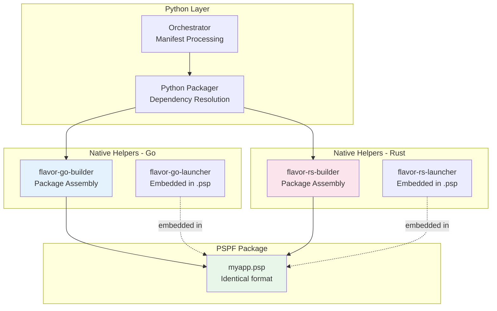

# Cross-Language Support

Understanding FlavorPack's Go and Rust helper integration.

## Overview

FlavorPack uses a polyglot architecture where Python orchestrates native Go and Rust helpers to create high-performance, cross-platform packages.

### Language Roles

| Component | Language | Purpose |
|-----------|----------|---------|
| **Orchestrator** | Python | High-level packaging logic, manifest parsing |
| **Builder** | Go/Rust | PSPF package assembly, compression, signing |
| **Launcher** | Go/Rust | Package extraction, verification, execution |
| **Runtime** | Python | Packaged application execution |

All helpers produce **identical PSPF/2025 format** packages with full cross-compatibility.

## Topics to be Covered

- Go helper architecture
- Rust helper architecture
- Format compatibility
- Cross-language testing
- Performance comparison
- When to use which helper

---

**See also:** [Architecture](../../development/architecture/) | [Testing](../../development/testing/cross-language/)
