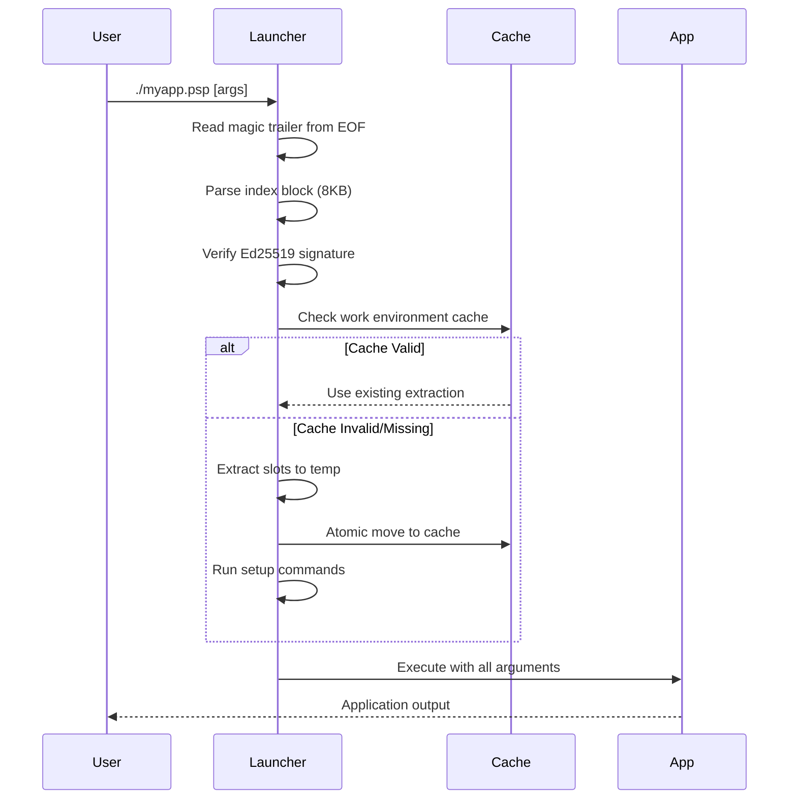

# Custom Launchers

Understanding and building custom launchers for PSPF packages.

## Overview

Launchers are native binary executables embedded at the beginning of every PSPF package. When you run a `.psp` file, the launcher is what actually executes first. It handles:

- Reading the package structure from itself
- Verifying signatures and checksums
- Extracting slots to a cached work environment
- Executing the packaged application

FlavorPack provides two launcher implementations:

| Implementation | Language | Binary Size | Characteristics |
|---------------|----------|-------------|-----------------|
| `flavor-go-launcher` | Go | ~3-4 MB | Fast compilation, broad platform support |
| `flavor-rs-launcher` | Rust | ~1 MB | Smallest size, maximum performance |

Both implementations are fully compatible and produce identical behavior.

## How Launchers Work

### Launch Sequence

When a PSPF package executes, the launcher performs these steps:



### Package Structure Awareness

The launcher reads the PSPF package structure from the executable itself:

1. **Magic Trailer** - Locates package data by reading from EOF
2. **Index Block** - 8192 bytes containing offsets, checksums, and signature
3. **Metadata** - Gzip-compressed JSON with package configuration
4. **Slot Descriptors** - 64-byte binary descriptors for each slot
5. **Slot Data** - Compressed archives (tar.gz, etc.)

## Execution Modes

Launchers support two execution modes for running the packaged application:

### Exec Mode (Default on Unix/Linux)

The launcher replaces itself with the application process:

```bash
# How it works internally
syscall.Exec(pythonPath, args, env)  # Go
Command::new(python).exec()           # Rust
```

- Current process is replaced entirely
- No parent process remains
- Most efficient on Unix systems
- Default behavior when `FLAVOR_EXEC_MODE` is unset

### Spawn Mode (Default on Windows)

The launcher creates a child process:

```bash
# How it works internally
cmd.Run()                    # Go
Command::new(python).spawn() # Rust
```

- Launcher remains as parent process
- Child process exit code is propagated
- Required on Windows (exec mode not supported)
- Enable explicitly: `FLAVOR_EXEC_MODE=spawn`

## CLI Mode

Launchers include a built-in CLI for package inspection and debugging. Enable it by setting the environment variable:

```bash
FLAVOR_LAUNCHER_CLI=1 ./myapp.psp [command]
```

### Available Commands

| Command | Description |
|---------|-------------|
| `info` | Show package information (default if no args) |
| `verify` | Verify package integrity and signatures |
| `metadata` | Show raw package metadata as JSON |
| `extract <INDEX> <DIR>` | Extract specified slot to directory |
| `run [args...]` | Execute package with additional arguments |
| `help` | Show help message |

### Usage Examples

```bash
# Show package info
FLAVOR_LAUNCHER_CLI=1 ./myapp.psp info

# Verify package integrity
FLAVOR_LAUNCHER_CLI=1 ./myapp.psp verify

# View raw metadata
FLAVOR_LAUNCHER_CLI=1 ./myapp.psp metadata | jq .

# Extract slot 0 (usually runtime) to a directory
FLAVOR_LAUNCHER_CLI=1 ./myapp.psp extract 0 /tmp/runtime

# Run with explicit arguments
FLAVOR_LAUNCHER_CLI=1 ./myapp.psp run --verbose
```

!!! important "Normal Mode Behavior"
    Without `FLAVOR_LAUNCHER_CLI=1`, launchers **never** intercept command-line arguments. All arguments (including `--help`, `--version`) are passed directly to the packaged application. The launcher is transparent.

## Environment Variables

### Logging Control

| Variable | Description | Values |
|----------|-------------|--------|
| `FLAVOR_LAUNCHER_LOG_LEVEL` | Launcher-specific log level | `trace`, `debug`, `info`, `warn`, `error` |
| `FLAVOR_LOG_LEVEL` | Fallback log level | Same as above |
| `FLAVOR_LOG_PATH` | Write logs to file | File path |

JSON-formatted logs: `FLAVOR_LOG_LEVEL=json:debug`

### Execution Control

| Variable | Description | Values |
|----------|-------------|--------|
| `FLAVOR_LAUNCHER_CLI` | Enable CLI mode | `1`, `true` |
| `FLAVOR_EXEC_MODE` | Execution mode | `exec`, `spawn` |
| `FLAVOR_WORKENV_CACHE` | Enable caching | `true` (default), `false` |
| `FLAVOR_WORKENV` | Override workenv path | Directory path |

### Validation Control

| Variable | Value | Behavior |
|----------|-------|----------|
| `FLAVOR_VALIDATION` | `strict` | Full security checks, fail on any issue (default) |
| | `standard` | Normal validation, warn on minor issues |
| | `relaxed` | Skip signature checks, warn on mismatches |
| | `minimal` | Only critical checks |
| | `none` | Skip all validation (testing only) |

!!! warning "Validation Levels"
    Using `relaxed`, `minimal`, or `none` disables security features. Only use for debugging or in trusted environments.

### Environment Injection

The launcher sets these variables for the packaged application:

| Variable | Description |
|----------|-------------|
| `FLAVOR_WORKENV` | Path to extracted work environment |
| `FLAVOR_PACKAGE` | Package name |
| `FLAVOR_VERSION` | Package version |
| `FLAVOR_CACHE` | Cache directory path |
| `FLAVOR_COMMAND_NAME` | Command name for argv[0] |

## Extraction Process

### Cache Validation

Before extraction, the launcher checks if a valid cache exists:

1. **Checksum File** - Compares stored vs computed package checksum
2. **Completion Marker** - Verifies extraction completed successfully
3. **Index Metadata** - Validates package identity

If validation fails, re-extraction occurs automatically.

### Atomic Extraction

Extraction uses atomic operations to prevent corruption:

```
1. Create temporary directory
2. Extract all slots to temp
3. Validate extracted contents
4. Atomic rename to final location
5. Create completion marker
```

### Setup Commands

After extraction, the launcher executes any configured setup commands:

- Defined in package metadata under `setup_commands`
- Run in order, in the work environment
- Failure aborts execution

### Init Slot Cleanup

Slots marked with `lifecycle: init` are cleaned up after setup:

- Used for one-time initialization files
- Reduces disk usage after first run
- Automatic cleanup after setup completes

## Verification Process

### Signature Verification

Every package launch verifies the Ed25519 signature:

1. Extract public key from index block
2. Hash package contents (excluding signature bytes)
3. Verify signature against hash
4. Reject if verification fails (based on validation level)

### Checksum Validation

Multiple checksum layers ensure integrity:

| Checksum | Algorithm | Purpose |
|----------|-----------|---------|
| Metadata | SHA-256 | Verify metadata hasn't been modified |
| Index | Adler-32 | Quick validation of index block |
| Slots | SHA-256 (first 4 bytes) | Per-slot integrity |

## Exit Codes

Launchers use specific exit codes to indicate failure types:

| Code | Meaning |
|------|---------|
| `0` | Success |
| `101` | Panic/unrecoverable error |
| `102` | PSPF format error |
| `103` | Extraction error |
| `104` | Execution error |
| `105` | Invalid arguments |
| `106` | I/O error |

## Building Custom Launchers

### Prerequisites

- **Go Launcher**: Go 1.24 or higher
- **Rust Launcher**: Rust 1.85 or higher (edition 2024)
- Make (optional but recommended)

### Build Commands

```bash
# Build all helpers (from project root)
make build-helpers

# Build Go launcher only
cd src/flavor-go
go build -ldflags="-s -w" -o flavor-go-launcher ./cmd/flavor-go-launcher

# Build Rust launcher only
cd src/flavor-rs
cargo build --release --bin flavor-rs-launcher
```

### Platform Considerations

**Linux (Static Linking)**:
```bash
# Go - static binary
CGO_ENABLED=0 go build -ldflags="-s -w" ./cmd/flavor-go-launcher

# Rust - musl for static linking
cargo build --release --target x86_64-unknown-linux-musl
```

**macOS**:
- Universal binaries support both Intel and Apple Silicon
- Dynamic linking to system libraries

**Windows**:
- Forces spawn mode (exec not supported)
- Standard PE executable format

### Testing Custom Launchers

Use pretaster to validate cross-language compatibility:

```bash
# Test all builder/launcher combinations
make validate-pspf-combo

# Test specific combination
./tests/pretaster/pretaster test --builder go --launcher rust
```

---

## See Also

- [Custom Builders](builders/) - Building PSPF packages
- [Helper Binaries](../concepts/helpers/) - Helper system overview
- [Architecture](../../development/architecture/) - System design
- [Building Helpers](../../development/helpers/) - Development guide
