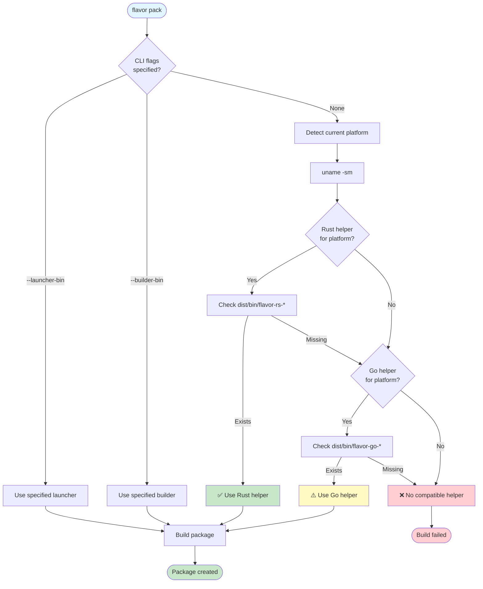

# Helper Binaries

Understanding FlavorPack's native Go and Rust helper system.

## Overview

FlavorPack uses native helper binaries (written in Go and Rust) for high-performance package operations. These helpers handle:

- **Building**: PSPF package assembly
- **Launching**: Package extraction and execution
- **Verification**: Signature and checksum validation

## Helper Types

### Builders

Create PSPF packages from prepared slots:

| Helper | Language | Size | Performance |
|--------|----------|------|-------------|
| `flavor-go-builder` | Go | ~3-4 MB | Fast |
| `flavor-rs-builder` | Rust | ~1 MB | Fastest |

### Launchers

Embedded executables that extract and run packages:

| Helper | Language | Size | Memory |
|--------|----------|------|--------|
| `flavor-go-launcher` | Go | ~3-4 MB | Low |
| `flavor-rs-launcher` | Rust | ~1 MB | Lowest |

!!! note "Platform Variations"
    Binary sizes vary by platform and build configuration. Sizes shown are for darwin_arm64.
    Linux static binaries may be larger. Use `ls -lh dist/bin/` to see actual sizes for your platform.

## Platform Support

Helpers are built for multiple platforms:

```
dist/bin/
├── flavor-go-builder-linux_amd64
├── flavor-go-builder-darwin_arm64
├── flavor-go-launcher-linux_amd64
├── flavor-go-launcher-darwin_arm64
├── flavor-rs-builder-linux_amd64
├── flavor-rs-builder-darwin_arm64
├── flavor-rs-launcher-linux_amd64
└── flavor-rs-launcher-darwin_arm64
```

## Helper Selection

FlavorPack automatically selects appropriate helpers based on platform and availability.

### Automatic Selection

```bash
# Auto-select based on platform
flavor pack  # Uses best available helper for current platform

# Example: On macOS ARM64, selects:
# - Builder: flavor-rs-builder-darwin_arm64 (if available, else flavor-go-builder-darwin_arm64)
# - Launcher: flavor-rs-launcher-darwin_arm64 (if available, else flavor-go-launcher-darwin_arm64)
```

### Selection Priority

The orchestrator selects helpers in this order:

1. **User-specified** via `--launcher-bin` or `--builder-bin` flags
2. **Rust helpers** for current platform (preferred for size)
3. **Go helpers** for current platform (fallback)
4. **Error** if no compatible helper found



**Selection Examples:**

| Platform | Available Helpers | Selected | Why |
|----------|------------------|----------|-----|
| macOS ARM64 | Rust + Go | Rust | Smaller size (1 MB vs 3-4 MB) |
| Linux x64 | Go only | Go | Only available option |
| Custom | Both | User choice | CLI flag overrides |

### Manual Selection

```bash
# Force specific launcher
flavor pack --launcher-bin dist/bin/flavor-rs-launcher-linux_amd64

# Force specific builder
flavor pack --builder-bin dist/bin/flavor-go-builder-linux_amd64

# Force both
flavor pack \
  --launcher-bin dist/bin/flavor-rs-launcher-darwin_arm64 \
  --builder-bin dist/bin/flavor-rs-builder-darwin_arm64
```

### Cross-Platform Builds

To create packages for a different platform:

```bash
# Build Linux package on macOS (requires Linux launcher)
flavor pack \
  --launcher-bin dist/bin/flavor-rs-launcher-linux_amd64 \
  --output myapp-linux.psp

# The Python build still works, only the launcher differs
```

## Building Helpers

```bash
# Build all helpers
make build-helpers

# Build Go helpers only
cd src/flavor-go && go build ./...

# Build Rust helpers only
cd src/flavor-rust && cargo build --release
```

## Binary Linking Strategy

Understanding how helpers are linked is critical for cross-platform compatibility.

### Linux: Static Linking (musl)

All Linux binaries are built as **static executables** using musl libc:

**Go Helpers:**
```bash
CGO_ENABLED=0 go build -ldflags="-s -w" ./cmd/flavor-go-launcher
```

**Rust Helpers:**
```bash
cargo build --release --target x86_64-unknown-linux-musl
```

**Why Static Linking?**
- ✅ Works on any Linux distribution (CentOS 7+, Ubuntu, Alpine, etc.)
- ✅ No glibc version dependencies
- ✅ No runtime library conflicts
- ✅ Smaller deployment footprint
- ⚠️ Slightly larger binary size (~1-2 MB more)

### macOS: Dynamic Linking

macOS helpers use dynamic linking to system libraries:

- Links to system `/usr/lib/libSystem.dylib`
- Compatible with macOS 11+ (Big Sur and later)
- Universal binaries support both Intel and Apple Silicon

### Windows: Dynamic Linking

Windows helpers link dynamically to Windows system DLLs:

- Requires Windows 10 or later
- Standard MSVC runtime libraries
- No additional dependencies needed

## Platform Compatibility Matrix

| Platform | Architecture | Binary Type | Min OS Version | Notes |
|----------|-------------|-------------|----------------|-------|
| Linux | x86_64 (amd64) | Static (musl) | CentOS 7+ | Universal compatibility |
| Linux | aarch64 (arm64) | Static (musl) | - | ARM64 servers |
| macOS | x86_64 | Dynamic | macOS 11+ | Intel Macs |
| macOS | arm64 | Dynamic | macOS 11+ | Apple Silicon |
| Windows | x86_64 | Dynamic | Windows 10+ | 64-bit only |

## Helper Embedding

When you create a package, the launcher binary is embedded directly:

```
myapp.psp structure:
┌─────────────────────┐
│ Launcher Binary     │ ← Embedded helper (1-5 MB)
├─────────────────────┤
│ Index Block         │
├─────────────────────┤
│ Metadata + Slots    │
└─────────────────────┘
```

This means:
- **Package size** includes launcher (~1-5 MB base overhead)
- **No external dependencies** required to run the package
- **Platform-specific** - Linux packages need Linux launchers

## Troubleshooting

### "helper binary not found"

```bash
# Check available helpers
flavor helpers list

# If none found, build them
make build-helpers

# Or build specific language
make build-go-helpers
make build-rust-helpers
```

### "cannot execute binary file"

Platform mismatch - you're trying to run a Linux package on macOS (or vice versa).

**Solution**: Build platform-specific packages:
```bash
# For Linux
flavor pack --launcher-bin dist/bin/flavor-rs-launcher-linux_amd64

# For macOS
flavor pack --launcher-bin dist/bin/flavor-rs-launcher-darwin_arm64
```

### "version GLIBC_X.XX not found" (Linux)

You're using a dynamically-linked binary instead of the static musl binary.

**Solution**: Use the properly built static binaries from `make build-helpers`, which uses musl.

## See Also

- [Cross-Language Support](../advanced/cross-language/) - How Python, Go, and Rust work together
- [Architecture](../../development/architecture/) - Overall system design
- [Building Helpers](../../development/helpers/) - Development guide for helpers
- [Platform Support](../packaging/platforms/) - Platform-specific packaging guides
