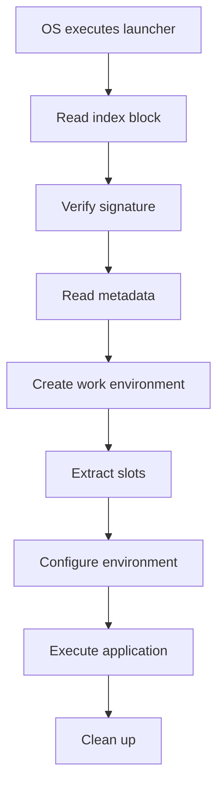

# Core Concepts

Understanding the fundamental concepts behind FlavorPack and the PSPF format.

## What is FlavorPack?

FlavorPack is a packaging system that solves modern software distribution challenges. It takes your entire application—code, dependencies, assets, and all—and bundles it into a **single, executable file**.

Instead of complex installation procedures:
```bash
tar -xzf myapp.tar.gz
cd myapp/
pip install -r requirements.txt
./run.sh
```

You get a simple, portable executable:
```bash
./myapp
```

## Why FlavorPack?

### True Portability
Your application "just works" - no external dependencies, no configuration required. The package contains everything needed to run.

### Secure by Default
Every package is automatically signed and verified with Ed25519 cryptography. Package integrity is guaranteed.

### Language Agnostic
Bundle Python, React, Rust, or any combination. FlavorPack doesn't care what's inside—it just packages and runs it.

### Efficient & Smart
Progressive extraction only unpacks what's needed, when needed. Smart caching reuses work environments across runs.

### Built for CI/CD
Self-contained packages with reproducible builds. Perfect for continuous deployment pipelines.

## What FlavorPack Is Not

- **Not a container**: Runs directly on the host OS without virtualization overhead
- **Not a VM**: Doesn't bundle a guest operating system
- **Not a sandbox**: Runs as a normal process under the executing user with standard permissions

## The PSPF Format

A FlavorPack package uses the Progressive Secure Package Format (PSPF/2025). It's two things at once:

1. A **native executable** that your OS can run directly
2. A **structured archive** containing your application

### Package Structure

```
┌──────────────────────────────┐
│      Launcher Binary         │ ← OS starts execution here
├──────────────────────────────┤
│      Index Block (8KB)       │ ← Package metadata & signature
├──────────────────────────────┤
│      Metadata (JSON)         │ ← Configuration & instructions
├──────────────────────────────┤
│      Slot Table              │ ← Slot descriptors
├──────────────────────────────┤
│      Slot 0 (Metadata)       │ ← Package info
├──────────────────────────────┤
│      Slot 1 (Python venv)    │ ← Runtime environment
├──────────────────────────────┤
│      Slot 2 (Application)    │ ← Your code
├──────────────────────────────┤
│      Slot N (Resources)      │ ← Additional data
├──────────────────────────────┤
│      📦🪄 (Magic Footer)      │ ← Format validation
└──────────────────────────────┘
```

## Launchers

The launcher is the native binary at the beginning of the file. It:

1. **Finds and reads** the package structure
2. **Verifies** the cryptographic signature
3. **Extracts** necessary slots to a work environment
4. **Configures** the runtime environment
5. **Executes** your application

### Launcher Types

- **flavor-rs-launcher**: Rust implementation (default, fastest)
- **flavor-go-launcher**: Go implementation (cross-platform)

Both launchers are fully compatible and can run any PSPF package.

## Slots

Slots are the building blocks of a package. Each slot contains a specific type of data with its own lifecycle.

### Slot Purposes

| Purpose | Description | Example |
|---------|-------------|---------|
| `package-metadata` | Package information | metadata.json |
| `python-environment` | Python virtual environment | venv.tar.gz |
| `application-code` | Your application code | app.tar.gz |
| `configuration` | Config files | settings.json |
| `static-resources` | Assets, images, fonts | assets.tar.gz |
| `native-binary` | Compiled executables | bin.tar.gz |
| `data-files` | Databases, models | data.tar.gz |

### Slot Lifecycles

| Lifecycle | Description | When Cleaned |
|-----------|-------------|--------------|
| `persistent` | Kept for entire execution | Never |
| `volatile` | Deleted after initialization | After setup |
| `temporary` | Deleted after session | On exit |
| `cached` | Can be regenerated | On cache clear |
| `lazy` | Load on demand | When needed |
| `eager` | Load immediately | At startup |

## Work Environments

A work environment is where FlavorPack extracts and runs your application. It's a temporary directory structure that:

1. **Isolates** each package execution
2. **Caches** persistent data between runs
3. **Manages** slot extraction and cleanup
4. **Provides** a consistent runtime environment

### Environment Structure

```
~/.cache/flavor/workenvs/myapp-abc123/
├── metadata.json           # Package metadata
├── venv/                   # Python environment
│   ├── bin/
│   ├── lib/
│   └── ...
├── app/                    # Application code
│   ├── myapp/
│   └── ...
├── data/                   # Runtime data
└── tmp/                    # Temporary files
```

## Package Signing

Every FlavorPack package is cryptographically signed using Ed25519:

1. **Key Generation**: Create a public/private key pair
2. **Metadata Hashing**: Hash the package metadata
3. **Signature Creation**: Sign the hash with private key
4. **Signature Embedding**: Store signature in index block
5. **Verification**: Launcher verifies with public key

### Deterministic Keys

For reproducible builds, use a seed:

```bash
flavor pack --key-seed "my-stable-seed"
```

This generates the same key pair every time, enabling:
- Reproducible builds
- Consistent signatures
- CI/CD integration

## Execution Flow

When you run a FlavorPack package:



## Platform Support

FlavorPack supports multiple platforms through:

1. **Platform-specific launchers**: Native binaries for each OS/architecture
2. **Cross-platform packages**: Same package data works everywhere
3. **Architecture matrix**: x86_64, ARM64, and more

### Supported Platforms

| Platform | Architecture | Status |
|----------|-------------|--------|
| Linux | x86_64 | ✅ Supported |
| Linux | ARM64 | ✅ Supported |
| macOS | x86_64 | ✅ Supported |
| macOS | ARM64 | ✅ Supported |
| Windows | x86_64 | ⚠️ Beta |

## Compression

FlavorPack uses multiple compression strategies:

- **Metadata**: Gzipped JSON for configuration
- **Python environments**: Tar+gzip for maximum compression
- **Application code**: Tar archives for fast extraction
- **Binary data**: Uncompressed for performance

## Caching

Smart caching improves performance:

1. **Work environment caching**: Reuse extracted environments
2. **Python environment caching**: Share virtual environments
3. **Lazy extraction**: Only extract what's needed
4. **Cache invalidation**: Automatic cleanup of old data

## Security Model

FlavorPack's security is built on:

1. **Cryptographic signatures**: Ed25519 for integrity
2. **No elevation**: Runs with user permissions
3. **Transparent operation**: All actions are auditable
4. **Secure defaults**: Verification enabled by default

## Next Steps

Now that you understand the core concepts:

- [Create your first package](../../getting-started/first-package/)
- [Learn about package structure](package-structure/)
- [Understand work environments](workenv/)
- [Explore security features](security/)

## Related Documentation

- [Getting Started](../../getting-started/index/)
- [API Reference](../../api/index/)
- [Package Format Specification](../../reference/spec/fep-0001-core-format-and-operation-chains/)
- [Troubleshooting](../../troubleshooting/index/)