# Package Structure

Understanding the internal structure of PSPF packages and how they organize content into executable bundles.

## Overview

A PSPF package is a self-contained executable file that combines:

1. **Native Launcher**: Platform-specific executable header
2. **Index Block**: Fixed-size metadata and signature block
3. **Slot Table**: Directory of content slots
4. **Metadata**: Compressed JSON manifest
5. **Content Slots**: Application code, data, and resources
6. **Magic Trailer**: Package validation footer

## Binary Layout

### Overall Structure

```
┌─────────────────────────┐ Offset 0
│    Native Launcher      │ ~2-3 MB
│   (Go/Rust binary)      │
├─────────────────────────┤ launcher_size
│     Index Block         │ 8192 bytes
│   (metadata, crypto)    │
├─────────────────────────┤
│     Slot Table          │ Variable
│  (64 bytes × slots)     │
├─────────────────────────┤
│   Metadata (gzip)       │ Variable
├─────────────────────────┤
│      Slot 0 Data        │
├─────────────────────────┤
│      Slot 1 Data        │
├─────────────────────────┤
│         ...             │
├─────────────────────────┤
│      Slot N Data        │
├─────────────────────────┤
│    Magic Trailer        │ 16 bytes
│      "📦🪄"+CRC32       │
└─────────────────────────┘ EOF
```

### Size Breakdown

Typical package sizes:

| Component | Size | Percentage |
|-----------|------|------------|
| Launcher | 2.5 MB | 5% |
| Index Block | 8 KB | <1% |
| Metadata | 10 KB | <1% |
| Python venv | 25 MB | 50% |
| Application | 20 MB | 40% |
| Resources | 2.5 MB | 5% |
| **Total** | **50 MB** | **100%** |

## Component Details

### 1. Native Launcher

The executable header that starts package execution:

```go
// Go launcher structure
type Launcher struct {
    Binary   []byte    // Platform-specific executable
    Platform string    // linux_amd64, darwin_arm64, etc.
    Version  string    // Launcher version
    Features []string  // Supported capabilities
}
```

**Responsibilities:**
- Find and read index block
- Verify package signature
- Extract slots to work environment
- Execute Python application
- Clean up temporary files

### 2. Index Block

Fixed 8192-byte structure containing:

```python
# Index block layout (8192 bytes)
class IndexBlock:
    format_version: uint32      # 0x20250000
    metadata_offset: uint64      # Offset to metadata
    metadata_size: uint64        # Size of metadata
    slot_table_offset: uint64    # Offset to slot table
    public_key: bytes[32]        # Ed25519 public key
    signature: bytes[64]         # Package signature
    launcher_size: uint64        # Size of launcher
    slot_count: uint32           # Number of slots
    index_checksum: uint32       # CRC32 of index
    # ... padding to 8192 bytes
```

### 3. Slot Table

Directory of content slots:

```python
# Each slot descriptor (64 bytes)
class SlotDescriptor:
    # Core fields (56 bytes - 7 × uint64)
    id: uint64           # Unique slot identifier
    name_hash: uint64    # SHA-256 of slot name (first 8 bytes)
    offset: uint64       # Byte offset in package
    size: uint64         # Size as stored (after operations)
    original_size: uint64 # Size before operations
    operations: uint64   # Packed operation chain (up to 8 ops)
    checksum: uint64     # SHA-256 (first 8 bytes)

    # Metadata fields (8 bytes - 8 × uint8)
    purpose: uint8       # 0=data, 1=code, 2=config, 3=media
    lifecycle: uint8     # When to extract/use
    priority: uint8      # Cache priority (0-255)
    platform: uint8      # Platform requirements
    reserved1: uint8     # Reserved
    reserved2: uint8     # Reserved
    permissions: uint8   # Unix permissions (low byte)
    permissions_high: uint8 # Unix permissions (high byte)
```

### 4. Metadata

Compressed JSON containing:

```json
{
  "package": {
    "name": "myapp",
    "version": "1.0.0",
    "description": "Application description"
  },
  "execution": {
    "entry_point": "app:main",
    "python_version": "3.11",
    "environment": {}
  },
  "slots": [
    {
      "id": "python-venv",
      "purpose": "python-environment",
      "lifecycle": "persistent",
      "extract_to": "venv",
      "operations": "tar.gz",
      "size": 25000000,
      "checksum": "sha256:abc123..."
    },
    {
      "id": "app-code",
      "purpose": "application-code",
      "lifecycle": "persistent",
      "extract_to": "app",
      "operations": "tar",
      "size": 20000000
    }
  ],
  "build": {
    "timestamp": 1704619815,
    "builder": "flavor-go-builder",
    "seed": "deterministic-seed"
  }
}
```

## Slot Organization

### Standard Slot Layout

Most packages follow this pattern:

```
slots/
├── 0: python-venv       # Python virtual environment
├── 1: application       # Main application code
├── 2: configuration     # Config files
├── 3: static-resources  # Images, CSS, JS
├── 4: data-files       # Databases, models
└── 5: scripts          # Helper scripts
```

### Slot Purposes

| Purpose | Description | Typical Content |
|---------|-------------|-----------------|
| `python-environment` | Python venv | site-packages, pip |
| `application-code` | Main code | Python modules |
| `configuration` | Settings | JSON, YAML, TOML |
| `static-resources` | Assets | Images, fonts |
| `native-binary` | Compiled code | .so, .dll files |
| `data-files` | Application data | SQLite, models |
| `documentation` | Docs | README, help |
| `scripts` | Utilities | Shell, Python |

### Slot Lifecycles

Control when slots are extracted:

```python
SLOT_LIFECYCLES = {
    "persistent": "Extract once, keep forever",
    "volatile": "Extract on startup, clean after init",
    "temporary": "Extract on startup, clean on exit", 
    "cached": "Extract on demand, clean by policy",
    "init-only": "Extract first run only",
    "lazy": "Extract when accessed",
    "eager": "Extract immediately"
}
```

## Building Packages

### Source Structure

Typical project layout:

```
myproject/
├── pyproject.toml       # Manifest file
├── src/
│   └── myapp/          # Application code
│       ├── __init__.py
│       └── main.py
├── config/
│   └── settings.yaml   # Configuration
├── static/             # Static resources
│   ├── css/
│   └── images/
└── requirements.txt    # Dependencies
```

### Manifest Configuration

```toml
[project]
name = "myapp"
version = "1.0.0"
dependencies = [
    "flask>=2.0",
    "sqlalchemy>=2.0"
]

[tool.flavor]
entry_point = "myapp:main"
python_version = "3.11"

[[tool.flavor.slots]]
id = "config"
source = "config/"
purpose = "configuration"
lifecycle = "persistent"

[[tool.flavor.slots]]
id = "static"
source = "static/"
purpose = "static-resources"
lifecycle = "cached"
operations = "tar.gz"
```

### Build Process

The packaging process transforms your Python application into a self-contained executable:

```mermaid
flowchart TD
    Start([flavor pack]) --> ParseManifest[1. Parse pyproject.toml]
    ParseManifest --> SelectHelpers{2. Select Helpers}

    SelectHelpers --> LauncherChoice[Choose Launcher]
    SelectHelpers --> BuilderChoice[Choose Builder]

    LauncherChoice --> BuildEnv[3. Build Python Environment]
    BuilderChoice --> BuildEnv

    BuildEnv --> InstallDeps[Install dependencies with UV]
    InstallDeps --> PrepareSlots[4. Prepare Content Slots]

    PrepareSlots --> Slot0[Slot 0: Python venv]
    PrepareSlots --> Slot1[Slot 1: App code]
    PrepareSlots --> SlotN[Slot N: Resources]

    Slot0 --> CompressSlots[5. Compress & Hash]
    Slot1 --> CompressSlots
    SlotN --> CompressSlots

    CompressSlots --> GenMetadata[6. Generate JSON Metadata]
    GenMetadata --> SignPkg{7. Sign Package?}

    SignPkg -->|With Keys| GenKeys[Use provided keys]
    SignPkg -->|Auto| AutoKeys[Generate ephemeral keys]

    GenKeys --> CreateSig[Create Ed25519 signature]
    AutoKeys --> CreateSig

    CreateSig --> Assemble[8. Assemble Binary]
    Assemble --> AddLauncher[Prepend launcher binary]
    AddLauncher --> AddIndex[Add index block]
    AddIndex --> AddMetadata[Add compressed metadata]
    AddMetadata --> AddSlots[Append slot data]
    AddSlots --> AddTrailer[9. Add magic trailer 📦🪄]

    AddTrailer --> Verify{Verify?}
    Verify -->|Yes| RunVerify[flavor verify]
    Verify -->|No| Done
    RunVerify --> Done([✅ Package complete])

    style Start fill:#e1f5fe
    style Done fill:#c8e6c9
    style BuildEnv fill:#fff9c4
    style SignPkg fill:#f3e5f5
    style Assemble fill:#ffe0b2
```



**Step Details:**

1. **Parse Manifest**: Read and validate `pyproject.toml` configuration
2. **Select Helpers**: Choose appropriate launcher/builder for target platform
3. **Build Environment**: Create isolated Python virtual environment with UV
4. **Prepare Slots**: Organize content into numbered slots (0=runtime, 1=app, 2+=resources)
5. **Compress & Hash**: Apply operations (tar.gz, etc.) and compute SHA-256 checksums
6. **Generate Metadata**: Create JSON manifest with package info and slot descriptors
7. **Sign Package**: Generate Ed25519 signature for integrity verification
8. **Assemble Binary**: Combine launcher + index + metadata + slots into single file
9. **Add Trailer**: Append magic bytes (`📦🪄`) and CRC32 for format identification

## Execution Flow

### Package Startup

When a user runs a `.psp` package, the launcher orchestrates extraction and execution:

```mermaid
flowchart TD
    Start([User: ./myapp.psp]) --> OSExec[OS loads executable]
    OSExec --> LauncherInit[Launcher initializes]

    LauncherInit --> FindIndex[Seek to EOF - 16 bytes]
    FindIndex --> ReadMagic{Magic bytes<br/>📦🪄 present?}

    ReadMagic -->|No| Error1[❌ Invalid package]
    ReadMagic -->|Yes| ReadIndexBlock[Read 8KB index block]

    ReadIndexBlock --> VerifySig{Verify Ed25519<br/>signature?}
    VerifySig -->|Invalid| Error2[❌ Signature failed]
    VerifySig -->|Valid| ReadMeta[Decompress metadata JSON]

    ReadMeta --> CalcCacheID[Calculate package ID<br/>SHA-256 of metadata]
    CalcCacheID --> CheckCache{Work environment<br/>exists in cache?}

    CheckCache -->|Yes| ValidateCache{Cache<br/>valid?}
    CheckCache -->|No| CreateWorkDir[Create cache directory]

    ValidateCache -->|Invalid| CreateWorkDir
    ValidateCache -->|Valid| SetEnv[Set FLAVOR_WORKENV]

    CreateWorkDir --> ExtractSlots[Extract slots by lifecycle]
    ExtractSlots --> ExtractPersistent[Extract persistent slots]
    ExtractPersistent --> ExtractCached[Extract cached slots]
    ExtractCached --> RegisterLazy[Register lazy slots]
    RegisterLazy --> SetEnv

    SetEnv --> FindPython[Locate Python in slot 0]
    FindPython --> ExecApp[Execute entry point]

    ExecApp --> AppRuns[Application running]
    AppRuns --> AppExit{App<br/>exits}

    AppExit --> CleanVolatile[Clean volatile slots]
    CleanVolatile --> Done([✅ Complete])

    Error1 --> Failed([❌ Failed])
    Error2 --> Failed

    style Start fill:#e1f5fe
    style Done fill:#c8e6c9
    style Failed fill:#ffcdd2
    style VerifySig fill:#fff3e0
    style CheckCache fill:#e8eaf6
    style AppRuns fill:#f3e5f5
```



**Startup Phases:**

1. **Validation** (0.1s): Verify magic bytes, index block, and Ed25519 signature
2. **Cache Check** (0.01s): Calculate package ID and check if work environment exists
3. **Extraction** (2-5s first run, 0s cached): Extract slots to `~/.cache/flavor/workenv/`
4. **Execution** (<0.1s): Set environment variables and launch Python interpreter

**Performance:**
- **First run**: 2-5 seconds (extraction time)
- **Subsequent runs**: <1 second (cached workenv)
- **Cache hit**: Near-instant startup

### Extraction Strategy

Slots are extracted based on lifecycle:

```python
def extract_package(metadata, work_dir):
    for slot in metadata["slots"]:
        target = work_dir / slot["extract_to"]
        
        if slot["lifecycle"] == "persistent":
            if not target.exists():
                extract_slot(slot, target)
        elif slot["lifecycle"] == "volatile":
            extract_slot(slot, target)
            schedule_cleanup(target, "after_init")
        elif slot["lifecycle"] == "lazy":
            # Extract on first access
            register_lazy_extractor(slot, target)
```

## Optimization Strategies

### Size Optimization

1. **Compression**: Use appropriate operations
   - `tar.gz` for text-heavy content
   - `tar` for already-compressed data
   - `raw` for small files

2. **Deduplication**: Share common libraries
   ```toml
   [[tool.flavor.slots]]
   id = "shared-libs"
   source = "/common/libs"
   lifecycle = "cached"
   ```

3. **Lazy Loading**: Defer optional content
   ```toml
   [[tool.flavor.slots]]
   id = "docs"
   lifecycle = "lazy"
   optional = true
   ```

### Performance Optimization

1. **Parallel Extraction**: Extract slots concurrently
2. **Memory Mapping**: Use mmap for large files
3. **Caching**: Reuse extracted environments
4. **Streaming**: Process without full extraction

## Security Features

### Package Integrity

- **Ed25519 Signatures**: Cryptographic authenticity
- **SHA-256 Checksums**: Content verification
- **CRC32 Validation**: Quick corruption detection

### Execution Safety

- **Isolated Environments**: Separate work directories
- **Permission Control**: Restricted file access
- **Path Sanitization**: Prevent directory traversal

## Debugging Packages

### Inspection Tools

```bash
# View package structure
flavor inspect package.psp

# Extract specific slot
flavor extract package.psp --slot app-code

# Verify integrity
flavor verify package.psp --deep

# Debug execution
FLAVOR_LOG_LEVEL=debug ./package.psp
```

### Common Issues

| Issue | Cause | Solution |
|-------|-------|----------|
| Large package size | Uncompressed slots | Use compression |
| Slow startup | Re-extraction | Enable caching |
| Missing files | Wrong lifecycle | Check slot config |
| Signature failure | Corruption | Rebuild package |

## Best Practices

1. **Organize Slots Logically**: Group related content
2. **Choose Appropriate Lifecycles**: Match usage patterns
3. **Compress Efficiently**: Balance size vs speed
4. **Version Carefully**: Use semantic versioning
5. **Test Extraction**: Verify all platforms
6. **Document Structure**: Include README in package
7. **Monitor Performance**: Profile extraction times

## Related Documentation

- [Binary Layout](../../reference/spec/pspf-2025/) - Technical format details
- [Slots](../../reference/spec/pspf-2025/) - Slot system specification
- [Metadata](../../reference/spec/pspf-2025/) - Metadata structure
- [Building Packages](../../guide/packaging/index/) - Build guide
