# Understanding the PSPF Format

The **Progressive Secure Package Format (PSPF) 2025 Edition** is the core innovation that makes FlavorPack possible. It's a polyglot file format that works as both an OS-native executable and a structured data package.

## What Makes PSPF Special?

### The Polyglot Magic ✨

PSPF files are simultaneously:
- **Native executables** that can be run directly by the OS
- **Structured packages** containing your application and dependencies
- **Cryptographically signed** archives ensuring integrity
- **Self-extracting** bundles requiring no special tools

```bash
# It's an executable
./myapp.psp

# AND it's a package format
flavor inspect myapp.psp
```

## Format Structure

### Binary Layout

```mermaid
graph TD
    subgraph "PSPF Package File"
        A["Launcher Binary<br/>~2-5 MB<br/>Platform-specific executable"]
        B["Index Block<br/>8192 bytes fixed<br/>Package metadata & offsets"]
        C["Gzipped Metadata<br/>~1-10 KB<br/>JSON configuration"]
        D["Slot 0<br/>~35-45 MB<br/>Python runtime tar.gz"]
        E["Slot 1<br/>Variable size<br/>Application code tar.gz"]
        F["Slot 2...N<br/>Optional<br/>Additional resources"]
        G["Magic Footer<br/>8 bytes<br/>📦🪄"]
    end

    A ==> B
    B ==> C
    C ==> D
    D ==> E
    E ==> F
    F ==> G

    style A fill:#e1f5ff
    style B fill:#fff4e6
    style C fill:#e8f5e9
    style D fill:#fce4ec
    style E fill:#f3e5f5
    style F fill:#e0f2f1
    style G fill:#fff9c4
```



### Visual Overview

```
┌─────────────────────────────────────┐ ← File Start
│                                     │
│         NATIVE LAUNCHER             │ ← Platform-specific binary
│         (Go or Rust)                │   (Variable size ~2-5 MB)
│                                     │
├─────────────────────────────────────┤ ← Boundary aligned to 8 bytes
│                                     │
│         8192-BYTE INDEX             │ ← Fixed-size index block
│   ┌─────────────────────────────┐  │
│   │ PSPF Header (32 bytes)      │  │
│   │ Metadata (256 bytes)        │  │
│   │ Slot Table (1024 bytes)     │  │
│   │ Reserved (6816 bytes)       │  │
│   │ Signature (64 bytes)        │  │
│   └─────────────────────────────┘  │
│                                     │
├─────────────────────────────────────┤
│                                     │
│      GZIPPED JSON METADATA         │ ← Package configuration
│                                     │   (Variable size ~1-10 KB)
├─────────────────────────────────────┤
│                                     │
│           SLOT 0                    │ ← Python runtime
│      (tar.gz archive)               │   (~35-45 MB)
│                                     │
├─────────────────────────────────────┤
│                                     │
│           SLOT 1                    │ ← Application code
│      (tar.gz archive)               │   (Variable size)
│                                     │
├─────────────────────────────────────┤
│                                     │
│         SLOTS 2...N                 │ ← Additional resources
│        (optional)                   │   (As needed)
│                                     │
├─────────────────────────────────────┤
│                                     │
│       EMOJI MAGIC FOOTER            │ ← 📦🪄 (8 bytes)
│        [F0 9F 93 A6]                │   Package verification
│        [F0 9F AA 84]                │
└─────────────────────────────────────┘ ← File End
```

## Component Details

### 1. Native Launcher

The launcher is a platform-specific executable that:

- **Extracts** package contents on first run
- **Verifies** cryptographic signatures
- **Manages** the work environment cache
- **Executes** the packaged application

#### Launcher Flow


=== "Go Launcher"
    ```go
    // Lightweight and fast
    // ~3-4 MB binary size
    // Cross-platform support
    ```

=== "Rust Launcher"
    ```rust
    // Memory-safe and efficient
    // ~1 MB binary size
    // Optimal performance
    ```

### 2. Index Block (8192 bytes)

The index is the heart of the PSPF format:

```python
# Index structure (Python representation)
class PSPFIndex:
    # Header (32 bytes)
    magic: bytes = b"PSPF"        # 4 bytes
    version: int = 0x20250001     # 4 bytes
    flags: int                    # 8 bytes
    metadata_offset: int          # 8 bytes
    metadata_size: int            # 8 bytes
    
    # Metadata (256 bytes)
    package_name: str             # Up to 128 bytes
    package_version: str          # Up to 64 bytes
    created_at: int               # 8 bytes (timestamp)
    # ... additional fields
    
    # Slot Table (1024 bytes)
    slot_count: int               # 4 bytes
    slots: list[SlotDescriptor]   # Up to 15 slots
    
    # Reserved (6816 bytes)
    # Future expansion space
    
    # Signature (64 bytes)
    ed25519_signature: bytes      # Package signature
```

### 3. Metadata (JSON)

Comprehensive package information:

```json
{
  "format_version": "2025.1",
  "package": {
    "name": "my-app",
    "version": "1.0.0",
    "description": "My application"
  },
  "build": {
    "timestamp": "2024-01-15T10:30:00Z",
    "builder": "flavor-rs-builder",
    "platform": "darwin_arm64"
  },
  "runtime": {
    "python_version": "3.11.9",
    "entry_point": "app:main"
  },
  "slots": [
    {
      "index": 0,
      "purpose": "runtime",
      "encoding": "tar.gz",
      "size": 38765432
    },
    {
      "index": 1,
      "purpose": "application",
      "encoding": "tar.gz",
      "size": 1024567
    }
  ],
  "security": {
    "signed": true,
    "public_key": "base64_encoded_key"
  }
}
```

### 4. Slot System

Slots are numbered containers for different components:

| Slot | Purpose | Contents | Typical Size |
|------|---------|----------|--------------|
| 0 | Runtime | Python interpreter + stdlib | 35-45 MB |
| 1 | Application | Your code + dependencies | Variable |
| 2 | Data | Static assets, configs | Variable |
| 3+ | Extensions | Additional resources | Variable |

Each slot has:
- **Purpose type**: runtime, code, config, media
- **Encoding**: raw, tar, gzip, tar.gz
- **Lifecycle**: persistent, ephemeral, cached
- **Permissions**: read, write, execute flags

#### Slot Descriptor Binary Layout (64 bytes)

!!! info "Complete Specification"
    The slot descriptor is a precisely defined 64-byte binary structure. For the complete specification including all fields, byte offsets, cross-language implementations, and detailed field descriptions, see [**Slot Descriptor Specification**](../../reference/spec/SLOT_DESCRIPTOR_SPECIFICATION/).

**Quick Reference - Field Layout:**

| Offset | Size | Field | Description |
|--------|------|-------|-------------|
| 0x00 | 8 bytes | `id` | Unique slot identifier |
| 0x08 | 8 bytes | `name_hash` | SHA-256 of slot name (first 8 bytes, little-endian) |
| 0x10 | 8 bytes | `offset` | Byte offset in package file |
| 0x18 | 8 bytes | `size` | Compressed/stored size |
| 0x20 | 8 bytes | `original_size` | Uncompressed size |
| 0x28 | 8 bytes | `operations` | Packed operation chain |
| 0x30 | 8 bytes | `checksum` | SHA-256 of slot data (first 8 bytes, little-endian) |
| 0x38 | 1 byte | `purpose` | Purpose classification (code, data, config, media) |
| 0x39 | 1 byte | `lifecycle` | Lifecycle hint (init, startup, runtime, etc.) |
| 0x3A | 1 byte | `priority` | Cache priority (0-255) |
| 0x3B | 1 byte | `platform` | Platform requirements (any, linux, macos, windows) |
| 0x3C-0x3D | 2 bytes | `reserved` | Reserved for future use |
| 0x3E-0x3F | 2 bytes | `permissions` | Unix-style permissions (16-bit) |

**Operations Field Encoding** (64-bit packed, up to 8 operations of 8 bits each):

```
Bit Layout:
┌──────────┬──────────┬──────────┬──────────┬──────────┬──────────┬──────────┬──────────┐
│  Op 7    │  Op 6    │  Op 5    │  Op 4    │  Op 3    │  Op 2    │  Op 1    │  Op 0    │
│  (00)    │  (00)    │  (00)    │  (00)    │  (00)    │  (00)    │  (10)    │  (01)    │
└──────────┴──────────┴──────────┴──────────┴──────────┴──────────┴──────────┴──────────┘
bits 63-56   55-48      47-40      39-32      31-24      23-16      15-8       7-0

Example: tar.gz = 0x0000000000001001 (Op 0 = 0x01 (tar), Op 1 = 0x10 (gzip))
```

### 5. Magic Footer

The emoji magic footer serves multiple purposes:

```
📦🪄 = [F0 9F 93 A6 F0 9F AA 84]
```

- **Format identification**: Quickly identify PSPF files
- **Corruption detection**: Ensure file completeness
- **Version marker**: Different emojis for format versions
- **Human-readable**: Visible in hex editors

## How Execution Works

### Step-by-Step Process


### Cache Management

FlavorPack uses intelligent caching:

```bash
# Cache structure
~/.cache/flavor/workenv/
├── myapp_1.0.0/
│   ├── .flavor.lock      # Lock file
│   ├── .flavor.checksum  # Integrity verification
│   ├── python/           # Python runtime
│   ├── lib/              # Dependencies
│   └── app/              # Application code
```

Benefits:
- **Fast startup**: No extraction after first run
- **Shared runtimes**: Multiple apps can share Python
- **Automatic cleanup**: Old versions removed
- **Integrity checks**: Detect tampering

## Security Features

### Ed25519 Signatures

Every package is cryptographically signed:

```python
# Signature verification process
def verify_package(package_path, public_key):
    # 1. Read entire package except signature
    package_data = read_package_without_signature()
    
    # 2. Extract signature from index
    signature = extract_signature_from_index()
    
    # 3. Verify with Ed25519
    return ed25519_verify(
        message=package_data,
        signature=signature,
        public_key=public_key
    )
```

### Checksum Verification

Multiple layers of integrity checking:

1. **Package checksum**: SHA-256 of entire package
2. **Slot checksums**: Individual slot verification
3. **Runtime checks**: Continuous integrity monitoring

## Advanced Features

### Progressive Extraction

Only extract what's needed:

```python
# Lazy loading example
class ProgressiveLoader:
    def load_slot(self, index):
        if not self.is_extracted(index):
            self.extract_slot(index)
        return self.get_slot_path(index)
```

### Metadata Extensions

Custom metadata fields:

```json
{
  "x-custom": {
    "license": "MIT",
    "author": "Your Name",
    "telemetry": false,
    "update_url": "https://example.com/updates"
  }
}
```

### Platform-Specific Optimizations

=== "Linux"
    - Static musl binaries
    - No glibc dependencies
    - Works on any Linux

=== "macOS"
    - Universal binaries
    - Code signing support
    - Notarization ready

=== "Windows"
    - PE executable format
    - UAC manifests
    - Anti-virus friendly

## Format Comparison

How PSPF compares to alternatives:

| Feature | PSPF | AppImage | Snap | Docker |
|---------|------|----------|------|--------|
| Single file | ✅ | ✅ | ❌ | ❌ |
| No dependencies | ✅ | ❌ | ❌ | ❌ |
| Cryptographic signing | ✅ | ✅ | ✅ | ✅ |
| Cross-platform | ✅ | ❌ | ❌ | ✅ |
| Direct execution | ✅ | ✅ | ❌ | ❌ |
| Smart caching | ✅ | ❌ | ✅ | ✅ |
| Python-optimized | ✅ | ❌ | ❌ | ❌ |

## Best Practices

### Package Organization

✅ **DO:**
- Keep slots focused on single purposes
- Use compression for text/code
- Include only necessary files
- Sign production packages

❌ **DON'T:**
- Mix runtime and application code
- Include development files
- Store secrets in packages
- Skip signature verification

### Size Optimization

Tips for smaller packages:

1. **Exclude unnecessary files**
   ```bash
   flavor pack --exclude "__pycache__" --exclude "*.pyc"
   ```

2. **Use slot compression**
   ```python
   slot_encoding = "tar.gz"  # Better than "tar"
   ```

3. **Strip debug symbols**
   ```bash
   flavor pack --strip-debug
   ```

4. **Optimize Python bytecode**
   ```bash
   flavor pack --optimize 2  # -OO flag
   ```

## Technical Specifications

### Constants and Limits

| Constant | Value | Description |
|----------|-------|-------------|
| `PSPF_VERSION` | `0x20250001` | Format version |
| `INDEX_SIZE` | 8192 bytes | Fixed index size |
| `MAX_SLOTS` | 256 | Maximum slot count |
| `SIGNATURE_SIZE` | 64 bytes | Ed25519 signature |
| `MAX_METADATA` | 1 MB | Metadata size limit |

### Binary Alignment

All components are 8-byte aligned:

```
Offset    | Component
----------|------------------
0x0000    | Launcher start
0xXXXX    | Index start (aligned)
0xXXXX    | Metadata start (aligned)
0xXXXX    | Slot 0 start (aligned)
...       | ...
```

## Further Reading

- 📚 [FEP-0001: Core Format Specification](../../reference/spec/fep-0001-core-format-and-operation-chains/) - Complete PSPF/2025 binary format specification
- 📋 [Slot Descriptor Specification](../../reference/spec/SLOT_DESCRIPTOR_SPECIFICATION/) - Detailed slot descriptor format
- 🔧 [Builder API](../../api/builder/) - How packages are created programmatically
- 🔍 [Reader API](../../api/reader/) - How packages are read and extracted
- 🔒 [Security Model](security/) - In-depth security analysis
- 📦 [Package Structure](package-structure/) - High-level package organization