# Security Model

FlavorPack implements multiple layers of security to ensure package integrity, authenticity, and safe execution.

## Overview

The FlavorPack security model provides comprehensive protection through multiple layers:

```mermaid
graph TD
    A[Package Build] --> B[Sign with Ed25519]
    B --> C[Package Distribution]
    C --> D[User Downloads]

    D --> E{Verify Signature}
    E -->|Invalid| F[❌ Reject Package]
    E -->|Valid| G{Verify Checksums}

    G -->|Invalid| F
    G -->|Valid| H{Verify Format}

    H -->|Invalid| F
    H -->|Valid| I[✅ Extract to Cache]

    I --> J{Validate Extraction}
    J -->|Failed| F
    J -->|Success| K[🚀 Execute Package]

    style B fill:#e8f5e9
    style E fill:#fff3e0
    style G fill:#fff3e0
    style H fill:#fff3e0
    style F fill:#ffebee
    style K fill:#e3f2fd
```



### Security Layers

1. **Cryptographic Signatures**: Ed25519 digital signatures for authenticity
2. **Integrity Verification**: SHA-256 checksums for all components
3. **Format Validation**: PSPF structure verification
4. **Isolation**: Sandboxed execution environments
5. **Access Control**: Permission-based slot extraction
6. **Audit Trail**: Comprehensive logging and verification

## Threat Model

### Protected Against

FlavorPack's security model defends against:

| Threat | Protection |
|--------|------------|
| **Package Tampering** | Ed25519 signatures detect modification |
| **Supply Chain Attacks** | Signature verification ensures authenticity |
| **Data Corruption** | SHA-256 checksums validate integrity |
| **Path Traversal** | Sanitized extraction paths |
| **Code Injection** | No dynamic code generation |
| **Privilege Escalation** | Restricted permissions |

### Out of Scope

FlavorPack does not protect against:

- Malicious code in legitimate packages
- Compromised signing keys
- Operating system vulnerabilities
- Network-based attacks during download
- Side-channel attacks

## Cryptographic Security

### Ed25519 Signatures

Every package is signed with Ed25519:

```python
# Key generation
from cryptography.hazmat.primitives.asymmetric import ed25519

private_key = ed25519.Ed25519PrivateKey.generate()
public_key = private_key.public_key()

# Signing
signature = private_key.sign(package_hash)

# Verification
try:
    public_key.verify(signature, package_hash)
    print("✅ Signature valid")
except InvalidSignature:
    print("❌ Signature invalid - package tampered!")
```

### Key Management

#### Key Generation Options

1. **Random Keys** (Recommended for production)
   ```bash
   flavor keygen --out-dir keys/
   ```

2. **Deterministic Keys** (For CI/CD)
   ```bash
   flavor pack --key-seed "$SECRET_SEED"
   ```

3. **External Keys** (Enterprise)
   ```bash
   flavor pack --private-key /secure/private.pem
   ```

#### Key Storage Best Practices

- **Never commit private keys** to version control
- **Use hardware security modules** (HSM) when available
- **Rotate keys periodically** (yearly recommended)
- **Separate keys by environment** (dev/staging/prod)
- **Backup keys securely** with encryption

### Signature Verification

Verification happens automatically on package execution:

```python
def verify_package(package_path):
    """Verify package signature."""
    reader = PSPFReader(package_path)
    
    # Extract signature components
    index = reader.read_index()
    public_key = index.public_key
    signature = index.signature
    
    # Calculate metadata hash
    metadata = reader.read_metadata()
    metadata_hash = hashlib.sha256(metadata).digest()
    
    # Verify signature
    key = ed25519.Ed25519PublicKey.from_public_bytes(public_key)
    key.verify(signature, metadata_hash)
```

## Integrity Verification

### Checksum Validation

Every component has SHA-256 checksums:

| Component | Checksum Location | Validation |
|-----------|------------------|------------|
| **Index Block** | Magic trailer | CRC32 |
| **Metadata** | Index block | SHA-256 |
| **Slots** | Metadata JSON | SHA-256 |
| **Extracted Files** | Cache manifest | SHA-256 |

### Verification Levels

#### ✅ Currently Available

```bash
# Standard verification (index + metadata + signatures)
flavor verify package.psp
```

The verify command performs comprehensive validation:
- Validates PSPF format structure
- Verifies index block integrity
- Checks metadata consistency
- Validates Ed25519 signature
- Reports any integrity issues

#### 📋 Planned Verification Modes

Additional verification levels are planned for future releases:

```bash
# Coming in future versions
flavor verify package.psp --quick     # Quick (index only)
flavor verify package.psp --deep      # Deep (all slots)
flavor verify package.psp --paranoid  # Paranoid (extract and verify)
```

## Execution Security

### Work Environment Isolation

Each package runs in an isolated directory:

```python
# Unique work environment per package
work_dir = cache_dir / generate_package_id(metadata)

# Restricted file access
os.chdir(work_dir)
# Package cannot access parent directories
```

### Permission Enforcement

Slot extraction respects file permissions:

```python
def extract_with_permissions(slot, target):
    """Extract slot with secure permissions."""
    # Extract content
    extract_slot(slot, target)
    
    # Apply permissions
    permissions = slot.get("permissions", "0644")
    os.chmod(target, int(permissions, 8))
    
    # Validate no setuid/setgid
    if os.stat(target).st_mode & (stat.S_ISUID | stat.S_ISGID):
        raise SecurityError("Setuid/setgid not allowed")
```

### Path Traversal Prevention

All paths are sanitized:

```python
def safe_path(base, user_path):
    """Prevent path traversal attacks."""
    # Resolve to absolute path
    full_path = (base / user_path).resolve()
    
    # Ensure within base directory
    if not full_path.is_relative_to(base):
        raise SecurityError(f"Path traversal detected: {user_path}")
    
    return full_path
```

## Trust Models

### Self-Signed Packages

Default mode for internal distribution:

```yaml
# Package contains its own public key
trust_model: self-signed
verification: integrity_only
use_case: internal_tools
```

### Pre-Shared Keys

For controlled environments:

```yaml
# Public key distributed separately
trust_model: pre-shared
verification: authenticity
use_case: enterprise_deployment
```

### 📋 Certificate-Based (Planned Feature)

PKI integration is planned for future releases to support public distribution:

```yaml
# X.509 certificate chains (not yet implemented)
trust_model: pki
verification: chain_of_trust
use_case: public_distribution
```

This will enable integration with existing PKI infrastructure and code signing certificates for broader distribution scenarios.

## Security Configuration

### Environment Variables

```bash
# Validation level (testing only)
FLAVOR_VALIDATION=none          # Skip verification (DANGER! Never use in production)

# Logging
FLAVOR_LOG_LEVEL=debug          # Verbose security logging
FOUNDATION_LOG_LEVEL=debug      # Python component logging
```

!!! warning "Security Configuration"
    For signature verification configuration, use CLI flags (`--private-key`, `--public-key`, `--key-seed`) rather than environment variables. See the [Environment Variables Guide](../../guide/usage/environment/) for the complete list of available variables.

### Configuration File

!!! info "📋 Planned Feature - Not Yet Implemented"
    Configuration file support is planned for a future release. Currently, all configuration is done via environment variables and CLI flags.

#### Current Configuration Methods

Use environment variables for configuration:

```bash
# Security settings
export FLAVOR_VALIDATION=none          # Skip verification (TESTING ONLY)

# Logging
export FLAVOR_LOG_LEVEL=debug
export FOUNDATION_LOG_LEVEL=debug

# Cache location
export FLAVOR_CACHE=/custom/cache
```

#### Planned Configuration File Format

Future releases will support a configuration file:

```toml
# ~/.flavor/config.toml (not yet supported - planned feature)
[security]
verify_signatures = true
require_https = true
allowed_key_fingerprints = [
    "abc123...",
    "def456..."
]

[audit]
log_file = "/var/log/flavor-audit.log"
log_verification = true
log_extraction = true
```

## Audit Logging

### Security Events

All security-relevant events are logged:

```python
import logging
from provide.foundation.logger import logger

# Signature verification
logger.info("security.verification", 
    package=package_path,
    signature_valid=True,
    public_key_fingerprint=fingerprint
)

# Failed verification
logger.error("security.verification.failed",
    package=package_path,
    reason="Invalid signature",
    public_key_fingerprint=fingerprint
)

# Extraction
logger.info("security.extraction",
    package=package_path,
    slot=slot_id,
    target=target_path,
    permissions=permissions
)
```

### Audit Trail Format

```json
{
  "timestamp": "2025-01-07T10:30:15Z",
  "event": "security.verification",
  "level": "info",
  "package": "/path/to/package.psp",
  "signature_valid": true,
  "public_key_fingerprint": "SHA256:abc123...",
  "metadata_hash": "def456...",
  "user": "username",
  "pid": 12345
}
```

## Security Best Practices

### For Package Creators

1. **Sign all production packages**
   ```bash
   flavor pack --private-key prod.pem manifest.toml
   ```

2. **Use deterministic builds**
   ```bash
   FLAVOR_DETERMINISTIC=1 flavor pack --manifest manifest.toml
   ```

3. **Verify after building**
   ```bash
   flavor verify package.psp
   ```

4. **Document security requirements**
   ```toml
   [tool.flavor.security]
   minimum_version = "0.3.0"
   required_capabilities = ["crypto", "isolation"]
   ```

### For Package Users

1. **Always verify packages**
   ```bash
   # Verify before running
   flavor verify package.psp
   ```

2. **Check key fingerprints**
   ```bash
   flavor inspect package.psp | grep "Public Key"
   ```

3. **Use audit logging**
   ```bash
   FLAVOR_AUDIT_LOG=audit.log ./package.psp
   ```

4. **Regular cache cleanup**
   ```bash
   flavor workenv clean --older-than 7
   ```

### For System Administrators

1. **Restrict execution**
   ```bash
   # AppArmor/SELinux policies
   aa-enforce /usr/local/bin/flavor
   ```

2. **Monitor audit logs**
   ```bash
   tail -f /var/log/flavor-audit.log | grep "failed"
   ```

3. **Manage allowed keys**
   ```bash
   # Whitelist specific keys
   export FLAVOR_ALLOWED_KEYS="fingerprint1,fingerprint2"
   ```

4. **Network isolation**
   ```bash
   # Firewall rules for package downloads
   iptables -A OUTPUT -p tcp --dport 443 -j ACCEPT
   ```

## Vulnerability Reporting

### Responsible Disclosure

Report security issues to:
- Email: security@provide.io
- PGP Key: [public key]
- Response time: 48 hours

### Security Updates

Stay informed:
- Security advisories: GitHub Security tab
- Mailing list: flavor-security@provide.io
- RSS feed: /security/feed.xml

## Compliance

### Standards

FlavorPack follows:
- **NIST** cryptographic standards
- **OWASP** secure coding practices
- **CIS** benchmark configurations

### Certifications

Working towards:
- SOC 2 Type II
- ISO 27001
- FedRAMP authorization

## Related Documentation

- [Cryptographic Specification](../../reference/spec/pspf-2025/) - Technical crypto details
- [Package Format](../../reference/spec/fep-0001-core-format-and-operation-chains/) - Binary security features
- [CLI Reference](../../guide/usage/cli/#verify) - Verification commands
- [Troubleshooting](../concepts/security/) - Security issues
