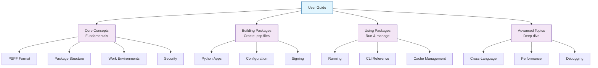

# User Guide

Welcome to the FlavorPack User Guide. This comprehensive guide covers everything you need to know about using FlavorPack to package and distribute Python applications.

## What's in This Guide

### :material-lightbulb: **Core Concepts**

Understand the fundamentals of FlavorPack and the PSPF format.

- **[PSPF Format](concepts/pspf-format/)** - Progressive Secure Package Format specification
- **[Package Structure](concepts/package-structure/)** - How packages are organized
- **[Work Environments](concepts/workenv/)** - Caching and extraction model
- **[Security Model](concepts/security/)** - Cryptographic signing and verification

### :material-hammer: **Building Packages**

Learn how to package your applications.

- **[Python Applications](packaging/python/)** - Package Python apps and CLIs
- **[Manifest Files](packaging/manifest/)** - Configure packaging with manifests
- **[Configuration](packaging/configuration/)** - Advanced configuration options
- **[Signing Packages](packaging/signing/)** - Cryptographically sign packages
- **[Platform Support](packaging/platforms/)** - Cross-platform packaging

### :material-play: **Using Packages**

Execute and manage packaged applications.

- **[Running Packages](usage/running/)** - Execute .psp files
- **[CLI Reference](usage/cli/)** - Command-line interface
- **[Inspecting Packages](usage/inspection/)** - View package contents
- **[Cache Management](usage/cache/)** - Manage work environment cache
- **[Environment Variables](usage/environment/)** - Configure runtime environment

### :material-cog: **Advanced Topics**

Deep dive into advanced features and customization.

- **[Cross-Language Support](advanced/cross-language/)** - Go and Rust integration
- **[Custom Launchers](advanced/launchers/)** - Build custom launchers
- **[Custom Builders](advanced/builders/)** - Extend the build system
- **[Performance Tuning](advanced/performance/)** - Optimize package size and speed
- **[Debugging](advanced/debugging/)** - Troubleshoot issues

## Quick Navigation

Looking for something specific?

- **First time?** → Start with [Getting Started](../getting-started/index/)
- **Need examples?** → Check out the [Cookbook](../cookbook/index/)
- **Having issues?** → See [Troubleshooting](../troubleshooting/index/)
- **Contributing?** → Read [Development Guide](../development/index/)

## Documentation Structure

## Getting Help

If you can't find what you're looking for:

- 📖 Check the [Cookbook](../cookbook/index/) for practical examples
- 📚 Review the [Glossary](../reference/glossary/) for term definitions
- 🔍 Search the documentation (Ctrl+K or Cmd+K)
- 💬 Ask in [Community Support](../community/support/)
- 🐛 Report issues on [GitHub](https://github.com/provide-io/flavorpack/issues)

---

**Ready to start?** Jump to [Core Concepts](concepts/index/) or try the [Quick Start](../getting-started/quickstart/).
