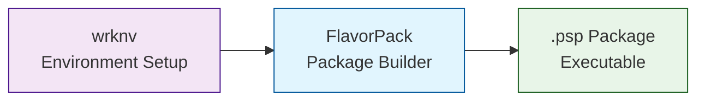

# Integration with wrknv

FlavorPack integrates seamlessly with `wrknv` for environment management and packaging.

!!! info "Optional Integration"
    **FlavorPack works standalone** without wrknv and has its own built-in workenv (work environment) management for package caching and execution.

    This integration is optional. Use wrknv when you want advanced development environment management alongside FlavorPack's packaging capabilities.

## Overview

[wrknv](https://foundry.provide.io/wrknv/) manages development environments, and FlavorPack packages them into distributable executables.



## Basic Workflow

### 1. **Initialize Environment with wrknv**

```bash
# Create environment
wrknv init myproject
cd myproject

# Configure environment
wrknv config set python_version 3.11
wrknv config set dependencies "requests,click,fastapi"

# Activate environment
wrknv activate
```

### 2. **Develop Application**

```python
# src/myapp/cli.py
import click

@click.command()
def main():
    click.echo("Hello from packaged app!")

if __name__ == '__main__':
    main()
```

### 3. **Package with FlavorPack**

```bash
# Package the wrknv-managed application
flavor pack --manifest pyproject.toml --output myapp.psp

# wrknv ensures correct dependencies and Python version
```

## Configuration Integration

### Shared Configuration

Both tools read from `pyproject.toml`:

```toml
[project]
name = "myapp"
version = "1.0.0"
dependencies = ["click>=8.0.0", "requests>=2.28.0"]

[tool.wrknv]
python_version = "3.11"
auto_activate = true

[tool.flavor]
type = "python-app"
entry_point = "myapp.cli:main"
```

### Environment Variables

```toml
[tool.wrknv.env]
# wrknv manages these during development
DATABASE_URL = "postgresql://localhost/dev"
LOG_LEVEL = "debug"

[tool.flavor.execution.runtime.env]
# FlavorPack uses these in packages
pass = ["DATABASE_URL", "LOG_LEVEL"]
set = { "ENVIRONMENT" = "production" }
```

## Advanced Integration

### Use wrknv Cache in Packages

```python
# Custom packaging script
from wrknv import Environment
from flavor import Packager

# Get wrknv environment
env = Environment.load()

# Package with wrknv dependencies
packager = Packager(
    manifest="pyproject.toml",
    python_version=env.python_version,
    dependencies=env.dependencies
)

package = packager.build()
```

### Shared Virtual Environments

```bash
# wrknv creates the venv
wrknv activate

# FlavorPack packages it
flavor pack \
  --venv-path $(wrknv info venv-path) \
  --output myapp.psp
```

## Deployment Workflow

### Development → Staging → Production

```bash
# 1. Development (wrknv)
wrknv activate
python -m myapp.cli  # Test locally

# 2. Package (FlavorPack)
flavor pack --output myapp.psp

# 3. Deploy to staging
scp myapp.psp staging:/opt/myapp/
ssh staging './opt/myapp/myapp.psp'

# 4. Deploy to production (same binary!)
scp myapp.psp prod:/opt/myapp/
```

## Environment Synchronization

### Keep Environments in Sync

```bash
# Update dependencies in wrknv
wrknv add requests==2.31.0

# Rebuild package with new dependencies
flavor pack --force
```

### Lock Dependencies

```bash
# wrknv locks dependencies
wrknv lock

# FlavorPack uses locked versions
flavor pack --use-lock-file
```

## Benefits of Integration

1. **Consistent Environments**: wrknv ensures same environment dev → prod
2. **Simplified Packaging**: FlavorPack uses wrknv's dependency resolution
3. **Version Control**: Both use pyproject.toml for configuration
4. **Smooth Workflow**: Develop with wrknv, deploy with FlavorPack

## Troubleshooting

### Dependency Conflicts

```bash
# Let wrknv resolve conflicts
wrknv install --resolve-conflicts

# Then rebuild package
flavor pack
```

### Python Version Mismatch

```toml
# Ensure versions match
[tool.wrknv]
python_version = "3.11"  # Must match

[tool.flavor]
python_version = "3.11"  # FlavorPack uses same version
```

## See Also

- **[wrknv Documentation](https://foundry.provide.io/wrknv/)**
- **[pyvider Integration](pyvider/)**
- **[Manifest Configuration](../../guide/packaging/manifest/)**
