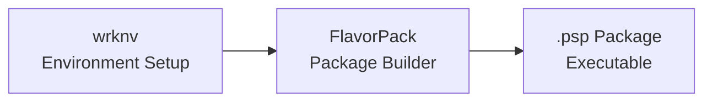

# Integration with wrknv

FlavorPack can be used alongside `wrknv` for development environment management. This integration is optional—FlavorPack works standalone with its own workenv caching.

## Overview

[wrknv](https://foundry.provide.io/wrknv/) manages development environments, and FlavorPack packages your application into a distributable executable.


```mermaid
graph LR
    WE[wrknv<br/>Environment Setup] --> FP[FlavorPack<br/>Package Builder]
    FP --> PKG[.psp Package<br/>Executable]
```

## Basic Workflow

### 1. Initialize Environment with wrknv

```bash
wrknv init myproject
cd myproject

wrknv config set python_version 3.11
wrknv config set dependencies "requests,click,fastapi"

wrknv activate
```

### 2. Develop Your Application

```python
# src/myapp/cli.py
import click

@click.command()
def main():
    click.echo("Hello from packaged app!")

if __name__ == "__main__":
    main()
```

### 3. Package with FlavorPack

```bash
flavor pack --manifest pyproject.toml --output myapp.psp
```

## Configuration Integration

Both tools read from `pyproject.toml`:

```toml
[project]
name = "myapp"
version = "1.0.0"
dependencies = ["click>=8.0.0", "requests>=2.28.0"]

[tool.wrknv]
python_version = "3.11"
auto_activate = true

[tool.flavor]
entry_point = "myapp.cli:main"
```

### Environment Variables

```toml
[tool.wrknv.env]
DATABASE_URL = "postgresql://localhost/dev"
LOG_LEVEL = "debug"

[tool.flavor.execution.runtime.env]
pass = ["DATABASE_URL", "LOG_LEVEL"]
set = { "ENVIRONMENT" = "production" }
```

## Deployment Workflow

```bash
# 1. Development (wrknv)
wrknv activate
python -m myapp.cli

# 2. Package (FlavorPack)
flavor pack --output myapp.psp

# 3. Deploy
scp myapp.psp prod:/opt/myapp/
```

## Troubleshooting

### Dependency Conflicts

```bash
# Let wrknv resolve conflicts, then rebuild
wrknv install --resolve-conflicts
flavor pack
```

## See Also

- **[wrknv Documentation](https://foundry.provide.io/wrknv/)**
- **[pyvider Integration](pyvider.md)**
- **[Manifest Configuration](../../guide/packaging/manifest.md)**
