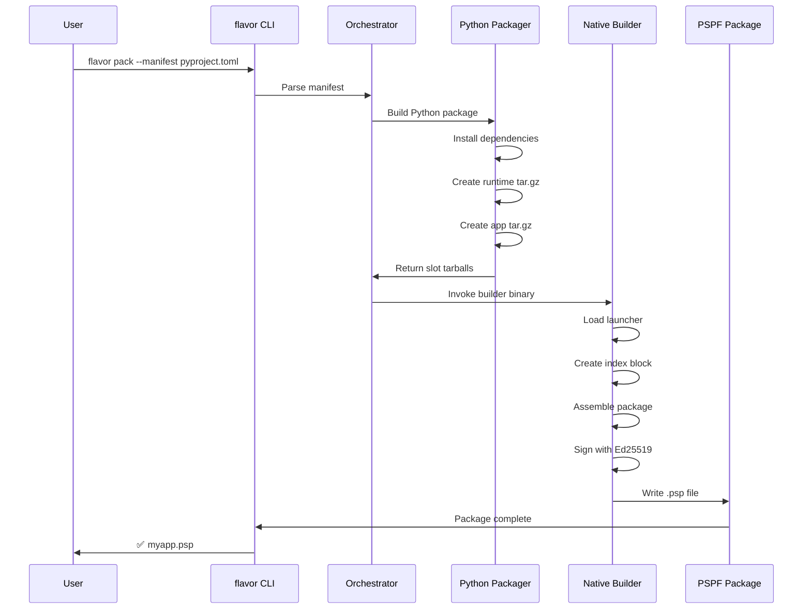

# Creating Packages

Learn how to build self-contained PSPF packages that bundle your Python applications into single executable files.

## Overview

FlavorPack transforms Python applications into portable executables that run anywhere without installation. This guide covers the complete packaging workflow from project setup to distribution.

## Quick Start

### 1. Install FlavorPack

```bash
pip install flavor
```

### 2. Create a Manifest

Add FlavorPack configuration to your `pyproject.toml`:

```toml
[project]
name = "myapp"
version = "1.0.0"
dependencies = [
    "flask>=2.0",
    "requests>=2.0"
]

[tool.flavor]
entry_point = "myapp:main"
python_version = "3.11"
```

### 3. Build the Package

```bash
flavor pack --manifest pyproject.toml
```

This creates `myapp-1.0.0.psp` - a single executable file containing your entire application.

### 4. Run the Package

```bash
./myapp-1.0.0.psp
# Or on Windows:
myapp-1.0.0.psp.exe
```

## Packaging Workflow



### Step 1: Project Structure

Organize your project with a clear structure:

```
myproject/
├── pyproject.toml          # Package manifest
├── src/
│   └── myapp/             # Application code
│       ├── __init__.py
│       ├── main.py        # Entry point
│       └── utils.py
├── tests/                  # Test files
├── static/                 # Static resources
└── README.md              # Documentation
```

### Step 2: Define Entry Point

Your application needs an entry point function:

```python
# src/myapp/main.py
def main():
    """Application entry point."""
    print("Hello from FlavorPack!")
    # Your application logic here

if __name__ == "__main__":
    main()
```

### Step 3: Configure Manifest

The manifest controls how your package is built:

```toml
[project]
name = "myapp"
version = "1.0.0"
description = "My application"
authors = [{name = "Your Name", email = "you@example.com"}]
dependencies = [
    # List all runtime dependencies
    "flask>=2.0",
    "sqlalchemy>=2.0"
]

[tool.flavor]
# Required: Entry point module:function
entry_point = "myapp:main"

# Python version (default: current)
python_version = "3.11"

# Optional: Additional slots
[[tool.flavor.slots]]
id = "config"
source = "config/"
purpose = "configuration"
lifecycle = "persistent"

[[tool.flavor.slots]]
id = "static"
source = "static/"
purpose = "static-resources"
lifecycle = "cached"
# Automatic tar.gz compression
```

### Step 4: Build Package

Build with default settings:

```bash
flavor pack --manifest pyproject.toml
```

Build with options:

```bash
# Sign package with key
flavor pack --manifest pyproject.toml --private-key keys/flavor-private.key --public-key keys/flavor-public.key

# Use deterministic seed (for CI/CD)
flavor pack --manifest pyproject.toml --key-seed "secret-seed"

# Strip debug symbols for smaller size
flavor pack --manifest pyproject.toml --strip

# Specify output location
flavor pack --manifest pyproject.toml --output dist/
```

### Step 5: Verify Package

Always verify your package after building:

```bash
# Basic verification
flavor verify myapp-1.0.0.psp

# Deep verification (all slots)
flavor verify myapp-1.0.0.psp --deep

# Inspect package contents
flavor inspect myapp-1.0.0.psp
```

## Package Components

### Python Environment

FlavorPack automatically creates a virtual environment with your dependencies:

- Installs all dependencies from `pyproject.toml`
- Includes pip for runtime package management
- Optimizes for size (removes __pycache__, tests, docs)
- Compresses with tar.gz for efficiency

### Application Code

Your source code is packaged separately:

- Preserves directory structure
- Includes all Python modules
- Excludes test files by default
- Can include data files and resources

### Slots

Organize content into logical slots:

| Slot Type | Purpose | Example Content |
|-----------|---------|-----------------|
| `python-environment` | Python venv | Dependencies |
| `application-code` | Your code | Python modules |
| `configuration` | Settings | JSON, YAML files |
| `static-resources` | Assets | Images, CSS, JS |
| `data-files` | Data | Databases, models |

## Build Options

### Launcher Selection

Choose between Go and Rust launchers:

```bash
# Use Rust launcher (default)
flavor pack --manifest pyproject.toml --launcher rust

# Use Go launcher
flavor pack --manifest pyproject.toml --launcher go

# Use specific launcher binary
flavor pack --manifest pyproject.toml --launcher-bin /path/to/launcher
```

### Compression

Control slot compression:

```toml
[[tool.flavor.slots]]
id = "large-data"
source = "data/"
# Automatic tar.gz compression  # Options: raw, tar, gzip, tgz
```

### Platform-Specific Builds

Build for specific platforms:

```bash
# Build for current platform (default)
flavor pack --manifest pyproject.toml

# Build for specific platform
flavor pack --manifest pyproject.toml --platform linux_amd64
flavor pack --manifest pyproject.toml --platform darwin_arm64
flavor pack --manifest pyproject.toml --platform windows_amd64
```

## Advanced Features

### Multiple Entry Points

Support multiple commands:

```toml
[project.scripts]
myapp = "myapp:main"
myapp-admin = "myapp.admin:main"
myapp-worker = "myapp.worker:main"
```

### Custom Slots

Add custom content slots:

```toml
[[tool.flavor.slots]]
id = "models"
source = "models/"
purpose = "data-files"
lifecycle = "lazy"  # Load on demand
platform = "linux_amd64"  # Platform-specific
```

### Build Hooks

Run commands during build:

```toml
[tool.flavor.build]
pre_build = ["pytest", "myapp/scripts/prepare.py"]
post_build = ["myapp/scripts/verify.py"]
```

### Deterministic Builds

Ensure reproducible builds:

```bash
# Set seed for deterministic builds
export FLAVOR_SEED="my-secret-seed"
flavor pack --manifest pyproject.toml

# Or use command line
flavor pack --manifest pyproject.toml --key-seed "my-secret-seed"
```

## Best Practices

### 1. Version Management

- Use semantic versioning (e.g., 1.2.3)
- Tag releases in version control
- Include version in package name

### 2. Dependency Management

- Pin exact versions for reproducibility
- Use version ranges for flexibility
- Test with all supported versions

### 3. Size Optimization

- Exclude unnecessary files (tests, docs)
- Use appropriate compression
- Strip debug symbols for production

### 4. Security

- Always sign production packages
- Verify packages before distribution
- Use secure key storage

### 5. Testing

- Test package on target platforms
- Verify all entry points work
- Check resource extraction

## Troubleshooting

### Common Issues

| Issue | Solution |
|-------|----------|
| Large package size | Use compression, exclude unnecessary files |
| Missing dependencies | Check pyproject.toml dependencies |
| Entry point not found | Verify module:function syntax |
| Platform incompatibility | Build for specific platform |

### Debug Mode

Enable verbose output:

```bash
FOUNDATION_LOG_LEVEL=debug flavor pack --manifest pyproject.toml
```

### Cache Issues

Clear build cache:

```bash
flavor clean
rm -rf ~/.cache/flavor/build
```

## Examples

### Flask Web Application

```toml
[project]
name = "webapp"
version = "1.0.0"
dependencies = ["flask>=2.0", "gunicorn>=20.0"]

[tool.flavor]
entry_point = "webapp:create_app"

[[tool.flavor.slots]]
id = "templates"
source = "templates/"
purpose = "static-resources"
```

### CLI Tool

```toml
[project]
name = "mytool"
version = "2.0.0"
dependencies = ["click>=8.0", "rich>=12.0"]

[project.scripts]
mytool = "mytool.cli:main"

[tool.flavor]
entry_point = "mytool.cli:main"
```

### Data Science Application

```toml
[project]
name = "ml-model"
version = "1.0.0"
dependencies = ["numpy", "pandas", "scikit-learn"]

[tool.flavor]
entry_point = "model:predict"

[[tool.flavor.slots]]
id = "models"
source = "trained_models/"
purpose = "data-files"
lifecycle = "lazy"
```

## Related Documentation

- [Manifest Configuration](manifest/) - Detailed manifest options
- [Python Packaging](python/) - Python-specific features
- [Package Signing](signing/) - Security and signatures
- [Platform Support](platforms/) - Cross-platform packaging
- [API Reference](../../api/index/) - Python API
- [Troubleshooting](../../troubleshooting/index/) - Common issues
