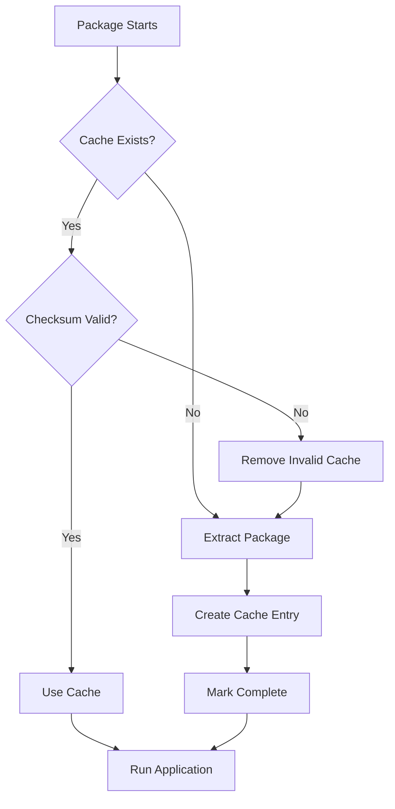

# Cache Management

Manage FlavorPack's work environment cache for efficient package execution.

## Overview

FlavorPack uses a work environment cache to avoid extracting packages on every execution. Understanding and managing this cache is essential for optimal performance and disk usage.

### What is the Cache?

When a PSPF package runs for the first time, it extracts its contents to a cache directory. Subsequent executions reuse this cached extraction, providing:

- **Faster startup**: No re-extraction needed
- **Consistency**: Same environment across runs
- **Validation**: Checksums verify cache integrity

### Cache Location

Default cache locations:

| Platform | Default Path |
|----------|--------------|
| **Linux** | `~/.cache/flavor/workenv/` |
| **macOS** | `~/.cache/flavor/workenv/` |
| **Windows** | `%LOCALAPPDATA%\flavor\workenv\` |

**Custom locations:**

```bash
# Set custom cache directory
export FLAVOR_CACHE=/custom/path

# Use XDG Base Directory specification
export XDG_CACHE_HOME=/custom/xdg/cache
# Cache will be: /custom/xdg/cache/flavor/workenv
```

---

## Cache Commands

### List Cached Packages

View all packages in the cache:

```bash
flavor workenv list
```

**Output:**

```
🗂️  Cached Packages:
============================================================

📦 myapp v1.0.0
   ID: pspf-a3f7b9c2d1e4f5a6
   Size: 45.2 MB
   Modified: 2025-10-24 15:45:30

📦 data-processor v2.3.1
   ID: pspf-8d7c6b5a4e3f2g1h
   Size: 32.1 MB
   Modified: 2025-10-23 10:22:15

📦 web-server v1.5.0
   ID: pspf-1a2b3c4d5e6f7g8h
   Size: 78.9 MB
   Modified: 2025-10-20 08:15:42
```

### Cache Information

Get cache statistics:

```bash
flavor workenv info
```

**Output:**

```
📊 Cache Information
========================================
Cache directory: /home/user/.cache/flavor/workenv
Total size: 156.2 MB
Number of packages: 3
```

### Clean Cache

Remove old or all packages from cache:

```bash
# Remove all packages (with confirmation)
flavor workenv clean

# Remove packages older than 30 days
flavor workenv clean --older-than 30

# Skip confirmation prompt
flavor workenv clean -y
```

**Interactive Prompt:**

```
Remove all cached packages? [y/N]: y
✅ Removed 3 cached package(s)
```

### Remove Specific Package

Remove a single package from cache:

```bash
# With confirmation
flavor workenv remove pspf-a3f7b9c2d1e4f5a6

# Without confirmation
flavor workenv remove pspf-a3f7b9c2d1e4f5a6 -y
```

**Output:**

```
Remove myapp (45.2 MB)? [y/N]: y
✅ Removed package 'pspf-a3f7b9c2d1e4f5a6'
```

### Inspect Cache Entry

View detailed metadata for a cached package:

```bash
flavor workenv inspect pspf-a3f7b9c2d1e4f5a6
```

**Output:**

```
============================================================
📦 Package: pspf-a3f7b9c2d1e4f5a6
------------------------------------------------------------
📁 Location: /home/user/.cache/flavor/workenv/pspf-a3f7b9c2d1e4f5a6
🗂️  Metadata Type: pspf_2025
✅ Extraction: Complete
🔐 Checksum: sha256:a3f7b9c2d1e4f5a6...

📋 Index Metadata:
  Format Version: 0x2025000c
  Package Size: 47,398,912 bytes
  Launcher Size: 2,201,600 bytes
  Slot Count: 2
  Build Time: 2025-10-24 15:30:00

📦 Package Info:
  Name: myapp
  Version: 1.0.0
  Builder: flavor-rs-builder
```

**JSON Output:**

```bash
flavor workenv inspect pspf-a3f7b9c2d1e4f5a6 --json
```

---

## Cache Structure

### Directory Layout

```
~/.cache/flavor/workenv/
├── pspf-a3f7b9c2d1e4f5a6/           # Package workenv (content)
│   ├── bin/                         # Executables
│   ├── lib/                         # Libraries
│   └── ...                          # Other extracted files
│
├── .pspf-a3f7b9c2d1e4f5a6.pspf/    # Metadata directory
│   ├── package/
│   │   └── psp.json                 # Package metadata
│   └── instance/
│       ├── index.json               # Index block
│       ├── extract/
│       │   └── complete             # Completion marker
│       └── slots/
│           ├── slot_0.json          # Slot 0 metadata
│           └── slot_1.json          # Slot 1 metadata
│
└── pspf-8d7c6b5a4e3f2g1h/           # Another package
    └── ...
```

### Cache ID Format

Cache IDs are derived from the package checksum:

```
pspf-{first-16-chars-of-sha256}
```

This ensures:
- **Uniqueness**: Different packages have different IDs
- **Consistency**: Same package always has the same ID
- **Collision resistance**: SHA-256 prefix provides high uniqueness

---

## Cache Validation

### Automatic Validation

Every time a package runs, FlavorPack validates the cache:



### Checksum Verification

Cached extractions are validated using:

- **Package checksum**: SHA-256 of package file
- **Extraction marker**: Ensures extraction completed
- **Metadata integrity**: Validates JSON metadata

If validation fails, the cache is automatically regenerated.

---

## Cache Management Strategies

### Daily Development

For active development:

```bash
# Clean old caches weekly
flavor workenv clean --older-than 7

# Check cache size occasionally
flavor workenv info
```

### CI/CD Pipelines

In continuous integration:

```bash
# Clean before build (start fresh)
flavor workenv clean -y

# Or use temporary cache
export FLAVOR_CACHE=/tmp/flavor-cache-$CI_JOB_ID
```

### Production Servers

On production systems:

```bash
# Keep caches (faster startup)
# Only clean when disk space is low

# Monitor cache size
flavor workenv info

# Remove specific old versions
flavor workenv list | grep old-version
flavor workenv remove pspf-old-id -y
```

### Disk Space Constraints

When disk space is limited:

```bash
# Find large caches
flavor workenv list | sort -k3 -h

# Remove largest caches
flavor workenv remove pspf-large-id -y

# Or clean all
flavor workenv clean -y
```

---

## Cache Troubleshooting

### "Cache directory not writable"

**Problem:** No write permissions to cache directory.

**Solution:**

```bash
# Check permissions
ls -la ~/.cache/flavor/

# Fix permissions
chmod 755 ~/.cache/flavor/workenv/

# Or use custom cache location
export FLAVOR_CACHE=/tmp/flavor-cache
```

### "Corrupted cache entry"

**Problem:** Cache validation failed.

**Solution:**

```bash
# Package will automatically regenerate cache
./myapp.psp

# Or manually remove corrupted cache
flavor workenv remove pspf-corrupted-id -y
```

### "Cache fills up disk"

**Problem:** Too many cached packages.

**Solution:**

```bash
# Check cache size
flavor workenv info

# Clean old caches
flavor workenv clean --older-than 30

# Or clean all
flavor workenv clean -y
```

### "Wrong package version cached"

**Problem:** Cache ID collision (extremely rare).

**Solution:**

```bash
# Remove the cache
flavor workenv remove pspf-conflicted-id -y

# Re-run package to regenerate
./myapp.psp
```

---

## Environment Variables

### Cache Configuration

| Variable | Default | Description |
|----------|---------|-------------|
| `FLAVOR_CACHE` | `~/.cache/flavor/workenv` | Override cache directory |
| `XDG_CACHE_HOME` | `~/.cache` | XDG Base Directory specification |
| `FLAVOR_CACHE_VALIDATION` | `true` | Enable/disable cache validation |

### Examples

```bash
# Use temporary cache
export FLAVOR_CACHE=/tmp/flavor-cache
./myapp.psp

# Use project-local cache
export FLAVOR_CACHE=./.flavor-cache
./myapp.psp

# Disable validation (not recommended)
export FLAVOR_CACHE_VALIDATION=false
./myapp.psp
```

---

## Cache Lifecycle

### First Execution

```bash
$ ./myapp.psp --version

# What happens:
# 1. Launcher reads package
# 2. Generates cache ID from checksum
# 3. Checks if cache exists → No
# 4. Extracts all slots to cache
# 5. Marks extraction complete
# 6. Runs application from cache

myapp 1.0.0
```

### Subsequent Executions

```bash
$ ./myapp.psp --version

# What happens:
# 1. Launcher reads package
# 2. Generates cache ID
# 3. Checks if cache exists → Yes
# 4. Validates cache checksum → Valid
# 5. Runs application from cache (no extraction)

myapp 1.0.0
```

### Cache Invalidation

Cache is invalidated when:

- Package file changes (different checksum)
- Completion marker is missing
- Cache directory is corrupted
- Manual removal

---

## Monitoring Cache Usage

### Automated Monitoring

```bash
#!/bin/bash
# monitor-cache.sh

CACHE_INFO=$(flavor workenv info)
CACHE_SIZE=$(echo "$CACHE_INFO" | grep "Total size:" | awk '{print $3}')
PKG_COUNT=$(echo "$CACHE_INFO" | grep "Number of packages:" | awk '{print $4}')

echo "Cache size: $CACHE_SIZE"
echo "Packages: $PKG_COUNT"

# Alert if over 1 GB
if [ "${CACHE_SIZE%.*}" -gt 1000 ]; then
    echo "⚠️  Cache exceeds 1 GB, consider cleaning"
fi
```

### Log Cache Operations

```bash
# Enable debug logging
export FOUNDATION_LOG_LEVEL=debug

# Run package and see cache operations
./myapp.psp --version 2>&1 | grep cache
```

---

## Best Practices

!!! tip "Development"
    - Keep caches during active development
    - Clean weekly or when switching projects
    - Use `workenv list` to see what's cached

!!! tip "CI/CD"
    - Clean cache before builds for reproducibility
    - Or use job-specific cache directories
    - Consider caching between pipeline stages

!!! tip "Production"
    - Keep caches for faster startup
    - Monitor disk usage regularly
    - Only clean when necessary

!!! tip "Performance"
    - Cache dramatically improves startup time
    - Validation adds minimal overhead
    - First run is slower (extraction required)

!!! warning "Security"
    - Cache validation prevents tampering
    - Never disable validation in production
    - Cache checksums protect integrity

---

## Advanced Usage

### Pre-populate Cache

Extract packages ahead of time:

```bash
# Run package once to populate cache
./myapp.psp --version

# Cache is now ready for fast subsequent runs
```

### Shared Cache (Multi-user)

For shared systems:

```bash
# Create shared cache directory
sudo mkdir -p /opt/flavor-cache
sudo chmod 1777 /opt/flavor-cache  # Sticky bit for safety

# All users use shared cache
export FLAVOR_CACHE=/opt/flavor-cache
```

### Read-only Cache

For immutable deployments:

```bash
# Populate cache
./myapp.psp --version

# Make cache read-only
chmod -R 555 ~/.cache/flavor/workenv/

# Package still runs (no re-extraction needed)
./myapp.psp
```

---

## See Also

- [Running Packages](running/) - Package execution
- [Environment Variables](environment/) - All environment variables
- [Work Environments](../concepts/workenv/) - Cache concepts
- [CLI Reference](cli/) - Cache commands
- [Troubleshooting](../../troubleshooting/index/) - Common issues

---

**Need help?** Run `flavor workenv --help` for command-specific documentation.
