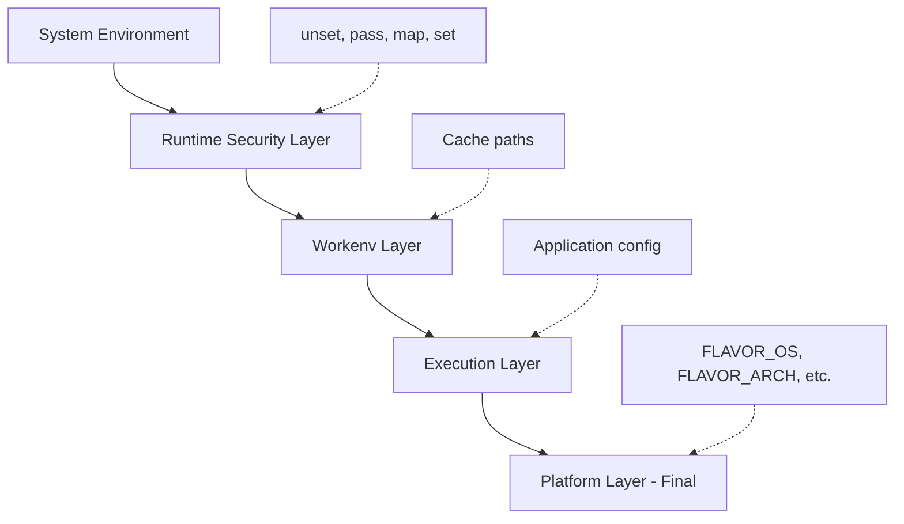

# Environment Variables

Configure FlavorPack's build, runtime, and execution behavior with environment variables.

## Overview

FlavorPack uses different environment variables depending on the context:

- **FlavorPack CLI** (`flavor pack`, `flavor verify`, etc.): Uses `FOUNDATION_*` variables
- **Packaged Applications** (`.psp` files): Uses `FLAVOR_*` variables
- **Build-time**: Configure package creation
- **Runtime**: Control package execution
- **Cache**: Manage work environment cache

---

## FlavorPack CLI Variables

Variables for controlling the `flavor` command-line tool.

### FOUNDATION_LOG_LEVEL

**Default:** `info`
**Values:** `trace`, `debug`, `info`, `warning`, `error`
**Purpose:** Control logging verbosity for FlavorPack CLI commands

```bash
# Debug package building
FOUNDATION_LOG_LEVEL=debug flavor pack

# Trace-level logging
FOUNDATION_LOG_LEVEL=trace flavor verify myapp.psp
```

### FOUNDATION_LOG_FILE

**Default:** None
**Purpose:** Write FlavorPack CLI logs to a file

```bash
# Log to file
FOUNDATION_LOG_FILE=flavor-build.log flavor pack
```

---

---

## Build-Time Variables

Variables that affect package creation with `flavor pack`.

### FLAVOR_WORKENV_BASE

**Default:** Current working directory
**Purpose:** Base directory for resolving `{workenv}` placeholders in manifests

```bash
# Use custom workenv base
export FLAVOR_WORKENV_BASE=/opt/myproject
flavor pack --manifest pyproject.toml
```

### FLAVOR_OUTPUT_FORMAT

**Default:** `text`
**Values:** `text`, `json`
**Purpose:** Output format for build logs

```bash
# JSON output for CI/CD parsing
export FLAVOR_OUTPUT_FORMAT=json
flavor pack --manifest pyproject.toml
```

### FLAVOR_OUTPUT_FILE

**Default:** `STDOUT`
**Values:** File path, `STDOUT`, `STDERR`
**Purpose:** Where to write build output

```bash
# Write output to file
export FLAVOR_OUTPUT_FILE=build.log
flavor pack --manifest pyproject.toml
```

---

## Packaged Application Variables

Variables that affect execution of packaged `.psp` applications.

### FLAVOR_LOG_LEVEL

**Default:** `info`
**Values:** `trace`, `debug`, `info`, `warn`, `error`
**Purpose:** Set logging verbosity for packaged application execution

```bash
# Debug package execution
FLAVOR_LOG_LEVEL=debug ./myapp.psp

# Minimal logging
FLAVOR_LOG_LEVEL=error ./myapp.psp
```

### FLAVOR_CACHE

**Default:** `~/.cache/flavor/workenv`
**Purpose:** Override cache directory location

```bash
# Use temporary cache
FLAVOR_CACHE=/tmp/flavor-cache ./myapp.psp

# Use project-local cache
FLAVOR_CACHE=./.cache/flavor ./myapp.psp

# Disable cache (extract to temp dir each run)
FLAVOR_CACHE="" ./myapp.psp
```

### FLAVOR_CACHE_VALIDATION

**Default:** `true`
**Values:** `true`, `false`
**Purpose:** Enable/disable cache integrity validation

```bash
# Disable validation (not recommended for production)
FLAVOR_CACHE_VALIDATION=false ./myapp.psp
```

!!! warning "Security"
    Disabling cache validation can allow tampered packages to execute.
    Only disable in trusted environments.

### FLAVOR_LAUNCHER_CLI

**Default:** `false`
**Values:** `true`, `false`
**Purpose:** Enable launcher CLI mode (for debugging)

```bash
# Inspect package with launcher CLI
FLAVOR_LAUNCHER_CLI=1 ./myapp.psp inspect
FLAVOR_LAUNCHER_CLI=1 ./myapp.psp verify
FLAVOR_LAUNCHER_CLI=1 ./myapp.psp extract
```

---

## Cache Variables

Variables controlling work environment cache behavior.

### XDG_CACHE_HOME

**Default:** `~/.cache`
**Purpose:** XDG Base Directory specification for cache location

```bash
# Use XDG-compliant cache location
export XDG_CACHE_HOME=/custom/cache
# FlavorPack cache will be: /custom/cache/flavor/workenv
./myapp.psp
```

---

## Logging Variables

Variables for diagnostic logging (Foundation framework).

### FOUNDATION_LOG_LEVEL

**Default:** `info`
**Values:** `trace`, `debug`, `info`, `warning`, `error`
**Purpose:** Set log level for FlavorPack tools (flavor pack, inspect, etc.)

```bash
# Debug build process
FOUNDATION_LOG_LEVEL=debug flavor pack --manifest pyproject.toml

# Trace all operations
FOUNDATION_LOG_LEVEL=trace flavor inspect myapp.psp
```

### FOUNDATION_LOG_FILE

**Default:** None (log to console)
**Purpose:** Write logs to file instead of console

```bash
# Log build to file
FOUNDATION_LOG_FILE=build.log flavor pack --manifest pyproject.toml

# Logs written to build.log
cat build.log
```

### FOUNDATION_SETUP_LOG_LEVEL

**Default:** `warning`
**Values:** `trace`, `debug`, `info`, `warning`, `error`
**Purpose:** Control Foundation initialization logs

```bash
# Hide foundation setup logs
FOUNDATION_SETUP_LOG_LEVEL=error flavor pack
```

---

## Platform Variables (Read-Only)

Variables automatically set by FlavorPack during execution. These cannot be overridden.

### FLAVOR_OS

**Set by:** FlavorPack launcher
**Values:** `linux`, `darwin`, `windows`
**Purpose:** Operating system identifier

```python
import os
os_name = os.environ['FLAVOR_OS']  # 'linux', 'darwin', or 'windows'
```

### FLAVOR_ARCH

**Set by:** FlavorPack launcher
**Values:** `amd64`, `arm64`, `x86`, `i386`
**Purpose:** CPU architecture identifier

```python
import os
arch = os.environ['FLAVOR_ARCH']  # 'amd64', 'arm64', etc.
```

### FLAVOR_PLATFORM

**Set by:** FlavorPack launcher
**Values:** `{os}_{arch}` (e.g., `linux_amd64`, `darwin_arm64`)
**Purpose:** Combined platform identifier

```python
import os
platform = os.environ['FLAVOR_PLATFORM']  # 'linux_amd64', 'darwin_arm64', etc.
```

### FLAVOR_OS_VERSION

**Set by:** FlavorPack launcher
**Values:** OS-specific version string
**Purpose:** Operating system version

```python
import os
os_version = os.environ.get('FLAVOR_OS_VERSION')  # '5.15.0', '14.2', etc.
```

### FLAVOR_CPU_TYPE

**Set by:** FlavorPack launcher
**Values:** CPU family/type
**Purpose:** CPU type identifier

```python
import os
cpu_type = os.environ.get('FLAVOR_CPU_TYPE')  # 'x86_64', 'aarch64', etc.
```

---

## Application-Specific Variables

Variables your packaged application can use.

### Custom Application Variables

Set custom variables in your package manifest:

```toml
# pyproject.toml
[tool.flavor.environment]
set = { APP_ENV = "production", DEBUG = "false" }
```

These are set during package execution:

```python
import os
app_env = os.environ['APP_ENV']  # 'production'
debug = os.environ['DEBUG']  # 'false'
```

---

## Environment Layers

FlavorPack applies environment variables in layers, with later layers overriding earlier ones:



### Layer 1: Runtime Security

Manifest-defined environment operations:

```toml
[tool.flavor.environment]
# Preserve specific variables
pass = ["PATH", "HOME", "USER"]

# Remove sensitive variables
unset = ["AWS_*", "SECRET_*"]

# Rename variables
[tool.flavor.environment.map]
OLD_VAR = "NEW_VAR"

# Set new variables
[tool.flavor.environment.set]
APP_MODE = "production"
```

### Layer 2: Workenv

Work environment paths:

```bash
PATH=/cache/workenv/bin:$PATH
LD_LIBRARY_PATH=/cache/workenv/lib
PYTHONPATH=/cache/workenv/lib/python3.11/site-packages
```

### Layer 3: Execution

Application-specific settings from manifest.

### Layer 4: Platform (Automatic)

Platform variables (FLAVOR_OS, FLAVOR_ARCH, etc.) are always set last and cannot be overridden.

---

## Variable Precedence

When the same variable is set in multiple places:

1. **Platform layer** (highest priority, cannot override)
2. **Execution layer** (manifest settings)
3. **Workenv layer** (cache paths)
4. **Runtime security layer** (manifest operations)
5. **System environment** (lowest priority)

---

## Common Patterns

### Development with Debug Logging

```bash
export FOUNDATION_LOG_LEVEL=debug
export FLAVOR_LOG_LEVEL=debug

flavor pack --manifest pyproject.toml
./myapp.psp
```

### CI/CD Pipeline

```bash
# Clean environment, JSON output
export FLAVOR_CACHE=/tmp/flavor-cache-$CI_JOB_ID
export FLAVOR_OUTPUT_FORMAT=json
export FOUNDATION_LOG_LEVEL=warning

flavor pack --manifest pyproject.toml --output dist/myapp.psp
```

### Production Deployment

```bash
# Minimal logging, persistent cache
export FLAVOR_LOG_LEVEL=error
export FOUNDATION_LOG_LEVEL=error
export FLAVOR_CACHE=/opt/flavor-cache

./myapp.psp
```

### Testing with Temporary Cache

```bash
# Isolated cache per test run
export FLAVOR_CACHE=/tmp/test-cache-$$

./myapp.psp --test
rm -rf /tmp/test-cache-$$
```

### Cross-Platform Detection

```python
#!/usr/bin/env python3
"""Detect platform in packaged application."""

import os
import sys

def detect_platform():
    """Detect platform using FlavorPack variables."""
    flavor_os = os.environ.get('FLAVOR_OS')
    flavor_arch = os.environ.get('FLAVOR_ARCH')
    flavor_platform = os.environ.get('FLAVOR_PLATFORM')

    if flavor_platform:
        # Running in FlavorPack package
        print(f"Platform: {flavor_platform}")
        print(f"OS: {flavor_os}")
        print(f"Arch: {flavor_arch}")
    else:
        # Running outside package (development)
        print(f"Platform: {sys.platform}")
        print("Not packaged (using system Python)")

if __name__ == '__main__':
    detect_platform()
```

---

## Troubleshooting

### "Variable not set" errors

**Problem:** Required variable missing

**Solution:**

```bash
# Check current variables
env | grep FLAVOR_

# Set missing variable
export FLAVOR_LOG_LEVEL=debug
./myapp.psp
```

### Cache directory permission errors

**Problem:** Cannot write to cache directory

**Solution:**

```bash
# Use writable cache location
export FLAVOR_CACHE=/tmp/flavor-cache
./myapp.psp

# Or fix permissions
chmod 755 ~/.cache/flavor/workenv
```

### Platform variables not available

**Problem:** FLAVOR_OS, FLAVOR_ARCH not set

**Solution:**

```bash
# These are only set during package execution
./myapp.psp  # Variables will be set

# Not available during:
python myapp.py  # Running outside package
flavor pack  # Build time (not execution)
```

### Logging too verbose

**Problem:** Too much log output

**Solution:**

```bash
# Reduce logging
export FLAVOR_LOG_LEVEL=error
export FOUNDATION_LOG_LEVEL=warning
./myapp.psp
```

---

## Variable Reference Table

### Quick Reference

| Variable | Scope | Default | Description |
|----------|-------|---------|-------------|
| `FLAVOR_WORKENV_BASE` | Build | CWD | Workenv base directory |
| `FLAVOR_OUTPUT_FORMAT` | Build | `text` | Output format (text/json) |
| `FLAVOR_OUTPUT_FILE` | Build | `STDOUT` | Output destination |
| `FLAVOR_LOG_LEVEL` | Runtime | `info` | Package log level |
| `FLAVOR_CACHE` | Runtime | `~/.cache/flavor/workenv` | Cache directory |
| `FLAVOR_CACHE_VALIDATION` | Runtime | `true` | Enable cache validation |
| `FLAVOR_LAUNCHER_CLI` | Runtime | `false` | Launcher CLI mode |
| `FOUNDATION_LOG_LEVEL` | Tools | `info` | Tool log level |
| `FOUNDATION_LOG_FILE` | Tools | - | Log file path |
| `FOUNDATION_SETUP_LOG_LEVEL` | Tools | `warning` | Setup log level |
| `XDG_CACHE_HOME` | Runtime | `~/.cache` | XDG cache base |
| `FLAVOR_OS` | Runtime | Auto | Operating system |
| `FLAVOR_ARCH` | Runtime | Auto | CPU architecture |
| `FLAVOR_PLATFORM` | Runtime | Auto | Platform string |
| `FLAVOR_OS_VERSION` | Runtime | Auto | OS version |
| `FLAVOR_CPU_TYPE` | Runtime | Auto | CPU type |

---

## Best Practices

!!! tip "Development"
    - Use `debug` log level during development
    - Use project-local cache for isolation
    - Enable verbose logging for troubleshooting

!!! tip "Production"
    - Use `error` or `warn` log level
    - Use persistent cache for performance
    - Never disable cache validation

!!! tip "CI/CD"
    - Use `json` output format for parsing
    - Use job-specific cache directories
    - Set `warning` or `error` log level

!!! tip "Security"
    - Never commit `.env` files with secrets
    - Use manifest `unset` for sensitive variables
    - Use `pass` to explicitly allow variables

---

## Deprecated Variables

!!! danger "Do Not Use"
    These variables are deprecated and should not be used in new code. They are documented here only for reference when maintaining legacy configurations.

### FLAVOR_WORKENV

**Status:** Deprecated
**Replacement:** Use `FLAVOR_CACHE` instead
**Purpose:** Legacy cache directory override (no longer supported)

This variable has been replaced by `FLAVOR_CACHE`. Using `FLAVOR_WORKENV` may result in undefined behavior.

---

## See Also

- [Running Packages](running.md) - Package execution
- [Cache Management](cache.md) - Cache configuration
- [CLI Reference](cli.md) - Command-line options
- [Packaging Guide](../packaging/configuration.md) - Manifest configuration
- [Work Environments](../concepts/workenv.md) - Cache concepts

---

**Need help?** Check variable values with `env | grep FLAVOR_` or `env | grep FOUNDATION_`.
