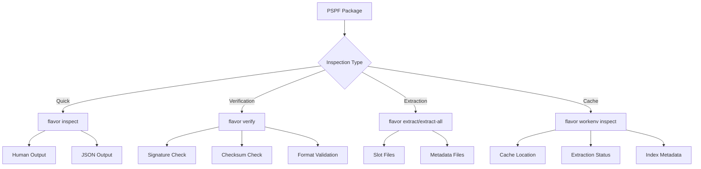

# Inspecting Packages

View package contents, metadata, and verify integrity of PSPF packages.

## Overview

FlavorPack provides multiple commands for inspecting package contents, from quick overviews to detailed metadata exploration.

### Inspection Commands

| Command | Purpose | Output |
|---------|---------|--------|
| `flavor inspect` | Quick package overview | Human or JSON |
| `flavor verify` | Verify integrity and signatures | Validation status |
| `flavor extract` | Extract specific slot | Slot data file |
| `flavor extract-all` | Extract all slots | Directory with slots |
| `flavor workenv inspect` | Inspect cached extraction | Cache metadata |

---

## Quick Inspection

### Basic Package Overview

Get a quick summary of package contents:

```bash
flavor inspect myapp.psp
```

**Output:**

```
Package: myapp.psp (45.2 MB)
├── Format: PSPF/0x2025000c
├── Launcher: rust (2.1 MB)
├── Built: 2025-10-24 15:30 with flavor-rs-builder v0.1.0
├── Package: myapp v1.0.0
└── Slots: 2
    ├── [0] python-runtime (42.5 MB) - Python 3.11 runtime
    └── [1] app-code (0.6 MB) - Application code and dependencies
```

### Understanding the Output

- **Format**: PSPF format version (hex-encoded)
- **Launcher**: Type (rust/go) and size of embedded launcher
- **Built**: Build timestamp and builder version
- **Package**: Application name and version from metadata
- **Slots**: Data slots containing runtime, code, and resources

---

## JSON Output

### Programmatic Inspection

For scripting and automation, use JSON output:

```bash
flavor inspect myapp.psp --json
```

**Output Structure:**

```json
{
  "package": "myapp.psp",
  "format": "PSPF/0x2025000c",
  "format_version": "0x2025000c",
  "size": 47398912,
  "launcher_size": 2201600,
  "package_metadata": {
    "name": "myapp",
    "version": "1.0.0",
    "description": "My application",
    "author": "Your Name",
    "license": "Apache-2.0"
  },
  "build_metadata": {
    "timestamp": "2025-10-24T15:30:00Z",
    "builder_version": "0.1.0",
    "builder_type": "flavor-rs-builder",
    "launcher_type": "rust",
    "platform": "linux-x86_64",
    "python_version": "3.11.9"
  },
  "slots": [
    {
      "index": 0,
      "name": "python-runtime",
      "purpose": "Python 3.11 runtime",
      "size": 44564480,
      "codec": "tar.gz"
    },
    {
      "index": 1,
      "name": "app-code",
      "purpose": "Application code and dependencies",
      "size": 629120,
      "codec": "tar.gz"
    }
  ]
}
```

### Parsing JSON with jq

Extract specific fields using `jq`:

```bash
# Get package size in MB
flavor inspect myapp.psp --json | jq '.size / 1048576'

# List slot names
flavor inspect myapp.psp --json | jq -r '.slots[].name'

# Get build timestamp
flavor inspect myapp.psp --json | jq -r '.build_metadata.timestamp'

# Check Python version
flavor inspect myapp.psp --json | jq -r '.build_metadata.python_version'
```

---

## Verification

### Signature Verification

Verify package integrity and Ed25519 signature:

```bash
flavor verify myapp.psp
```

**Output:**

```
🔍 Verifying package 'myapp.psp'...

Package: myapp.psp
Format: PSPF/2025
Size: 45.2 MB

Index Block:
  ✅ Checksum: Valid (SHA-256)
  ✅ Launcher Size: 2.1 MB
  ✅ Slot Count: 2

Metadata:
  ✅ Format: Valid JSON
  ✅ Compression: gzip
  ✅ Size: 1,024 bytes

Signature:
  ✅ Algorithm: Ed25519
  ✅ Status: Valid
  ✅ Public Key: Present in metadata

✅ Package verification successful!
```

### Verification Failure

If verification fails, you'll see specific error details:

```
❌ Package verification failed!

Index Block:
  ❌ Checksum: Invalid (expected: abc123..., got: def456...)

Signature:
  ❌ Status: Invalid signature
  ⚠️  Package may be tampered or corrupted
```

!!! warning "Security"
    Never run packages that fail verification unless you fully trust the source.
    Verification failures indicate potential tampering or corruption.

---

## Slot Extraction

### Extract Specific Slot

Extract individual slots for examination:

```bash
# Extract slot 0 (Python runtime)
flavor extract myapp.psp 0 runtime.tar.gz

# Extract slot 1 (application code)
flavor extract myapp.psp 1 app-code.tar.gz
```

**Output:**

```
📦 Extracting slot 0 from myapp.psp
✅ Extracted 42.5 MB to runtime.tar.gz
```

### Examine Extracted Slot

```bash
# List contents
tar -tzf runtime.tar.gz | head -20

# Extract to directory
mkdir runtime
tar -xzf runtime.tar.gz -C runtime/

# Inspect contents
ls -lah runtime/
```

### Extract All Slots

Extract all slots at once:

```bash
flavor extract-all myapp.psp extracted/
```

**Output Structure:**

```
extracted/
├── slot_0.tar.gz        # Python runtime
├── slot_1.tar.gz        # Application code
├── metadata.json        # Package metadata
└── index.json           # Index block data
```

**Metadata Files:**

```bash
# View package metadata
cat extracted/metadata.json | jq

# View index data
cat extracted/index.json | jq
```

---

## Cache Inspection

### Inspecting Cached Packages

When packages run, they're extracted to a cache. Inspect cached extractions:

```bash
# List cached packages
flavor workenv list

# Output
🗂️  Cached Packages:
============================================================

📦 myapp v1.0.0
   ID: pspf-a3f7b9c2d1e4f5a6
   Size: 45.2 MB
   Modified: 2025-10-24 15:45:30
```

### Detailed Cache Inspection

```bash
flavor workenv inspect pspf-a3f7b9c2d1e4f5a6
```

**Output:**

```
============================================================
📦 Package: pspf-a3f7b9c2d1e4f5a6
------------------------------------------------------------
📁 Location: /home/user/.cache/flavor/pspf-a3f7b9c2d1e4f5a6
🗂️  Metadata Type: pspf_2025
✅ Extraction: Complete
🔐 Checksum: sha256:a3f7b9c2d1e4f5a6...

📋 Index Metadata:
  Format Version: 0x2025000c
  Package Size: 47,398,912 bytes
  Launcher Size: 2,201,600 bytes
  Slot Count: 2
  Build Time: 2025-10-24 15:30:00

📦 Package Info:
  Name: myapp
  Version: 1.0.0
  Builder: flavor-rs-builder
```

### Cache JSON Output

```bash
flavor workenv inspect pspf-a3f7b9c2d1e4f5a6 --json
```

---

## Inspection Workflows

### Pre-Distribution Checklist

Before distributing packages:

```bash
#!/bin/bash
# verify-package.sh

PACKAGE="$1"

echo "Inspecting $PACKAGE..."

# 1. Verify integrity
if ! flavor verify "$PACKAGE"; then
    echo "❌ Verification failed!"
    exit 1
fi

# 2. Check size
SIZE=$(flavor inspect "$PACKAGE" --json | jq '.size')
MAX_SIZE=$((100 * 1024 * 1024))  # 100 MB

if [ "$SIZE" -gt "$MAX_SIZE" ]; then
    echo "⚠️  Package exceeds 100 MB: $(($SIZE / 1024 / 1024)) MB"
fi

# 3. Extract metadata
flavor inspect "$PACKAGE" --json > "$PACKAGE.json"

echo "✅ Package verified and metadata extracted"
```

### Comparing Packages

Compare two package versions:

```bash
#!/bin/bash
# compare-packages.sh

OLD="$1"
NEW="$2"

echo "Comparing packages..."

# Extract metadata
flavor inspect "$OLD" --json > old.json
flavor inspect "$NEW" --json > new.json

# Compare sizes
OLD_SIZE=$(jq '.size' old.json)
NEW_SIZE=$(jq '.size' new.json)
DIFF=$((NEW_SIZE - OLD_SIZE))

echo "Size change: $(($DIFF / 1024 / 1024)) MB"

# Compare versions
OLD_VER=$(jq -r '.package_metadata.version' old.json)
NEW_VER=$(jq -r '.package_metadata.version' new.json)

echo "Version: $OLD_VER → $NEW_VER"

# Compare slot counts
OLD_SLOTS=$(jq '.slots | length' old.json)
NEW_SLOTS=$(jq '.slots | length' new.json)

echo "Slots: $OLD_SLOTS → $NEW_SLOTS"

# Cleanup
rm old.json new.json
```

### Debugging Package Issues

When packages fail to run:

```bash
# 1. Verify integrity
flavor verify myapp.psp

# 2. Check cache
flavor workenv list

# 3. Inspect cache entry
CACHE_ID=$(flavor workenv list | grep myapp | awk '{print $3}')
flavor workenv inspect "$CACHE_ID"

# 4. Extract and examine slots
flavor extract-all myapp.psp debug/
ls -lah debug/

# 5. Check metadata
cat debug/metadata.json | jq

# 6. Verify slot integrity
tar -tzf debug/slot_0.tar.gz > /dev/null 2>&1
if [ $? -eq 0 ]; then
    echo "✅ Slot 0 is valid tar.gz"
else
    echo "❌ Slot 0 is corrupted"
fi
```

---

## Inspection Diagram



---

## Common Inspection Tasks

### Check Package Size

```bash
# Human-readable
flavor inspect myapp.psp | grep "Package:" | awk '{print $3}'

# Bytes (for scripts)
flavor inspect myapp.psp --json | jq '.size'

# MB (for scripts)
flavor inspect myapp.psp --json | jq '.size / 1048576 | floor'
```

### Find Python Version

```bash
flavor inspect myapp.psp --json | jq -r '.build_metadata.python_version'
```

### List All Slots

```bash
flavor inspect myapp.psp --json | jq -r '.slots[] | "\(.index): \(.name) (\(.size / 1048576 | floor)MB)"'
```

### Check Build Date

```bash
flavor inspect myapp.psp --json | jq -r '.build_metadata.timestamp'
```

### Verify Signature Only

```bash
flavor verify myapp.psp 2>&1 | grep "Signature:"
```

---

## Tips and Best Practices

!!! tip "Performance"
    - Use `--json` for automated processing
    - Cache inspection is faster than extracting packages
    - Verification adds minimal overhead (<1 second)

!!! tip "Security"
    - Always verify packages before distribution
    - Check signatures after downloading packages
    - Use `flavor verify` in CI/CD pipelines

!!! tip "Debugging"
    - Extract slots to examine contents
    - Check cache with `workenv inspect` for runtime issues
    - Use JSON output for detailed error investigation

!!! tip "Automation"
    - Combine with `jq` for powerful JSON processing
    - Create verification scripts for CI/CD
    - Monitor package sizes over time

---

## Troubleshooting

### "Invalid package format"

```bash
# Check if file is actually a PSPF package
file myapp.psp

# Check magic trailer
flavor verify myapp.psp
```

### "Signature verification failed"

```bash
# Extract and check metadata
flavor extract-all myapp.psp debug/
cat debug/metadata.json | jq '.signature'

# Package may be unsigned or tampered
```

### "Cache not found"

```bash
# Package hasn't run yet - cache is created on first execution
./myapp.psp --version  # Run package to create cache
flavor workenv list    # Now it appears
```

### "Corrupted slot data"

```bash
# Extract slot and verify
flavor extract myapp.psp 0 slot.tar.gz
tar -tzf slot.tar.gz  # Check if valid tar.gz

# If corrupted, re-build package
```

---

## See Also

- [CLI Reference](cli/) - All inspection commands
- [Running Packages](running/) - Package execution
- [Cache Management](cache/) - Work environment cache
- [Verification Guide](../concepts/security/) - Security model
- [Package Structure](../concepts/package-structure/) - PSPF format details

---

**Need help?** Run `flavor inspect --help` or `flavor verify --help` for command-specific documentation.
