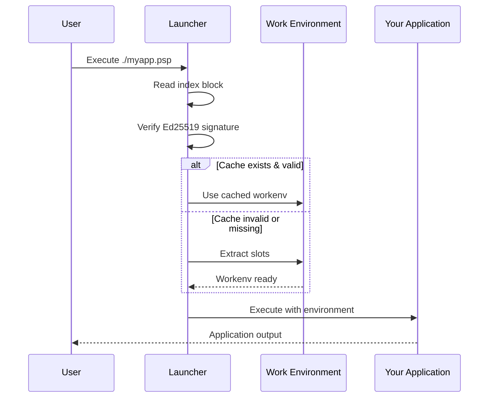

# Running Packages

Execute FlavorPack packages (.psp files) with zero installation required.

## Basic Execution

```bash
# Make executable (first time only)
chmod +x myapp.psp

# Run it!
./myapp.psp

# That's it - no Python, no dependencies, no setup!
```

## Execution Flow



## Command-Line Arguments

Pass arguments directly to your application:

```bash
# Single argument
./myapp.psp --help

# Multiple arguments
./myapp.psp --input data.csv --output results.json

# Flags and values
./myapp.psp -v --log-level debug process file.txt

# Arguments with spaces (quote them)
./myapp.psp --message "Hello, World!"
```

## Environment Variables

### FlavorPack Variables

Configure launcher behavior:

```bash
# Debug logging
FLAVOR_LOG_LEVEL=debug ./myapp.psp

# Trace logging (very verbose)
FLAVOR_LOG_LEVEL=trace ./myapp.psp

# Custom cache location
FLAVOR_WORKENV=/tmp/my-cache ./myapp.psp

# Disable signature validation (NOT recommended)
FLAVOR_VALIDATION=none ./myapp.psp
```

### Application Variables

Pass environment variables to your application:

```bash
# Single variable
PORT=8000 ./myapp.psp

# Multiple variables
DATABASE_URL=postgres://localhost/db \
LOG_LEVEL=info \
./myapp.psp

# From .env file (if your app loads it)
./myapp.psp  # Reads .env in current directory
```

## Exit Codes

Packages propagate exit codes correctly:

```bash
# Run and check exit code
./myapp.psp
echo $?  # Shows exit code

# Use in scripts
if ./myapp.psp; then
    echo "Success!"
else
    echo "Failed with code $?"
fi

# Chain commands
./myapp.psp && echo "Succeeded" || echo "Failed"
```

## Signal Handling

Packages handle signals gracefully:

```bash
# Ctrl+C (SIGINT) - Graceful shutdown
./myapp.psp
^C  # Application receives SIGINT

# Background process
./myapp.psp &
PID=$!

# Send signals
kill -TERM $PID  # Graceful termination
kill -KILL $PID  # Force kill
```

## Common Scenarios

### Web Server

```bash
# Start server on custom port
PORT=3000 ./api-server.psp

# With environment file
export $(cat .env | xargs)
./api-server.psp

# Background with logging
nohup ./api-server.psp > server.log 2>&1 &
```

### CLI Tool

```bash
# Help and version
./mytool.psp --help
./mytool.psp --version

# Process files
./mytool.psp process input.csv --output results.json

# Pipe data
cat data.txt | ./mytool.psp transform | grep pattern
```

### Data Pipeline

```bash
# Run with logging
FLAVOR_LOG_LEVEL=info ./pipeline.psp \
  --input /data/*.csv \
  --output /results/

# Cron job
0 2 * * * /opt/pipeline.psp --daily >> /var/log/pipeline.log 2>&1
```

## Troubleshooting

### Package Won't Execute

```bash
# Check if executable
ls -l myapp.psp
chmod +x myapp.psp

# Verify integrity
flavor verify myapp.psp

# Check for errors
FLAVOR_LOG_LEVEL=debug ./myapp.psp
```

### Import Errors

```bash
# Check workenv was extracted
ls ~/.cache/flavor/

# Verify dependencies
flavor inspect myapp.psp | grep dependencies

# Force re-extraction
rm -rf ~/.cache/flavor/pspf-*
./myapp.psp
```

### Performance Issues

```bash
# Check if cache is being used
FLAVOR_LOG_LEVEL=debug ./myapp.psp 2>&1 | grep cache

# Verify workenv location
echo $FLAVOR_WORKENV

# Check disk space
df -h ~/.cache/flavor/
```

## Advanced Usage

### Custom Cache Location

```bash
# Per-execution
FLAVOR_WORKENV=/fast-ssd/cache ./myapp.psp

# Permanent (add to ~/.bashrc or ~/.zshrc)
export FLAVOR_WORKENV=/fast-ssd/cache
```

### Multiple Versions

```bash
# Run different versions side-by-side
./myapp-v1.0.0.psp &
./myapp-v2.0.0.psp &

# Each version has its own cache
```

### Container Execution

```bash
# Docker
docker run -v $(pwd):/app alpine /app/myapp.psp

# Kubernetes
kubectl run myapp --image=alpine --command -- /app/myapp.psp
```

## Performance Tips

1. **First run is slower** - Extracts to cache
2. **Subsequent runs are fast** - Uses cached workenv
3. **Cache persists** - Survives reboots
4. **SSD recommended** - For faster extraction

## Security Notes

- ✅ **Signatures verified automatically** - Can't disable in production builds
- ✅ **Checksums validated** - Detects tampering
- ✅ **Isolated execution** - Work environment per package
- ⚠️ **Trust the source** - Only run packages from trusted sources

---

**See also:** [CLI Reference](cli/) | [Environment Variables](environment/) | [Cache Management](cache/)
