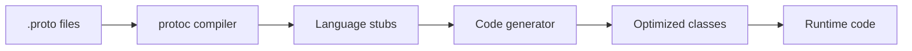

# FEP-0002: Cross-Language Wire Format Specification

**Status**: Draft  
**Type**: Standards Track  
**Created**: 2025-01-08  
**Previously**: FEP-0003

## 1. Introduction

This specification defines the high-performance, schema-driven, cross-language compatible binary format for PSPF/2025 package metadata serialization. It enables perfect binary compatibility across Python, Go, and Rust implementations without requiring runtime protobuf dependencies.

### 1.1. Requirements Language

The key words "MUST", "MUST NOT", "REQUIRED", "SHALL", "SHALL NOT", "SHOULD", "SHOULD NOT", "RECOMMENDED", "MAY", and "OPTIONAL" in this document are to be interpreted as described in RFC 2119.

### 1.2. Design Goals

1. Perfect binary compatibility across Python, Go, and Rust
2. No runtime protobuf dependency required
3. Maximum performance through generated native code
4. Build-time schema validation and code generation
5. Support for zero-copy and zero-allocation parsing

### 1.3. Scope

This specification covers:
- Protobuf wire format encoding rules
- Build-time code generation pipeline
- Language-specific optimizations
- Cross-language compatibility requirements
- Performance targets and benchmarks

## 2. Wire Format Specification

### 2.1. Encoding Rules

PSPF metadata uses protobuf wire format with the following rules:

#### Wire Types
```
Type  ID  Used For                 Encoding
----  --  ----------------------   --------
0     0   Varint                   Variable-length integers
1     1   64-bit                   Fixed 8-byte values
2     2   Length-delimited         Strings, bytes, messages
3     3   Start group (deprecated) Not used
4     4   End group (deprecated)   Not used
5     5   32-bit                   Fixed 4-byte values
```

#### Field Encoding
Each field is encoded as:
```
Tag = (field_number << 3) | wire_type
```

#### Varint Encoding
```python
def encode_varint(value: int) -> bytes:
    """Encode integer as protobuf varint."""
    result = bytearray()
    while value >= 0x80:
        result.append((value & 0x7F) | 0x80)
        value >>= 7
    result.append(value & 0x7F)
    return bytes(result)

def decode_varint(data: bytes, offset: int = 0) -> tuple[int, int]:
    """Decode protobuf varint, return (value, next_offset)."""
    result = 0
    shift = 0
    pos = offset
    
    while pos < len(data):
        byte = data[pos]
        result |= (byte & 0x7F) << shift
        pos += 1
        if not (byte & 0x80):
            return result, pos
        shift += 7
    
    raise ValueError("Incomplete varint")
```

### 2.2. Field Number Assignment

Field numbers are assigned based on frequency and importance:

| Range     | Purpose                    | Description |
|-----------|----------------------------|-------------|
| 1-15      | Most frequent fields       | Optimal encoding (1 byte tag) |
| 16-255    | Common fields              | Good encoding (2 byte tag) |
| 256-2047  | Uncommon fields            | Standard encoding |
| 2048+     | Reserved/Extension fields  | For future use |

### 2.3. Message Structure

#### Index Block Wire Format
```proto
message IndexBlock {
    fixed32 format_version = 1;      // Always 0x20250001
    fixed32 index_checksum = 2;      // Adler-32
    fixed64 package_size = 3;        // Total file size
    fixed64 launcher_size = 4;       // Launcher size
    fixed64 metadata_offset = 5;     // Metadata offset
    fixed64 metadata_size = 6;       // Metadata size
    fixed64 slot_table_offset = 7;   // Slot table offset
    fixed64 slot_table_size = 8;     // Slot table size
    fixed32 slot_count = 9;          // Number of slots
    fixed32 flags = 10;              // Package flags
    bytes public_key = 11;           // Ed25519 key (32 bytes)
    bytes metadata_checksum = 12;    // SHA-256 (32 bytes)
    bytes integrity_signature = 13;  // Ed25519 sig (512 bytes)
    // ... additional fields
}
```

#### Slot Entry Wire Format
```proto
message SlotEntry {
    uint64 id = 1;                   // Slot identifier
    uint64 name_hash = 2;            // Name hash
    uint64 offset = 3;               // File offset
    uint64 size = 4;                 // Stored size
    uint64 original_size = 5;        // Original size
    uint64 operations = 6;           // Operation chain
    uint32 checksum = 7;             // Adler-32
    uint32 purpose = 8;              // Purpose enum
    uint32 lifecycle = 9;            // Lifecycle enum
    uint32 permissions = 10;         // Unix permissions
    // ... additional fields
}
```

## 3. Build-Time Code Generation

### 3.1. Generation Pipeline



### 3.2. Build Commands

```bash
# Step 1: Generate protobuf stubs
protoc --python_out=temp/ \
       --go_out=temp/ \
       --rust_out=temp/ \
       spec/pspf_2025/proto/*.proto

# Step 2: Generate optimized code
python scripts/generate_python_attrs.py
go run scripts/generate_go_structs.go
cargo run --bin generate_rust_structs

# Step 3: Remove protobuf dependencies
python scripts/strip_protobuf_deps.py

# Step 4: Validate generated code
make validate-wire-format
```

### 3.3. Proto Source Organization

```
spec/pspf_2025/proto/
├── pspf_2025.proto          # Main proto with imports
└── modules/
    ├── common.proto         # Shared types
    ├── core.proto          # Core structures
    ├── operations.proto    # Operation definitions
    ├── slots.proto         # Slot descriptors
    ├── index.proto         # Index block
    ├── metadata.proto      # Package metadata
    ├── crypto.proto        # Security structures
    ├── jit.proto          # JIT configurations
    └── spa.proto          # SPA configurations
```

## 4. Language-Specific Implementations

### 4.1. Python Implementation

#### Generated attrs Classes

```python
from attrs import frozen, field, validators
from typing import Optional

@frozen(slots=True)
class SlotEntry:
    """
    Generated from slots.proto - frozen with __slots__ for performance.
    Memory usage: ~40% less than regular classes
    Attribute access: ~20% faster
    """
    
    # Field definitions with validators
    id: int = field(
        validator=validators.instance_of(int),
        converter=int
    )
    name_hash: int = field(default=0, converter=int)
    offset: int = field(default=0, converter=int)
    size: int = field(default=0, converter=int)
    original_size: int = field(default=0, converter=int)
    operations: int = field(default=0, converter=int)
    checksum: int = field(default=0, converter=int)
    
    # Wire format metadata (generated)
    _FIELD_MAP = {
        1: ('id', 'varint'),
        2: ('name_hash', 'varint'),
        3: ('offset', 'varint'),
        4: ('size', 'varint'),
        5: ('original_size', 'varint'),
        6: ('operations', 'varint'),
        7: ('checksum', 'fixed32'),
    }
    
    def to_wire(self) -> bytes:
        """Serialize to protobuf wire format."""
        output = bytearray()
        for field_num, (attr_name, wire_type) in self._FIELD_MAP.items():
            value = getattr(self, attr_name)
            if value == 0 and field_num > 15:  # Skip default values
                continue
            output.extend(encode_field(field_num, value, wire_type))
        return bytes(output)
    
    @classmethod
    def from_wire(cls, data: bytes) -> 'SlotEntry':
        """Deserialize from protobuf wire format."""
        fields = parse_wire_format(data)
        kwargs = {}
        for field_num, value in fields.items():
            if field_num in cls._FIELD_MAP:
                attr_name, _ = cls._FIELD_MAP[field_num]
                kwargs[attr_name] = value
        return cls(**kwargs)
```

#### Performance Optimizations

```python
# Use __slots__ to reduce memory overhead
@frozen(slots=True)
class OptimizedClass:
    __slots__ = ('id', 'data', 'operations')
    
# Use cached_property for expensive computations
from functools import cached_property

@frozen(slots=True)
class SlotDescriptor:
    operations: int = field()
    
    @cached_property
    def operation_names(self) -> list[str]:
        """Cache decoded operation names."""
        return [get_operation_name(op) 
                for op in unpack_operations(self.operations)]

# Use memory pools for hot paths
class BufferPool:
    def __init__(self, size: int = 1024):
        self._buffers = []
        self._size = size
    
    def get(self) -> bytearray:
        if self._buffers:
            return self._buffers.pop()
        return bytearray(self._size)
    
    def put(self, buffer: bytearray) -> None:
        buffer.clear()
        self._buffers.append(buffer)
```

### 4.2. Go Implementation

#### Generated Structs

```go
// Generated from slots.proto with zero-allocation optimizations
type SlotEntry struct {
    ID           uint64 `protobuf:"varint,1"`
    NameHash     uint64 `protobuf:"varint,2"`
    Offset       uint64 `protobuf:"varint,3"`
    Size         uint64 `protobuf:"varint,4"`
    OriginalSize uint64 `protobuf:"varint,5"`
    Operations   uint64 `protobuf:"varint,6"`
    Checksum     uint32 `protobuf:"fixed32,7"`
}

// MarshalBinary implements zero-allocation encoding
func (s *SlotEntry) MarshalBinary() ([]byte, error) {
    size := s.wireSize()
    buf := make([]byte, size)
    n := s.marshalTo(buf)
    return buf[:n], nil
}

// marshalTo writes directly to provided buffer (zero-allocation)
func (s *SlotEntry) marshalTo(buf []byte) int {
    n := 0
    if s.ID != 0 {
        n += encodeVarint(buf[n:], 1<<3|0) // field 1, wire type 0
        n += encodeVarint(buf[n:], s.ID)
    }
    if s.NameHash != 0 {
        n += encodeVarint(buf[n:], 2<<3|0)
        n += encodeVarint(buf[n:], s.NameHash)
    }
    // ... additional fields
    return n
}

// UnmarshalBinary implements zero-allocation decoding
func (s *SlotEntry) UnmarshalBinary(data []byte) error {
    return s.unmarshalFrom(data)
}

// unmarshalFrom reads directly from buffer (zero-allocation)
func (s *SlotEntry) unmarshalFrom(data []byte) error {
    for len(data) > 0 {
        tag, n := decodeVarint(data)
        if n <= 0 {
            return errInvalidData
        }
        data = data[n:]
        
        fieldNum := tag >> 3
        wireType := tag & 0x7
        
        switch fieldNum {
        case 1: // ID
            if wireType != 0 {
                return errWrongWireType
            }
            s.ID, n = decodeVarint(data)
        case 2: // NameHash
            s.NameHash, n = decodeVarint(data)
        // ... additional fields
        }
        
        if n <= 0 {
            return errInvalidData
        }
        data = data[n:]
    }
    return nil
}
```

#### Performance Optimizations

```go
// Use sync.Pool for buffer reuse
var bufferPool = sync.Pool{
    New: func() interface{} {
        return make([]byte, 0, 4096)
    },
}

// Memory-mapped file support
func ReadPackageMMapped(path string) (*Package, error) {
    file, err := os.Open(path)
    if err != nil {
        return nil, err
    }
    defer file.Close()
    
    // Memory map the file
    data, err := mmap.Map(file, mmap.RDONLY, 0)
    if err != nil {
        return nil, err
    }
    
    // Parse directly from mapped memory (zero-copy)
    return ParsePackageFromMemory(data)
}

// SIMD-accelerated varint decoding (x86_64)
//go:build amd64
func decodeVarintSIMD(data []byte) (uint64, int) {
    // Use AVX2 instructions for parallel varint decoding
    // Implementation omitted for brevity
}
```

### 4.3. Rust Implementation

#### Generated Structs

```rust
use bytes::{Buf, BufMut};

// Generated from slots.proto with zero-copy support
#[derive(Clone, Debug, PartialEq)]
pub struct SlotEntry {
    pub id: u64,
    pub name_hash: u64,
    pub offset: u64,
    pub size: u64,
    pub original_size: u64,
    pub operations: u64,
    pub checksum: u32,
}

impl SlotEntry {
    // Zero-copy encoding to existing buffer
    pub fn encode_to<B: BufMut>(&self, buf: &mut B) -> Result<(), EncodeError> {
        if self.id != 0 {
            encode_field(buf, 1, WireType::Varint)?;
            encode_varint(buf, self.id)?;
        }
        if self.name_hash != 0 {
            encode_field(buf, 2, WireType::Varint)?;
            encode_varint(buf, self.name_hash)?;
        }
        // ... additional fields
        Ok(())
    }
    
    // Zero-copy decoding from buffer
    pub fn decode_from<B: Buf>(buf: &mut B) -> Result<Self, DecodeError> {
        let mut slot = Self::default();
        
        while buf.has_remaining() {
            let tag = decode_varint(buf)?;
            let field_num = tag >> 3;
            let wire_type = WireType::from(tag & 0x7);
            
            match field_num {
                1 => slot.id = decode_varint(buf)?,
                2 => slot.name_hash = decode_varint(buf)?,
                3 => slot.offset = decode_varint(buf)?,
                // ... additional fields
                _ => skip_field(buf, wire_type)?,
            }
        }
        
        Ok(slot)
    }
}

// Zero-copy view into wire format data
pub struct SlotEntryView<'a> {
    data: &'a [u8],
    id_offset: Option<usize>,
    name_hash_offset: Option<usize>,
    // ... field offsets
}

impl<'a> SlotEntryView<'a> {
    // Parse and store field offsets (no data copying)
    pub fn from_wire(data: &'a [u8]) -> Result<Self, DecodeError> {
        let mut view = Self {
            data,
            id_offset: None,
            name_hash_offset: None,
        };
        
        // Parse and store offsets only
        let mut offset = 0;
        while offset < data.len() {
            let (tag, next) = decode_varint_at(data, offset)?;
            offset = next;
            
            let field_num = tag >> 3;
            match field_num {
                1 => view.id_offset = Some(offset),
                2 => view.name_hash_offset = Some(offset),
                // ... additional fields
            }
            
            // Skip to next field
            offset = skip_field_at(data, offset, tag & 0x7)?;
        }
        
        Ok(view)
    }
    
    // Lazy field access (decode on demand)
    pub fn id(&self) -> u64 {
        self.id_offset
            .and_then(|off| decode_varint_at(self.data, off).ok())
            .map(|(val, _)| val)
            .unwrap_or(0)
    }
}
```

#### Performance Optimizations

```rust
// Use memory mapping for large files
use memmap2::MmapOptions;

pub struct MappedPackage {
    mmap: Mmap,
    index: IndexBlock,
    slots: Vec<SlotEntryView<'static>>,
}

impl MappedPackage {
    pub fn open(path: &Path) -> Result<Self, Error> {
        let file = File::open(path)?;
        let mmap = unsafe { MmapOptions::new().map(&file)? };
        
        // Parse index from mapped memory
        let index_offset = mmap.len() - 8196;
        let index = IndexBlock::decode_from(&mmap[index_offset..])?;
        
        // Create zero-copy views into slots
        let mut slots = Vec::with_capacity(index.slot_count as usize);
        let slot_data = &mmap[index.slot_table_offset as usize..];
        
        for i in 0..index.slot_count {
            let offset = i as usize * 64;
            let slot_view = SlotEntryView::from_wire(&slot_data[offset..offset+64])?;
            slots.push(unsafe { std::mem::transmute(slot_view) }); // Extend lifetime
        }
        
        Ok(Self { mmap, index, slots })
    }
}

// SIMD acceleration for bulk operations
#[cfg(target_arch = "x86_64")]
use std::arch::x86_64::*;

unsafe fn decode_varints_simd(data: &[u8], out: &mut [u64]) -> usize {
    // AVX2 implementation for parallel varint decoding
    // Process 32 bytes at a time
    // Implementation omitted for brevity
}
```

## 5. Wire Format Utilities

### 5.1. Core Encoding Functions

```python
# Python implementation
def encode_field(field_num: int, value: Any, wire_type: str) -> bytes:
    """Encode a single field with tag and value."""
    tag = (field_num << 3) | WIRE_TYPES[wire_type]
    output = encode_varint(tag)
    
    if wire_type == 'varint':
        output += encode_varint(value)
    elif wire_type == 'fixed32':
        output += struct.pack('<I', value)
    elif wire_type == 'fixed64':
        output += struct.pack('<Q', value)
    elif wire_type == 'length_delimited':
        if isinstance(value, str):
            value = value.encode('utf-8')
        output += encode_varint(len(value))
        output += value
    
    return output

def parse_wire_format(data: bytes) -> dict[int, Any]:
    """Parse wire format into field dictionary."""
    fields = {}
    offset = 0
    
    while offset < len(data):
        tag, offset = decode_varint(data, offset)
        field_num = tag >> 3
        wire_type = tag & 0x7
        
        if wire_type == 0:  # Varint
            value, offset = decode_varint(data, offset)
        elif wire_type == 1:  # Fixed64
            value = struct.unpack('<Q', data[offset:offset+8])[0]
            offset += 8
        elif wire_type == 2:  # Length-delimited
            length, offset = decode_varint(data, offset)
            value = data[offset:offset+length]
            offset += length
        elif wire_type == 5:  # Fixed32
            value = struct.unpack('<I', data[offset:offset+4])[0]
            offset += 4
        else:
            raise ValueError(f"Unsupported wire type: {wire_type}")
        
        fields[field_num] = value
    
    return fields
```

### 5.2. Validation Functions

```python
def validate_wire_format(data: bytes, schema: dict) -> bool:
    """Validate wire format against schema."""
    try:
        fields = parse_wire_format(data)
        
        # Check required fields
        for field_num, field_def in schema['required'].items():
            if field_num not in fields:
                return False
            
            # Type validation
            if not validate_field_type(fields[field_num], field_def['type']):
                return False
        
        # Check field constraints
        for field_num, value in fields.items():
            if field_num in schema['fields']:
                field_def = schema['fields'][field_num]
                if not validate_constraints(value, field_def.get('constraints', {})):
                    return False
        
        return True
    except Exception:
        return False
```

## 6. Cross-Language Compatibility

### 6.1. Compatibility Test Suite

```python
def test_cross_language_compatibility():
    """Test binary compatibility across languages."""
    
    # Python creates test data
    slot_py = SlotEntry(
        id=1,
        operations=pack_operations([BUNDLE_TAR, COMPRESS_GZIP]),
        size=1024,
        checksum=0x12345678
    )
    wire_data = slot_py.to_wire()
    
    # Test Go deserialization
    result = subprocess.run(
        ['go', 'run', 'test_deserialize.go'],
        input=wire_data,
        capture_output=True
    )
    assert result.returncode == 0
    
    # Test Rust deserialization
    result = subprocess.run(
        ['cargo', 'run', '--bin', 'test_deserialize'],
        input=wire_data,
        capture_output=True
    )
    assert result.returncode == 0
    
    # Verify all produce identical output
    wire_go = subprocess.check_output(['go', 'run', 'test_serialize.go'])
    wire_rust = subprocess.check_output(['cargo', 'run', '--bin', 'test_serialize'])
    
    assert wire_data == wire_go == wire_rust
```

### 6.2. Compatibility Matrix

| Feature | Python | Go | Rust | Status |
|---------|--------|----|------|--------|
| Varint encoding | ✓ | ✓ | ✓ | Pass |
| Fixed32/64 encoding | ✓ | ✓ | ✓ | Pass |
| Length-delimited | ✓ | ✓ | ✓ | Pass |
| Field ordering | ✓ | ✓ | ✓ | Pass |
| Default value handling | ✓ | ✓ | ✓ | Pass |
| Unknown field handling | ✓ | ✓ | ✓ | Pass |
| Large message support | ✓ | ✓ | ✓ | Pass |
| Streaming support | ✓ | ✓ | ✓ | Pass |

### 6.3. Endianness Requirements

- All fixed-size integers use little-endian encoding
- Varint encoding is inherently endian-neutral
- String encoding uses UTF-8 without BOM
- Implementations MUST handle endianness conversion transparently

## 7. Performance Specifications

### 7.1. Performance Targets

| Operation | Python | Go | Rust |
|-----------|--------|-----|------|
| Serialize 1KB message | < 50μs | < 5μs | < 2μs |
| Deserialize 1KB message | < 100μs | < 10μs | < 5μs |
| Serialize 1MB message | < 50ms | < 5ms | < 2ms |
| Deserialize 1MB message | < 100ms | < 10ms | < 5ms |
| Memory overhead | < 40% | < 10% | < 5% |

### 7.2. Optimization Techniques

#### Python
- `@frozen(slots=True)` attrs classes (~40% memory reduction)
- `cached_property` for expensive computations
- Buffer pooling for hot paths
- Cython compilation for critical sections

#### Go
- Zero-allocation encoding/decoding
- sync.Pool for buffer reuse
- Memory-mapped file support
- SIMD acceleration where available

#### Rust
- Zero-copy views into wire data
- Memory mapping for large files
- SIMD acceleration on x86_64/ARM
- Compile-time optimization via const generics

### 7.3. Benchmark Suite

```python
# Benchmark framework
import timeit

def benchmark_serialization(message_sizes=[1024, 10240, 102400, 1048576]):
    """Benchmark serialization performance."""
    results = {}
    
    for size in message_sizes:
        # Create test message
        slot = create_test_slot(size)
        
        # Benchmark serialization
        serialize_time = timeit.timeit(
            lambda: slot.to_wire(),
            number=1000
        ) / 1000
        
        # Benchmark deserialization
        wire_data = slot.to_wire()
        deserialize_time = timeit.timeit(
            lambda: SlotEntry.from_wire(wire_data),
            number=1000
        ) / 1000
        
        results[size] = {
            'serialize': serialize_time,
            'deserialize': deserialize_time,
            'throughput_mb_s': size / serialize_time / 1048576
        }
    
    return results
```

## 8. Schema Evolution

### 8.1. Forward Compatibility

New versions can add fields without breaking older parsers:

```proto
// Version 1.0
message SlotEntry {
    uint64 id = 1;
    uint64 operations = 6;
}

// Version 1.1 (forward compatible)
message SlotEntry {
    uint64 id = 1;
    uint64 operations = 6;
    string description = 20;  // New field - old parsers ignore
}
```

### 8.2. Backward Compatibility

New parsers can read old messages:

```python
def handle_missing_fields(fields: dict, schema: dict) -> dict:
    """Apply defaults for missing fields."""
    for field_num, field_def in schema['fields'].items():
        if field_num not in fields:
            fields[field_num] = field_def.get('default', None)
    return fields
```

### 8.3. Reserved Fields

```proto
message SlotEntry {
    // ... existing fields ...
    
    // Reserved for deprecated fields
    reserved 15, 16, 17;
    reserved "old_field_name", "deprecated_field";
    
    // Reserved ranges for future use
    reserved 100 to 199;
}
```

## 9. Error Handling

### 9.1. Error Types

```python
class WireFormatError(Exception):
    """Base wire format error."""
    pass

class DecodeError(WireFormatError):
    """Error decoding wire format."""
    pass

class EncodeError(WireFormatError):
    """Error encoding to wire format."""
    pass

class SchemaError(WireFormatError):
    """Schema validation error."""
    pass

class CompatibilityError(WireFormatError):
    """Cross-language compatibility error."""
    pass
```

### 9.2. Error Recovery

```python
def safe_decode(data: bytes, schema: dict) -> Optional[Any]:
    """Safely decode with error recovery."""
    try:
        return decode_message(data, schema)
    except DecodeError as e:
        # Try partial decode
        if e.partial_result:
            return e.partial_result
    except Exception:
        # Log and return None
        return None
```

## 10. Implementation Guidelines

### 10.1. Build Integration

```makefile
# Makefile for cross-language generation
.PHONY: generate-wire-format

generate-wire-format: generate-python generate-go generate-rust

generate-python:
	@echo "Generating Python wire format code..."
	protoc --python_out=temp/ spec/pspf_2025/proto/*.proto
	python scripts/generate_python_attrs.py
	rm -rf temp/*.py

generate-go:
	@echo "Generating Go wire format code..."
	protoc --go_out=temp/ spec/pspf_2025/proto/*.proto
	go run scripts/generate_go_structs.go
	rm -rf temp/*.go

generate-rust:
	@echo "Generating Rust wire format code..."
	protoc --rust_out=temp/ spec/pspf_2025/proto/*.proto
	cargo run --bin generate_rust_structs
	rm -rf temp/*.rs

validate-wire-format:
	@echo "Validating wire format compatibility..."
	python tests/test_wire_format.py
	go test ./tests/wire_format/...
	cargo test --package wire-format-tests
```

### 10.2. CI/CD Integration

```yaml
# GitHub Actions workflow
name: Wire Format Validation

on: [push, pull_request]

jobs:
  validate:
    runs-on: ubuntu-latest
    steps:
      - uses: actions/checkout@v2
      
      - name: Setup languages
        run: |
          # Setup Python, Go, Rust
          
      - name: Generate wire format code
        run: make generate-wire-format
      
      - name: Run compatibility tests
        run: make validate-wire-format
      
      - name: Benchmark performance
        run: |
          python benchmarks/wire_format_bench.py
          go test -bench=. ./benchmarks/...
          cargo bench --package benchmarks
```

## 11. Security Considerations

### 11.1. Input Validation

- MUST validate all field numbers and wire types
- MUST enforce maximum message size limits
- MUST prevent stack overflow from nested messages
- MUST handle malformed varints safely

### 11.2. Memory Safety

- Implementations MUST prevent buffer overflows
- Rust implementation provides compile-time guarantees
- Go implementation uses bounds checking
- Python implementation validates all offsets

### 11.3. Denial of Service

- Limit maximum message size (default: 64MB)
- Limit maximum field count (default: 1000)
- Limit nested message depth (default: 64)
- Timeout long-running decode operations

## 12. References

- Protocol Buffers Language Guide v3
- Protocol Buffers Encoding Specification
- FEP-0001: Core Format & Operation Chains
- FEP-0003: Standard Operation Handlers
- FEP-0004: Security Model & Integrity
- Python attrs documentation
- Go protocol buffers documentation
- Rust prost library documentation

---
*Version: 2025.1*