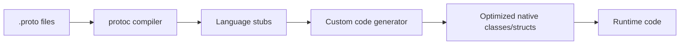

# FEP-0002: Cross-Language Wire Format Specification

**Status**: Draft  
**Type**: Standards Track  
**Created**: 2025-01-08  
**Previously**: FEP-0003
**Authoritative Schema**: `proto/pspf_2025.proto` and all imported modules.

## 1. Introduction

This specification defines the high-performance, schema-driven, cross-language compatible binary format for PSPF/2025 package metadata serialization. It enables perfect binary compatibility across Python, Go, and Rust implementations without requiring runtime protobuf dependencies.

### 1.1. Requirements Language

The key words "MUST", "MUST NOT", "REQUIRED", "SHALL", "SHALL NOT", "SHOULD", "SHOULD NOT", "RECOMMENDED", "MAY", and "OPTIONAL" in this document are to be interpreted as described in RFC 2119.

### 1.2. Design Goals

1. Perfect binary compatibility across Python, Go, and Rust
2. No runtime protobuf dependency required
3. Maximum performance through generated native code
4. Build-time schema validation and code generation
5. Support for zero-copy and zero-allocation parsing

## 2. Wire Format Specification

### 2.1. Encoding Rules

PSPF metadata MUST use the standard Protocol Buffers v3 wire format encoding.

### 2.2. Message Structure Examples

The following are **non-normative examples** illustrating the structure. The authoritative definitions are in the `.proto` files.

#### Index Block Wire Format Example
```proto
// From: proto/modules/index.proto
message IndexBlock {
  fixed32 format_version = 1;      // Always 0x20250001
  fixed32 index_checksum = 2;      // Adler-32
  fixed64 package_size = 3;        // Total file size
  fixed64 launcher_size = 4;       // Launcher size
  // ... many more fields
}
```

#### Slot Entry Wire Format Example
```proto
// From: proto/modules/slots.proto
message SlotEntry {
  uint32 id = 1;                   // Slot identifier
  uint64 name_hash = 2;            // Name hash
  uint64 offset = 3;               // File offset
  uint64 size = 4;                 // Stored size
  uint64 original_size = 5;        // Original size
  uint64 operations = 6;           // Operation chain
  uint32 checksum = 7;             // Adler-32
  Purpose purpose = 9;             // Purpose enum
  Lifecycle lifecycle = 10;        // Lifecycle enum
  // ... additional fields
}
```

## 3. Build-Time Code Generation

A build-time code generation pipeline is REQUIRED. This process consumes the `.proto` files and generates optimized, native code for each target language, eliminating runtime dependencies on a full protobuf library.

### 3.1. Generation Pipeline



### 3.2. Proto Source Organization

The canonical schemas are located in `spec/pspf_2025/proto/`.

## 4. Language-Specific Implementations

### 4.1. Python

Generated code SHOULD use `@frozen(slots=True)` `attrs` classes for performance and immutability. Custom `to_wire` and `from_wire` methods will handle serialization without a runtime protobuf dependency.

### 4.2. Go

Generated code SHOULD be standard Go structs with custom `MarshalBinary` and `UnmarshalBinary` methods that perform zero-allocation encoding and decoding.

### 4.3. Rust

Generated code SHOULD be standard Rust structs, leveraging libraries like `bytes` to provide zero-copy encoding and decoding functions. A `*_view` struct MAY be generated to provide lazy, zero-copy access to fields from a memory-mapped buffer.

## 5. Cross-Language Compatibility

A test suite MUST exist to validate that a package serialized by one language implementation can be perfectly deserialized by all other language implementations. This suite MUST use a set of canonical test vectors.

## 6. Security Considerations

All deserialization code MUST be hardened against malformed input. This includes validating all field numbers, wire types, lengths, and preventing excessive recursion in nested messages to mitigate denial-of-service attacks.

---
*Version: 2025.1*
