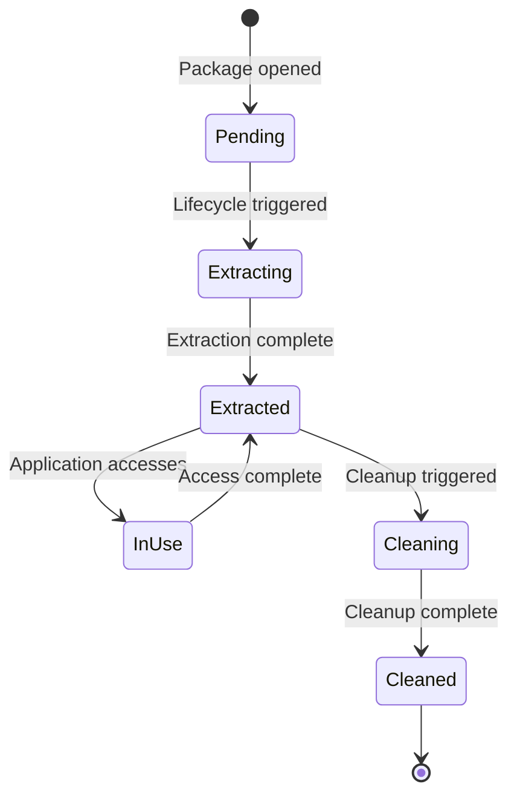

# Slot System Specification

The slot system is the core data management mechanism in PSPF/2025 packages.

## Overview

Slots are discrete data units within a package, each containing specific content with defined purposes, lifecycles, and extraction behaviors. The slot system enables:

1. **Modular packaging**: Separate concerns into distinct slots
2. **Progressive extraction**: Extract only what's needed
3. **Lifecycle management**: Automatic cleanup based on usage patterns
4. **Platform flexibility**: Platform-specific slot selection
5. **Efficient caching**: Reuse extracted slots across runs

## Slot Structure

### Physical Layout

Each slot in the package consists of:

```
┌─────────────────────────┐
│   Slot Descriptor (32B) │ ← In slot table
├─────────────────────────┤
│      Slot Data          │ ← At specified offset
└─────────────────────────┘
```

### Slot Descriptor

Located in the slot table, each descriptor is 32 bytes:

| Offset | Size | Field | Description |
|--------|------|-------|-------------|
| 0 | 8 | offset | Absolute file offset to slot data |
| 8 | 8 | size | Size of slot data in bytes |
| 16 | 4 | encoding | Compression/encoding type |
| 20 | 4 | checksum | CRC32 checksum |
| 24 | 8 | reserved | Reserved for future use |

### Slot Metadata

Stored in the package metadata JSON:

```json
{
  "id": "python-venv",
  "purpose": "python-environment",
  "lifecycle": "persistent",
  "extract_to": "venv",
  "platform": "linux_amd64",
  "checksum": "sha256:abc123...",
  "size": 50000000,
  "codec": "tgz",
  "type": "application/x-tar",
  "permissions": "0755"
}
```

## Slot Purposes

Purposes define the semantic meaning of slot content:

### Core Purposes

| Purpose | Description | Typical Content |
|---------|-------------|-----------------|
| `package-metadata` | Package information | metadata.json |
| `python-environment` | Python virtual environment | venv.tar.gz |
| `application-code` | Application source code | app.tar.gz |
| `configuration` | Configuration files | config.json, settings.yaml |
| `static-resources` | Static assets | images, fonts, styles |
| `native-binary` | Compiled executables | .exe, .so, .dylib files |
| `data-files` | Application data | databases, models |
| `documentation` | Documentation files | README, docs |
| `scripts` | Executable scripts | shell, Python scripts |
| `templates` | Template files | HTML, config templates |

### Purpose Guidelines

1. **Single Responsibility**: Each slot should have one clear purpose
2. **Self-Contained**: Slots should be independently extractable
3. **Platform Agnostic**: Use platform field for OS-specific content
4. **Size Appropriate**: Balance between granularity and slot count

## Slot Lifecycles

Lifecycles determine when and how slots are extracted and cleaned up:

### Lifecycle Types

| Lifecycle | Extraction | Cleanup | Use Case |
|-----------|------------|---------|----------|
| `persistent` | On first run | Never | Core application files |
| `volatile` | On startup | After initialization | Setup scripts |
| `temporary` | On startup | On exit | Session-specific data |
| `cached` | On demand | On cache clear | Regeneratable content |
| `init-only` | First run only | After first run | One-time setup |
| `lazy` | When accessed | Based on policy | Optional features |
| `eager` | Immediately | Never | Critical dependencies |

### Lifecycle State Machine



## Slot Encoding

### Supported Codecs

| Value | Codec | Extension | Description |
|-------|-------|-----------|-------------|
| 0 | `raw` | - | Uncompressed data |
| 1 | `tar` | .tar | Tar archive |
| 2 | `gzip` | .gz | Gzipped single file |
| 3 | `tgz` | .tar.gz | Gzipped tar archive |
| 4 | `zip` | .zip | ZIP archive (future) |
| 5 | `xz` | .xz | XZ compressed (future) |
| 6 | `zstd` | .zst | Zstandard compressed (future) |

### Codec Selection

Choose codecs based on content type:

- **Text files**: `gzip` for single files
- **Directories**: `tgz` for maximum compression
- **Binary data**: `raw` or `tar` for speed
- **Python environments**: `tgz` standard
- **Configuration**: `raw` for quick access

## Extraction Behavior

### Extract-To Paths

The `extract_to` field specifies the extraction location:

```json
{
  "extract_to": "venv",        // Relative to workenv
  "extract_to": "./config",     // Relative to workenv
  "extract_to": "{cache}/data", // Cache directory
  "extract_to": "{tmp}/work"    // Temporary directory
}
```

### Path Variables

| Variable | Description | Example |
|----------|-------------|---------|
| `{workenv}` | Work environment root | ~/.cache/flavor/workenvs/abc123 |
| `{cache}` | Cache directory | ~/.cache/flavor |
| `{tmp}` | System temp | /tmp |
| `{home}` | User home | /home/user |

### Extraction Process

1. **Check Cache**: Look for existing extraction
2. **Verify Checksum**: Ensure integrity
3. **Create Directory**: Prepare target location
4. **Extract Content**: Decompress and write
5. **Set Permissions**: Apply file permissions
6. **Update Manifest**: Record extraction

## Platform-Specific Slots

### Platform Specification

Use the `platform` field for OS/architecture-specific slots:

```json
{
  "id": "native-lib",
  "platform": "linux_amd64",
  "purpose": "native-binary"
}
```

### Platform Matching

```python
def matches_platform(slot, current_platform):
    if not slot.get("platform"):
        return True  # No platform = universal
    return slot["platform"] == current_platform
```

### Multi-Platform Packages

Include multiple platform-specific slots:

```json
"slots": [
  {"id": "lib-linux", "platform": "linux_amd64", ...},
  {"id": "lib-mac", "platform": "darwin_amd64", ...},
  {"id": "lib-win", "platform": "windows_amd64", ...}
]
```

## Slot Dependencies

### Dependency Declaration

Slots can declare dependencies (future enhancement):

```json
{
  "id": "app-code",
  "depends_on": ["python-venv", "config"],
  "purpose": "application-code"
}
```

### Dependency Resolution

1. **Topological Sort**: Order by dependencies
2. **Parallel Extraction**: Extract independent slots
3. **Wait for Dependencies**: Block until ready
4. **Error Propagation**: Fail if dependency fails

## Performance Optimization

### Slot Ordering

Order slots for optimal extraction:

1. **Metadata first**: Always slot 0
2. **Eager slots next**: Required for startup
3. **Large slots later**: Defer heavy extraction
4. **Lazy slots last**: May never be extracted

### Compression Ratios

Typical compression performance:

| Content Type | Raw Size | Compressed | Ratio | Codec |
|--------------|----------|------------|-------|-------|
| Python venv | 100 MB | 25 MB | 4:1 | tgz |
| Source code | 10 MB | 2 MB | 5:1 | tar |
| Binary data | 50 MB | 45 MB | 1.1:1 | raw |
| Text config | 100 KB | 20 KB | 5:1 | gzip |

### Extraction Caching

Cache extracted slots to avoid re-extraction:

```python
cache_key = f"{package_hash}:{slot_id}:{slot_checksum}"
cache_path = cache_dir / cache_key

if cache_path.exists():
    return cache_path  # Reuse existing
else:
    extract_slot(slot, cache_path)
    return cache_path
```

## Security Considerations

### Checksum Verification

Every slot includes a SHA256 checksum:

```python
def verify_slot(slot_data, expected_checksum):
    actual = hashlib.sha256(slot_data).hexdigest()
    if actual != expected_checksum:
        raise IntegrityError(f"Slot checksum mismatch")
```

### Path Traversal Prevention

Sanitize extraction paths:

```python
def safe_extract_path(base, target):
    full_path = (base / target).resolve()
    if not full_path.is_relative_to(base):
        raise SecurityError("Path traversal detected")
    return full_path
```

### Permission Restrictions

Apply safe default permissions:

- Directories: 0o755 (rwxr-xr-x)
- Executables: 0o755 (rwxr-xr-x)
- Data files: 0o644 (rw-r--r--)
- Sensitive: 0o600 (rw-------)

## Implementation Notes

### Python Implementation

```python
class Slot:
    def __init__(self, descriptor, metadata):
        self.offset = descriptor.offset
        self.size = descriptor.size
        self.encoding = descriptor.encoding
        self.metadata = metadata
    
    def extract(self, package_file, target_dir):
        package_file.seek(self.offset)
        data = package_file.read(self.size)
        
        if self.encoding == "tgz":
            with tarfile.open(fileobj=BytesIO(data)) as tar:
                tar.extractall(target_dir)
        elif self.encoding == "raw":
            target_dir.write_bytes(data)
```

### Launcher Implementation

Both Go and Rust launchers implement slot extraction:

```go
// Go launcher
func ExtractSlot(slot Slot, target string) error {
    data := readSlotData(slot)
    return extractWithCodec(data, slot.Codec, target)
}
```

```rust
// Rust launcher
fn extract_slot(slot: &Slot, target: &Path) -> Result<()> {
    let data = read_slot_data(slot)?;
    extract_with_codec(&data, slot.codec, target)
}
```

## Best Practices

1. **Minimize Slot Count**: Balance between modularity and complexity
2. **Compress Text**: Always compress text-heavy slots
3. **Use Appropriate Lifecycles**: Match lifecycle to usage pattern
4. **Version Slot Formats**: Include version in metadata
5. **Document Slot Contents**: Clear descriptions in metadata
6. **Test Extraction**: Verify all slots extract correctly
7. **Monitor Performance**: Profile extraction times

## Future Enhancements

- **Incremental Updates**: Delta slots for updates
- **Slot Signing**: Individual slot signatures
- **Encryption**: Encrypted slot support
- **Streaming**: Direct execution without extraction
- **Slot Versioning**: Multiple versions of same slot
- **Dependency Graph**: Automatic dependency resolution

## Related Documentation

- [Binary Layout](binary-layout.md) - Physical slot storage
- [Metadata Structure](metadata.md) - Slot metadata format
- [Package Format](pspf-2025.md) - Overall package structure
- [Work Environments](../guide/concepts/workenv.md) - Extraction targets