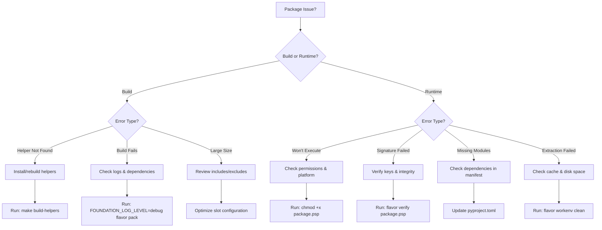

# Troubleshooting Guide

Solutions to common FlavorPack issues and debugging techniques.

## Quick Diagnostic



## Common Issues

### Package Building Issues

#### Helper Not Found

**Error**: `Helper binary 'flavor-rs-launcher' not found`

**Solutions**:
```bash
# Rebuild helpers
make build-helpers

# Check helper locations
flavor helpers list

# Verify helpers exist
ls -la dist/bin/
```

#### Non-Deterministic Builds

**Error**: Package sizes differ between builds

**Solutions**:
```bash
# Use deterministic key seed
flavor pack --key-seed stable-seed-123

# Set consistent timestamps
export SOURCE_DATE_EPOCH=$(date +%s)
```

#### Large Package Size

**Problem**: Package is larger than expected

**Solutions**:
- Exclude development dependencies from your manifest
- Configure compression in manifest (use `xz` or `zstd` operations)
- Use `--strip` to remove debug symbols from launcher
- Optimize slot configuration to include only necessary files

### Package Execution Issues

#### Package Won't Run

**Error**: `./myapp.psp: Permission denied`

**Solutions**:
```bash
# Make executable
chmod +x myapp.psp

# Check file format
file myapp.psp

# Verify platform compatibility
uname -sm  # Check your platform
```

#### Signature Verification Failed

**Error**: `Package signature verification failed`

**Solutions**:
```bash
# Rebuild with known key seed
flavor pack --key-seed test123

# Check package integrity
flavor verify myapp.psp

# For testing only (NEVER in production)
FLAVOR_VALIDATION=none ./myapp.psp
```

#### Missing Dependencies

**Error**: `ModuleNotFoundError: No module named 'xxx'`

**Solutions**:
- Add missing dependency to `pyproject.toml`
- Ensure `requires-python` version is correct
- Check if dependency needs system libraries
- Rebuild package with `--verbose` to see what's included

### Extraction Issues

#### UV Binary Not Found

**Error**: `Launch failed: No such file or directory`

**Problem**: UV binary extracted to wrong path

**Solutions**:
```bash
# Rebuild helpers to get latest fixes
make build-helpers

# Clean cache and rebuild package
flavor workenv clean -y
flavor pack --manifest pyproject.toml
```

#### Cache Directory Full

**Error**: `No space left on device`

**Solutions**:
```bash
# Clean FlavorPack cache
flavor clean --all --yes

# Check cache size
du -sh ~/.cache/flavor/

# Use different cache location
export XDG_CACHE_HOME=/path/with/space
```

### Platform-Specific Issues

#### Windows UTF-8 Errors

**Error**: `UnicodeDecodeError` on Windows

**Solutions**:
```bash
# Set UTF-8 environment
set PYTHONUTF8=1
set PYTHONIOENCODING=utf-8

# Or in PowerShell
$env:PYTHONUTF8=1
$env:PYTHONIOENCODING="utf-8"
```

#### macOS Code Signing

**Error**: `"myapp.psp" cannot be opened because the developer cannot be verified`

**Solutions**:
```bash
# Remove quarantine attribute
xattr -d com.apple.quarantine myapp.psp

# Or allow in System Preferences > Security & Privacy
```

#### Linux Shared Library Issues

**Error**: `error while loading shared libraries`

**Solutions**:
```bash
# Check dependencies
ldd myapp.psp

# Install missing libraries (example)
sudo apt-get install libssl-dev  # Ubuntu/Debian
sudo yum install openssl-devel   # RHEL/CentOS
```

### Development Issues

#### Import Errors in Development

**Error**: `ImportError: cannot import name 'xxx' from 'flavor'`

**Solutions**:
```bash
# Reinstall environment
rm -rf workenv/
uv sync

# Verify installation
uv run python -c "import flavor; print(flavor.__version__)"
```

#### Test Failures

**Error**: Tests failing locally but not in CI

**Solutions**:
```bash
# Clean test cache
rm -rf .pytest_cache/

# Run with fresh environment
FLAVOR_CACHE_DIR=$(mktemp -d) pytest

# Run specific test with verbose output
pytest tests/test_specific.py -xvs --tb=short
```

#### Helper Build Failures

**Error**: Go or Rust compilation errors

**Solutions**:
```bash
# Check Go version
go version  # Should be 1.23+

# Check Rust version
rustc --version  # Should be 1.85+ (edition 2024 support)

# Clean and rebuild
cd src/flavor-go && go clean && cd ../..
cd src/flavor-rust && cargo clean && cd ../..
make build-helpers
```

## Debug Techniques

### Enable Verbose Logging

```bash
# For package building
flavor pack --verbose --log-level debug

# For package execution
FLAVOR_LOG_LEVEL=trace ./myapp.psp

# For specific components
FLAVOR_LAUNCHER_LOG_LEVEL=debug ./myapp.psp
FLAVOR_BUILDER_LOG_LEVEL=trace flavor pack
```

### Inspect Package Contents

```bash
# View package structure
flavor inspect myapp.psp

# Export metadata as JSON
flavor inspect myapp.psp --json > metadata.json

# Check with hexdump
hexdump -C myapp.psp | head -n 50  # View header
hexdump -C myapp.psp | tail -n 20  # Check magic footer
```

### Test Helpers Directly

```bash
# Test launcher
dist/bin/flavor-rs-launcher-* --version

# Test builder with minimal manifest
cat > test.json << EOF
{
  "package": {"name": "test", "version": "1.0"},
  "slots": [],
  "execution": {"command": "echo", "args": ["test"]}
}
EOF
dist/bin/flavor-go-builder-* --manifest test.json --output test.psp
```

### Environment Debugging

```bash
# Check all FlavorPack environment variables
env | grep FLAVOR

# Test with clean environment
env -i PATH=$PATH HOME=$HOME flavor pack

# Trace system calls (Linux)
strace -f ./myapp.psp 2>&1 | grep -E "open|stat"

# Trace system calls (macOS)
dtruss ./myapp.psp 2>&1 | grep -E "open|stat"
```

## Performance Issues

### Slow Package Building

**Solutions**:
- Use `--jobs` flag for parallel processing
- Exclude unnecessary files early
- Pre-download dependencies
- Use local package index

### Slow Package Startup

**Solutions**:
- Mark large init-only files as `volatile`
- Use `lazy` lifecycle for optional components
- Enable extraction caching
- Reduce package size

### High Memory Usage

**Solutions**:
- Stream large files instead of loading
- Use memory-mapped I/O for large slots
- Clean up volatile slots after setup
- Monitor with: `FLAVOR_LOG_LEVEL=trace`

## Getting Help

### Check Documentation
1. Review [User Guide](../guide/index/)
2. Check [API Reference](../api/index/)
3. Read [Architecture](../development/architecture/)

### Debugging Checklist
- [ ] Using latest version?
- [ ] Helpers built correctly?
- [ ] Platform supported?
- [ ] Dependencies listed?
- [ ] Permissions correct?
- [ ] Enough disk space?
- [ ] Network accessible?

### Report Issues

When reporting issues, include:
1. Flavor version: `flavor --version`
2. Platform: `uname -a`
3. Python version: `python --version`
4. Helper versions: `flavor helpers list`
5. Error message and stack trace
6. Minimal reproduction steps

Report at: https://github.com/provide-io/flavorpack/issues

---

## Advanced Troubleshooting

### Package Won't Extract

**Symptoms:**
- Package hangs during first run
- Extraction timeout errors
- Incomplete cache directory

**Debug Steps:**

```bash
# 1. Enable trace logging
FLAVOR_LOG_LEVEL=trace ./myapp.psp 2>&1 | tee extraction.log

# 2. Check cache directory
ls -la ~/.cache/flavor/workenv/

# 3. Manually inspect package
flavor inspect myapp.psp --json | jq '.slots'

# 4. Test extraction manually
mkdir -p /tmp/test-extract
flavor extract-all myapp.psp /tmp/test-extract

# 5. Verify extraction completed
ls -la /tmp/test-extract/
# Check if all expected directories exist
```

**Solutions:**
- Remove corrupted cache: `flavor workenv clean -y`
- Rebuild package: `flavor pack --manifest pyproject.toml && flavor verify myapp.psp`
- Check available disk space: `df -h ~/.cache/flavor`
- Verify slot checksums in package

### Import Errors After Packaging

**Problem:** Module works in development but fails in package

**Debug Process:**

```bash
# 1. Compare environments
# Development
python -c "import sys; print('\n'.join(sys.path))"

# Package (with FLAVOR_LAUNCHER_CLI=1)
FLAVOR_LAUNCHER_CLI=1 ./myapp.psp shell
>>> import sys
>>> print('\n'.join(sys.path))

# 2. Check what's actually in the package
flavor extract-all myapp.psp extracted/
# Inspect extracted slot contents (slots are numbered 0, 1, 2, etc.)
ls -la extracted/

# 3. Verify dependencies
cat extracted/metadata.json | jq '.package.dependencies'
```

**Common Causes:**
- Missing dependency in `pyproject.toml`
- Implicit dependency not declared
- Development-only import in production code
- Namespace package issue

**Solutions:**

```toml
# Add missing dependencies
[project]
dependencies = [
    "missing-package>=1.0",
]

# For namespace packages
[tool.flavor]
include_namespace_packages = true

# For implicit dependencies
[project]
dependencies = [
    "main-package[all]>=1.0",  # Include all extras
]
```

### Signature Verification Loops

**Problem:** Package keeps asking for verification or fails repeatedly

**Symptoms:**
```
🔍 Verifying package signature...
❌ Signature verification failed
🔍 Verifying package signature...
❌ Signature verification failed
```

**Causes:**
1. Public key mismatch
2. Package tampered/corrupted
3. Different builder used for signing

**Debug:**

```bash
# 1. Extract metadata and check signature
flavor inspect myapp.psp --json > meta.json
cat meta.json | jq '.signature'

# 2. Compare public keys
cat meta.json | jq -r '.signature.public_key' > pkg-pubkey.txt
cat keys/public.pem | base64 > file-pubkey.txt
diff pkg-pubkey.txt file-pubkey.txt

# 3. Verify package integrity
flavor verify myapp.psp 2>&1 | grep -A 5 "Signature"
```

**Solutions:**

```bash
# Rebuild with same keys
flavor pack \
  --private-key keys/flavor-private.key \
  --public-key keys/flavor-public.key \
  --output myapp.psp

# Or use deterministic seed
flavor pack --key-seed "my-stable-seed-123"

# For testing only (DANGEROUS - never in production)
FLAVOR_VALIDATION=none ./myapp.psp
```

### Cross-Platform Issues

**Building on one platform for another:**

**Problem:** Package built on Linux fails on macOS (or vice versa)

**Solution:** Use platform-specific launchers

```bash
# Build for Linux (from any platform)
flavor pack \
  --launcher-bin helpers/flavor-rs-launcher-linux_amd64 \
  --output myapp-linux.psp

# Build for macOS ARM
flavor pack \
  --launcher-bin helpers/flavor-rs-launcher-darwin_arm64 \
  --output myapp-macos-arm64.psp

# Build for Windows
flavor pack \
  --launcher-bin helpers/flavor-rs-launcher-windows_amd64.exe \
  --output myapp-windows.psp
```

### Performance Degradation

**Problem:** Package runs slowly or uses excessive resources

**Diagnostic:**

```bash
# 1. Profile package startup
time ./myapp.psp --version

# 2. Check cache usage
du -sh ~/.cache/flavor/workenv/*

# 3. Monitor resource usage
# On Linux
/usr/bin/time -v ./myapp.psp command

# On macOS
/usr/bin/time -l ./myapp.psp command

# 4. Check for repeated extractions
FLAVOR_LOG_LEVEL=debug ./myapp.psp 2>&1 | grep -i "extract"
```

**Solutions:**

```bash
# Clear and rebuild cache
flavor workenv clean -y
./myapp.psp --version  # Rebuild cache

# Check package size
flavor inspect myapp.psp | grep "Size:"

# Optimize package
flavor pack \
  --strip \
  --exclude "tests/" \
  --exclude "*.pyc" \
  --exclude "__pycache__/"
```

### Network-Dependent Builds

**Problem:** Builds fail without internet or in restricted environments

**Solutions:**

```bash
# 1. Pre-download dependencies
mkdir -p .cache/pip
pip download -d .cache/pip -r requirements.txt

# 2. Use local package index
flavor pack \
  --pip-index-url file://$(pwd)/.cache/pip \
  --no-index

# 3. Vendor dependencies
pip install --target vendor/ -r requirements.txt

# 4. Build in offline mode
PIP_NO_INDEX=1 PIP_FIND_LINKS=vendor/ flavor pack
```

### Debugging Helper Issues

**Problem:** Custom or rebuilt helpers not working

**Verification:**

```bash
# 1. Check helper executability
ls -la dist/bin/flavor-*
file dist/bin/flavor-rs-launcher-*

# 2. Test helper directly
dist/bin/flavor-rs-launcher-linux_amd64 --version
dist/bin/flavor-go-builder-linux_amd64 --help

# 3. Check helper selection
FOUNDATION_LOG_LEVEL=debug flavor pack 2>&1 | grep -i "helper"

# 4. Force specific helper
flavor pack \
  --launcher-bin dist/bin/flavor-rs-launcher-linux_amd64 \
  --builder-bin dist/bin/flavor-rs-builder-linux_amd64
```

**Rebuild helpers:**

```bash
# Clean rebuild
make clean
make build-helpers

# Test helpers
make test-helpers

# Install helpers
make install-helpers
```

---

## Error Message Reference

### Build Errors

| Error | Cause | Solution |
|-------|-------|----------|
| `Helper binary not found` | Missing helper | Run `make build-helpers` |
| `Invalid manifest` | Bad pyproject.toml | Validate TOML syntax |
| `Dependency resolution failed` | Incompatible deps | Check dependency versions |
| `Builder execution failed` | Helper crashed | Check logs, rebuild helpers |
| `Checksum mismatch` | Corrupted file | Re-download source files |

### Runtime Errors

| Error | Cause | Solution |
|-------|-------|----------|
| `Permission denied` | Not executable | Run `chmod +x package.psp` |
| `Signature verification failed` | Wrong keys | Rebuild with correct keys |
| `ModuleNotFoundError` | Missing dependency | Add to pyproject.toml |
| `Extraction failed` | Disk space/permissions | Check `df -h` and permissions |
| `Cache corrupted` | Interrupted extraction | Run `flavor workenv clean` |

---

## Platform-Specific Guides

See detailed troubleshooting for your platform:

- [Linux](platforms/linux/)
- [macOS](platforms/macos/)
- [Windows](platforms/windows/)

---

## See Also

- [CLI Reference](../guide/usage/cli/) - All commands
- [Environment Variables](../guide/usage/environment/) - Configuration
- [Cache Management](../guide/usage/cache/) - Cache troubleshooting
- [Advanced Debugging](../guide/advanced/debugging/) - Deep debugging techniques