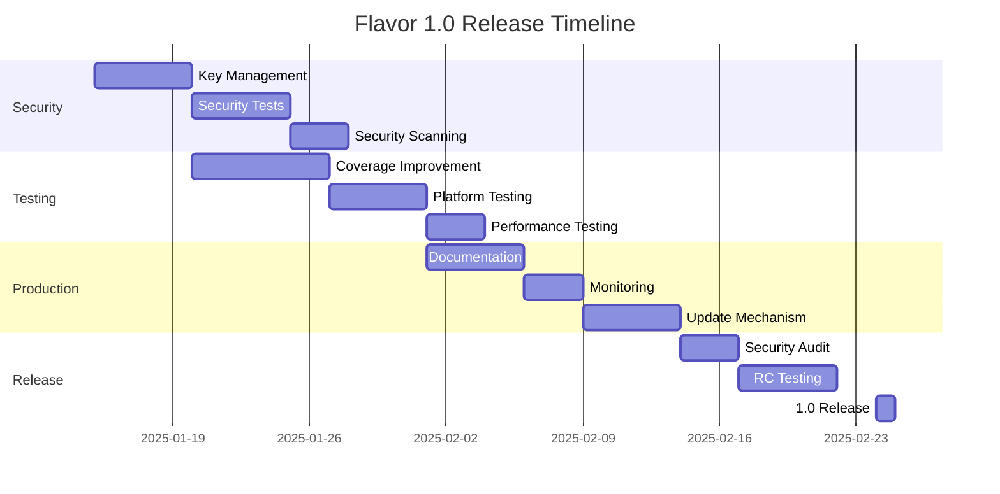

# 🛡️ Flavor 1.0 Release Hardening Checklist

## Executive Summary
**Current State**: Beta-ready (70% complete)
**Target State**: Production 1.0
**Estimated Effort**: 4-6 weeks

---

## 🔐 Security Hardening

### Critical Security Tasks
- [ ] **Signature Verification Enforcement**
  - [ ] Remove FLAVOR_INSECURE from production builds
  - [ ] Add signature verification bypass detection/logging
  - [ ] Implement certificate pinning for updates
  - [ ] Add tamper detection for modified packages

- [ ] **Key Management**
  - [ ] Implement secure key storage (not in environment variables)
  - [ ] Add key rotation mechanism
  - [ ] Support hardware security modules (HSM)
  - [ ] Implement key escrow/recovery process

- [ ] **Supply Chain Security**
  - [ ] Sign all release artifacts with GPG
  - [ ] Generate and publish SBOM (Software Bill of Materials)
  - [ ] Implement reproducible builds
  - [ ] Add dependency vulnerability scanning
  - [ ] Pin all dependencies with hashes

- [ ] **Runtime Security**
  - [ ] Implement seccomp filters for Linux
  - [ ] Add AppArmor/SELinux profiles
  - [ ] Implement process isolation
  - [ ] Add memory protection (ASLR, DEP, PIE)
  - [ ] Sanitize all environment variables

### Security Tooling
```yaml
# .github/workflows/security.yml additions needed:
- CodeQL analysis for Go/Rust/Python
- Semgrep security scanning
- Trivy container scanning
- OSSF Scorecard
- Dependabot configuration
- Secret scanning
- SAST/DAST integration
```

---

## 🧪 Testing & Quality

### Test Coverage Goals
**Current**: 68% line coverage, 63% branch coverage
**Target**: 90% line coverage, 85% branch coverage

### Critical Test Gaps to Fill
- [ ] **Security Tests**
  - [ ] Signature verification bypass attempts
  - [ ] Malformed package handling
  - [ ] Path traversal prevention
  - [ ] Command injection prevention
  - [ ] Race condition testing

- [ ] **Resilience Tests**
  - [ ] Disk full scenarios
  - [ ] Network interruption during extraction
  - [ ] Corrupted package recovery
  - [ ] Signal handling under load
  - [ ] Memory exhaustion handling

- [ ] **Cross-Platform Tests**
  - [ ] Windows native testing (currently untested)
  - [ ] Linux distributions (Ubuntu, RHEL, Alpine)
  - [ ] macOS versions (12, 13, 14, 15)
  - [ ] ARM64 Linux testing
  - [ ] FreeBSD compatibility

- [ ] **Performance Tests**
  - [ ] Large package handling (>1GB)
  - [ ] Many small files (10,000+)
  - [ ] Concurrent package execution
  - [ ] Memory leak detection
  - [ ] CPU profiling under load

### Testing Infrastructure
```python
# tests/security/test_security_hardening.py
def test_signature_bypass_prevention():
    """Ensure package cannot run with modified signature"""
    
def test_path_traversal_prevention():
    """Ensure ../.. in paths cannot escape sandbox"""
    
def test_command_injection_prevention():
    """Ensure user input cannot inject commands"""

# tests/resilience/test_fault_tolerance.py
def test_disk_full_handling():
    """Ensure graceful failure when disk is full"""
    
def test_corrupted_package_recovery():
    """Ensure corrupted packages don't crash"""
```

---

## 🔧 Error Handling & Resilience

### Critical Improvements Needed
- [ ] **Structured Error Types**
  ```python
  class FlavorError(Exception):
      error_code: str
      user_message: str
      technical_details: dict
      recovery_suggestions: list[str]
  ```

- [ ] **Retry Mechanisms**
  - [ ] Exponential backoff for network operations
  - [ ] Automatic corruption recovery
  - [ ] Partial extraction resumption
  - [ ] Transient failure handling

- [ ] **Graceful Degradation**
  - [ ] Fallback to system Python if embedded fails
  - [ ] Skip non-critical slots if corrupted
  - [ ] Continue with warnings for minor issues
  - [ ] Provide diagnostic information

- [ ] **Observability**
  - [ ] OpenTelemetry integration
  - [ ] Structured logging (JSON)
  - [ ] Metrics collection
  - [ ] Distributed tracing
  - [ ] Health check endpoints

---

## 📦 Supply Chain Security

### Build Pipeline Hardening
- [ ] **Reproducible Builds**
  ```bash
  # All builds must produce identical outputs
  SOURCE_DATE_EPOCH=1234567890
  GO_FLAGS="-trimpath -buildmode=pie"
  RUST_FLAGS="-C opt-level=3 -C lto=true"
  ```

- [ ] **Dependency Management**
  - [ ] Lock all dependency versions
  - [ ] Verify checksums for all downloads
  - [ ] Mirror critical dependencies
  - [ ] Regular dependency audits
  - [ ] License compliance scanning

- [ ] **Build Attestation**
  - [ ] SLSA Level 3 compliance
  - [ ] Sigstore integration
  - [ ] Build provenance generation
  - [ ] Container signing with cosign

---

## 🚀 Production Features

### Must-Have for 1.0
- [ ] **Update Mechanism**
  - [ ] Self-update capability
  - [ ] Rollback mechanism
  - [ ] Update verification
  - [ ] Staged rollouts

- [ ] **Monitoring Integration**
  - [ ] Prometheus metrics
  - [ ] StatsD support
  - [ ] Custom metric collectors
  - [ ] Performance benchmarks

- [ ] **Enterprise Features**
  - [ ] Proxy support (HTTP/HTTPS/SOCKS)
  - [ ] Custom CA certificates
  - [ ] Air-gapped installation
  - [ ] License management

- [ ] **Platform Integration**
  - [ ] systemd service files
  - [ ] Windows service support
  - [ ] macOS launchd integration
  - [ ] Docker/Kubernetes support

---

## 📚 Documentation

### Critical Documentation Gaps
- [ ] **Security Documentation**
  - [ ] Security architecture document
  - [ ] Threat model
  - [ ] Security best practices
  - [ ] Incident response plan
  - [ ] Vulnerability disclosure policy

- [ ] **Operational Documentation**
  - [ ] Production deployment guide
  - [ ] Monitoring and alerting setup
  - [ ] Troubleshooting guide
  - [ ] Performance tuning guide
  - [ ] Backup and recovery procedures

- [ ] **Developer Documentation**
  - [ ] API reference (automated)
  - [ ] Plugin development guide
  - [ ] Contributing guidelines
  - [ ] Architecture decision records
  - [ ] Code style guide

---

## 🔍 Audit & Compliance

### Required Audits
- [ ] **Security Audit**
  - [ ] External penetration testing
  - [ ] Code security review
  - [ ] Cryptography audit
  - [ ] Supply chain audit

- [ ] **Compliance**
  - [ ] GDPR compliance
  - [ ] SOC 2 readiness
  - [ ] Export control compliance
  - [ ] License compliance

- [ ] **Performance Audit**
  - [ ] Load testing results
  - [ ] Resource usage analysis
  - [ ] Scalability testing
  - [ ] Benchmark comparisons

---

## 🛠️ Implementation Priority

### Week 1-2: Security Foundation
1. Fix all authentication/signing issues
2. Implement proper key management
3. Add security tests
4. Enable security scanning

### Week 3-4: Testing & Quality
1. Increase test coverage to 90%
2. Add resilience tests
3. Fix all failing tests
4. Add performance benchmarks

### Week 5-6: Production Readiness
1. Complete documentation
2. Add monitoring/observability
3. Implement update mechanism
4. Final security audit

---

## 🚦 Release Gates

### Mandatory for 1.0
- ✅ All security tests passing
- ✅ 90% test coverage
- ✅ No critical vulnerabilities
- ✅ Documentation complete
- ✅ Performance benchmarks met
- ✅ Security audit passed
- ✅ All platforms tested
- ✅ Reproducible builds working

### Nice to Have
- ⭐ SLSA Level 3 compliance
- ⭐ SOC 2 certification
- ⭐ Performance optimizations
- ⭐ Advanced monitoring

---

## 📊 Risk Assessment

### High Risk Areas
1. **Windows Support** - Currently untested
2. **Key Management** - Needs complete redesign
3. **Update Mechanism** - Not implemented
4. **Large Package Handling** - Untested at scale

### Mitigation Strategies
1. Set up Windows CI immediately
2. Implement proper key storage before 1.0
3. Design update mechanism with rollback
4. Load test with 1GB+ packages

---

## 🎯 Success Metrics

### Technical Metrics
- **Reliability**: 99.9% success rate
- **Performance**: <5s for 100MB package
- **Security**: 0 critical vulnerabilities
- **Coverage**: >90% test coverage
- **Compatibility**: All major platforms

### Business Metrics
- **Adoption**: 1000+ downloads/week
- **Stability**: <5 critical bugs/month
- **Support**: <24h response time
- **Documentation**: 100% API coverage

---

## 📅 Timeline



---

## 🔄 Next Steps

1. **Immediate Actions**
   - Fix the 29 failing tests
   - Set up Windows CI
   - Implement key management
   - Add security tests

2. **This Week**
   - Increase test coverage
   - Add resilience tests
   - Document security architecture
   - Enable security scanning

3. **Before 1.0**
   - Complete all checklist items
   - Pass security audit
   - Load test at scale
   - Update all documentation

---

## 📝 Notes

- Consider hiring external security auditor
- Plan for post-1.0 maintenance
- Set up bug bounty program
- Create enterprise support tier
- Document migration path from competitors